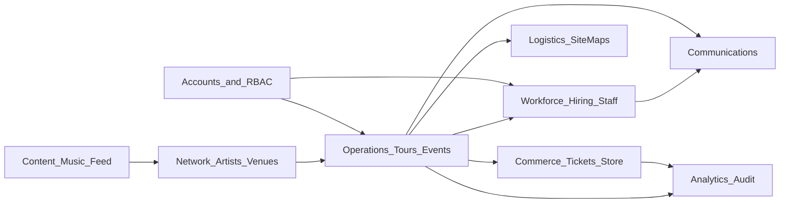

# Admin Builder — Platform Integration Map

Use this when answering “how does this integrate better into the platform?”

## Domain graph

## Expected cross-links by domain

| Admin domain | Should connect to |
|--------------|-------------------|
| Dashboard home | Upcoming events/tours, open applications, unread comms, finance alerts, audit highlights |
| Tours | Events on tour, calendar, logistics/site maps, roster/shifts, advancing/day-sheet |
| Events | HQ, advancing, day-sheet, check-in, command-center, ticketing, staff, logistics, messages |
| Calendar | Tours + events + shifts; deep-link into day-sheet / scheduling |
| Logistics | Active tour/event context, site maps, lodging, vendors, equipment, inventory |
| Hiring Hub | Job postings, applications, candidates, onboarding templates, roster |
| Scheduling | Staff roster, event/tour zones, conflicts, open shifts |
| Applications / Candidates | Hiring hub, messages to applicants, roster after hire |
| Roster / Organization / RBAC | Account grants, Work Mode, band hub vs org team |
| Staff Operations | Scheduling tab, communications, analytics — no dead tab stubs |
| Ticketing | Event detail, finances, check-in |
| Finances | Ticketing, marketplace orders, store |
| Marketplace / Store / Inventory | Orders detail, logistics equipment where SKUs overlap |
| Artists / Venues / Agencies | Tours/events booking context, network connections, EPK/content |
| Network / Connections | Artists, venues, agencies, messaging |
| Communications | Entity-scoped threads (event/tour/staff); supersede orphan `messages` when consolidating |
| Content / Music / EPK / Website / Feed | Public surfaces + music-trust ops panels; avoid monitor-only dead ends |
| Analytics / Connect / Features / Audit / Settings | Account-scoped telemetry; feature flags gate unfinished admin modules |

## Account scoping rules

- Organizer/admin shell is gated by account type in `app/admin/layout.tsx` / `admin-layout-client.tsx`.
- Hiring and workforce links often append `entity_type`, `entity_id`, optional `venue_id` / `display_name` — preserve these query params when adding CTAs.
- Prefer account-scoped APIs and RLS-safe queries; do not introduce service-role client usage in browser code.

## Canonical vs legacy surfaces

| Prefer (canonical) | Avoid duplicating |
|--------------------|-------------------|
| `/admin/dashboard/hiring` | Legacy `/admin/dashboard/jobs` (consolidate or redirect) |
| `/admin/dashboard/communications` | Orphan `/admin/dashboard/messages` |
| `/admin/dashboard/logistics` (+ site map builder chain) | `site-maps-enhanced` redirect; orphan old site-map-builder files |
| Event create / tour builder | Planner redirects (`events/planner`, `tours/planner`) |

When improving a legacy surface, prefer redirecting into the canonical page and sharing components over maintaining two UIs.

## Gold-standard integration moves

- Deep-link CTAs: “Open in logistics”, “Assign shifts”, “Message crew”, “View orders”.
- Shared selectors: tour/event context that filters child pages.
- Status chips pulled from related domains (ticket sales on event card, onboarding % on candidate).
- Empty states that start the right workflow (Create event → hire staff → build site map), not dead “You have no data” copy.

## Out of scope for integration fantasies

- New social networks, speculative AI hubs, or greenfield modules with no schema/API.
- Resetting local DB to “make integration easier.”
- Breaking account isolation to simplify queries.
