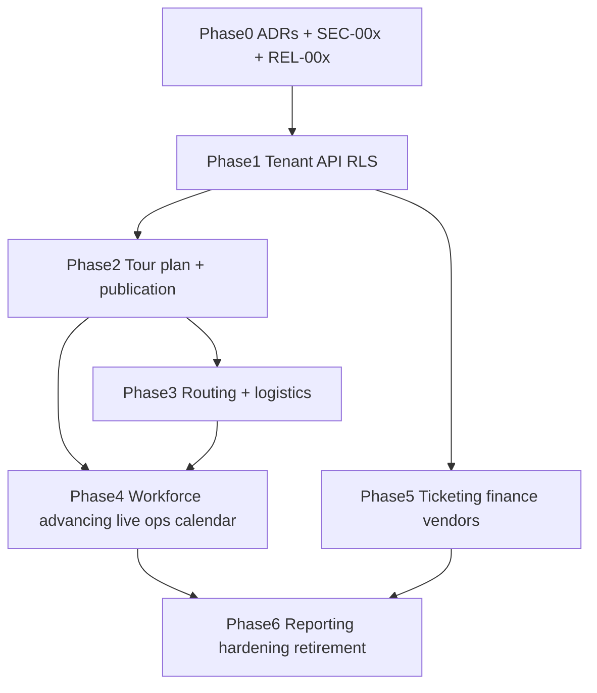

# Admin Feature Spec Builder — Phase Order & Gates

Canonical sequencing follows [`docs/admin-feature-specs/00_Master_Roadmap.md`](../../../../docs/admin-feature-specs/00_Master_Roadmap.md).  
**Do not** process documents in strict `00→14` filename order when that would violate dependencies.

## Dependency graph

## Phase contents

| Phase | Theme | Typical prefixes |
|------:|-------|------------------|
| 0 | Decisions and safety harness | `ADR-*`, `PLAN-00x`, `PUB-00x`, `TIX-00x`, `FIN-00x`, `CONT-101`, `SEC-00x`, `REL-00x`, `REP-001` |
| 1 | Tenant and API convergence | `SEC-1xx`, `TOUR-1xx`, `PLAN-1xx`, `PUB-1xx`, `TRAVEL-1xx`, `LOG-1xx`, `MAP-101`, `TIX-1xx`, `FIN-1xx`, `CAL-1xx`, `COMMS-101`, `REL-1xx`, `REP-101` |
| 2 | Authoritative planning and publication | `SEC-2xx`, `TOUR-2xx`, `PLAN-2xx`, `PUB-2xx`, `EVENT-2xx`, `REP-2xx` |
| 3 | Routing and logistics | `ROUTE-3xx`, `TRAVEL/TRANS/LODGE-3xx`, `LOG/EQUIP/RENT/CATER/MAP-3xx`, `TOUR-3xx`, `PUB-3xx`, `REP-301` |
| 4 | Workforce, advancing, live ops, calendar | `WORK/HIRE-4xx`, `ADV/LIVE-4xx`, `CAL/COMMS-4xx`, `PUB-4xx`, `PLAN-4xx`, `TOUR-401`, `REP-401`, `REL-2xx/3xx/4xx` |
| 5 | Commercial operations | `TIX-5xx`, `FIN/SETTLE-5xx`, `VEND/CONT-5xx`, `TRAVEL-5xx`, `TOUR-5xx`, `REP-5xx`, `REL-501` |
| 6 | Reporting and hardening | `*-6xx`, `EXP-6xx`, `REL-6xx` |

Exact ordered IDs live in [`.agents/admin-feature-spec-builder/INVENTORY.md`](../../../admin-feature-spec-builder/INVENTORY.md).

## Hard gates (must not skip)

1. **No domain production writes** before Phase 1 tenant keys + capability wrappers for that domain.
2. **No publish / ack / day-sheet / schedule / itinerary delivery** before `PUB-101`, `PUB-102`, and `PUB-204`.
3. **No travel passenger / equipment movement writes** before `PLAN-201`, `ROUTE-301`, and `WORK-401` (as applicable).
4. **No commercial UI rollout** before `TIX-10x` / `FIN-10x` RLS hardening.
5. **No `*-60x` retirement** until reconciliation evidence and `REL-610` criteria are met (or the item is explicitly `blocked` with an owner note).

## Overlap rule

UI design for a later phase may be sketched early, but **production writes** wait until upstream contracts (tenant keys, canonical stops/legs, party identities, publication outbox) are stable.
