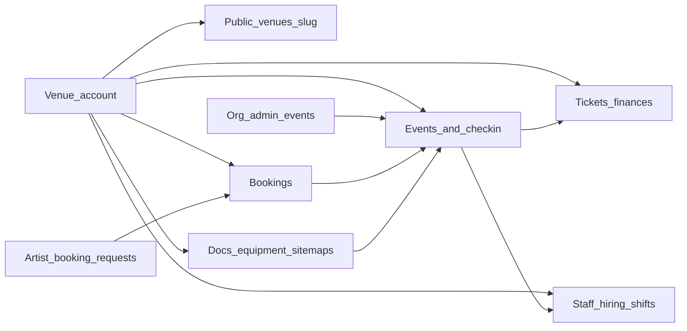

# Venue Builder — Platform Integration Map

Use when answering “how does this integrate better into the platform?”

## Domain graph

## Expected cross-links

| Venue domain | Should connect to |
|--------------|-------------------|
| Dashboard | Pending bookings, upcoming events, open shifts, unread messages, ticket sales pulse |
| Bookings | Public booking-request, event create/ops hub, messages to requester |
| Calendar | Bookings + events + shifts; deep-link day → event or schedule |
| Events / Event ops hub | Check-in, tickets, staff assignments, site map, finances for that event |
| Check-in / Tickets | Event detail, door staff roles, finances |
| Messages | Booking threads, staff, artist/org counterparts (account-scoped) |
| Staff / Scheduling / Roles | Active venue id, hiring after accept, event zone shifts |
| Hiring / Jobs / Kanban / Onboarding | Venue entity hiring APIs; roster after hire |
| Documents / Equipment / Site maps | Event ops and public tech rider / capacity context |
| Overview / Settings / Edit | Public `/venues/[slug]` parity |
| Multi-venue CRUD | Switcher + `useCurrentVenue`; booking-request per venue |
| Finances / Analytics | Tickets + bookings revenue; no chart mocks |
| Admin venues | Org discovery/collaboration — not venue ops chrome |

## Canonical vs twin

| Prefer | Redirect / retire |
|--------|-------------------|
| `/venue/dashboard` | `/venue` |
| `/venue/dashboard/tickets` | `/venue/tickets` |
| `/venue/dashboard/site-maps` | `/venue/site-maps`, `/venue/assets` → equipment |
| `/venue/settings` | `/venue/dashboard/settings` |
| `/venue/analytics` | `/venue/dashboard/analytics` |
| `/venue/equipment` | `/venue/dashboard/equipment` |
| `/venue/documents` | `/venue/dashboard/documents` |
| `/venue/events/[id]` | `/venue/manage-event/[id]` |
| `/venue/events` | Prefer over `/venue/dashboard/events` when consolidating |
| `VenueOperationsShell` | Legacy `venue-sidebar`, `venue-owner-sidebar`, creator sidebars |

Social/creator dashboard routes (`feed`, `music`, `epk`, `store`, `social`, …) are not primary venue product — redirect to dashboard or `FeatureUnavailable` per IA Phase 9 unless a real venue-owned use case is proven.

## Active venue rules

- Source: `useCurrentVenue` + `venueService` session persistence.
- Roles, hiring, and scheduling must work when `?venueId` is omitted.
- Do not break multi-venue accounts when improving list/detail CRUD.

## Out of scope fantasies

- Turning venue ops into a full social network.
- Resetting the DB to simplify local testing.
- Breaking RLS / account isolation between venue and org.
