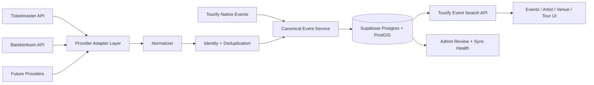

# 03 — Target Architecture

## Architectural principle

Tourify owns the product model. Providers supply evidence and distribution links.



## Required layers

### 1. Provider adapters

Each adapter is responsible for:

- Authentication.
- Request construction.
- Rate limiting.
- Pagination.
- Provider response validation.
- Provider error translation.
- Normalization.
- Provider-specific cache policy.
- Health checks.
- Sync telemetry.

Suggested interface:

```ts
export interface EventProviderAdapter {
  readonly provider: EventProvider;

  searchEvents(input: ProviderEventSearchInput): Promise<ProviderPage>;
  getEvent(providerEventId: string): Promise<ProviderEvent | null>;

  getArtistEvents?(
    connection: ProviderArtistConnection,
    input: ProviderArtistEventQuery
  ): Promise<ProviderPage>;

  normalizeEvent(raw: unknown): NormalizedExternalEvent;
  getRateLimitState?(): Promise<ProviderRateLimitState | null>;
  healthCheck(): Promise<ProviderHealth>;
}
```

Do not require every provider to implement broad search. Bandsintown, for example, can support artist-connected event retrieval without supporting platform-wide discovery.

### 2. Normalized external event contract

The provider-neutral contract should include:

```ts
type NormalizedExternalEvent = {
  provider: EventProvider;
  providerEventId: string;
  sourceUrl: string | null;
  title: string;
  normalizedTitle: string;
  description: string | null;
  status: "scheduled" | "cancelled" | "postponed" | "rescheduled" | "unknown";
  startAt: string | null;
  endAt: string | null;
  localDate: string | null;
  localTime: string | null;
  timezone: string | null;
  venue: NormalizedVenue | null;
  performers: NormalizedPerformer[];
  classifications: NormalizedClassification[];
  images: NormalizedImage[];
  ticketOffers: NormalizedTicketOffer[];
  providerUpdatedAt: string | null;
  rawPayloadHash: string;
  fetchedAt: string;
};
```

The adapter may retain a bounded raw payload for debugging only when provider terms and data-retention rules permit it. The canonical application must not depend on raw JSON.

### 3. Canonical event service

Responsibilities:

- Create or update source records.
- Match against existing canonical events.
- Create merge candidates when confidence is insufficient.
- Apply source authority rules.
- Preserve native overrides.
- Rebuild discovery index.
- Publish audit events.
- Return canonical event DTOs.

### 4. Discovery index

Use a search-optimized projection rather than repeatedly joining every operational table.

The discovery index should contain:

- Canonical event ID.
- Search title.
- Start/end time.
- Status.
- Geographic point.
- Venue identity and normalized text.
- Artist IDs.
- Categories and genres.
- Price summary.
- Source quality.
- Popularity signals.
- Visibility.
- Search vector.
- Last indexed timestamp.

It may be a table maintained by application code or triggers. Kimi must select the least disruptive approach after auditing current write paths.

### 5. Search API

The search API accepts normalized Tourify filters and executes against the discovery index.

It must not pass arbitrary user query parameters directly to providers.

### 6. Background job system

Use scheduled server routes or the platform's existing job architecture. A valid initial pattern is:

- Vercel Cron invokes protected API routes.
- Routes claim jobs from a database queue.
- Workers call provider adapters.
- Jobs commit idempotent results.
- Retry state is persisted.
- Cron endpoints verify `CRON_SECRET`.

If the repository already has Supabase Cron, queues or another worker, reuse it rather than creating parallel infrastructure.

## Feature flags

Required flags:

```text
EVENT_DISCOVERY_V2
EVENT_PROVIDER_TICKETMASTER
EVENT_PROVIDER_BANDSINTOWN
EVENT_PROVIDER_BANDSINTOWN_PARTNER_MODE
EVENT_EXTERNAL_CLAIMS
EVENT_MAP_VIEW
EVENT_RECOMMENDED_SORT
EVENT_PROVIDER_ADMIN_TOOLS
```

Flags should support environment and optionally account-level targeting.

## Source authority hierarchy

Default hierarchy:

1. Verified Tourify event owner or authorized Tourify editor.
2. Tourify-native operational event data.
3. Connected and verified venue or organizer.
4. Connected and verified artist tour source.
5. Primary ticketing provider.
6. Secondary catalog provider.
7. Community submission.

Authority should be field-aware. For example:

- A verified owner may control the Tourify description.
- A ticket provider may remain authoritative for its checkout URL.
- A venue identity may be managed by a verified venue account.
- Cancellation status should use the most trustworthy recent source and be surfaced for review when sources conflict.

## Resilience

- Circuit breaker per provider.
- Retry only retryable errors.
- Exponential backoff with jitter.
- Dead-letter state after bounded retries.
- Last-known-good canonical data remains available.
- Native events never disappear because a provider is disabled.
