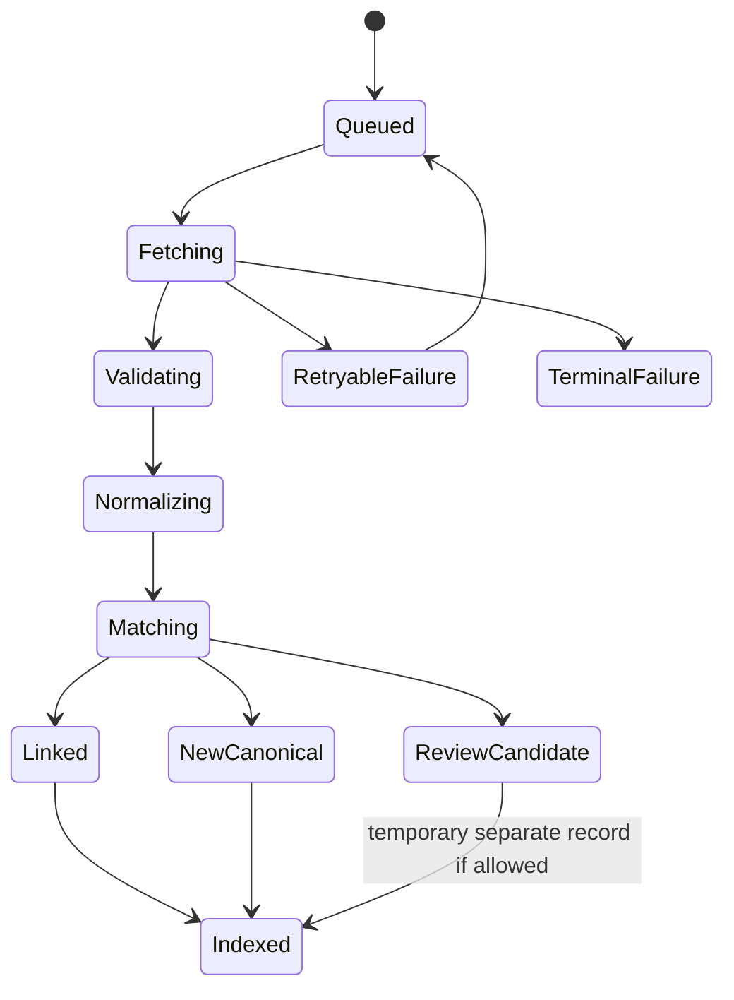

# 09 — Ingestion, Deduplication and Claiming

## Ingestion lifecycle



## Idempotency

Every provider upsert must use:

```text
(provider, provider_event_id)
```

A repeated payload must not create a new event, ticket offer or venue.

Use payload hashes to skip unnecessary writes.

## Matching stages

### Stage 1 — Exact provider identity

Match `provider + provider_event_id`.

### Stage 2 — Existing explicit links

Match a source record already linked by an administrator, owner or previous merge.

### Stage 3 — High-confidence deterministic match

Candidate conditions:

- Start times within configured tolerance.
- Venue identity matches, or coordinates and normalized venue name are strongly similar.
- Event title is strongly similar.
- At least one performer matches.
- City/country match.
- Neither record is explicitly marked distinct.

### Stage 4 — Probabilistic/fuzzy candidate

Generate a review candidate instead of auto-merging.

## Suggested confidence model

```text
0.35 time similarity
0.25 venue identity or coordinate similarity
0.20 title similarity
0.15 performer overlap
0.05 city/country consistency
```

Auto-merge only above a reviewed threshold, for example `0.92`, and only when no disqualifier exists.

Disqualifiers:

- Different venue and coordinates.
- Different calendar date beyond tolerance.
- Separate performances of the same tour on the same day.
- Matinee versus evening show when provider identities differ.
- Festival pass versus single-day event.
- Livestream versus in-person event.
- Explicit admin “never merge” decision.

## Normalization rules

### Titles

- Unicode normalize.
- Lowercase for comparison.
- Remove repeated whitespace.
- Normalize common punctuation.
- Preserve the display title.
- Avoid stripping meaningful edition numbers or tour names.

### Venues

- Normalize name and address.
- Match exact Tourify venue IDs first.
- Compare coordinates within a small distance.
- Keep aliases.
- Never merge venues solely by common name.

### Performers

- Prefer linked Tourify artist identity.
- Store provider identity aliases.
- Avoid fuzzy automatic artist linking for short or generic names.

### Time

- Compare UTC instants when timezone is reliable.
- Preserve local date/time when provider timezone is incomplete.
- Flag uncertain time rather than inventing one.

## Canonical merge behavior

A merge must:

1. Choose a surviving canonical event.
2. Move external source links.
3. Move ticket offers.
4. Move tour links.
5. Preserve claims and audit history.
6. Preserve saves and social references.
7. Redirect old public URLs.
8. Rebuild discovery index.
9. Record the merge decision.
10. Support administrative reversal where feasible.

Never hard-delete the losing event immediately.

## Claim workflow

### Eligible claimants

- Artist or authorized artist team.
- Venue account.
- Organization/promoter.
- Tour manager.
- Tourify administrator.

### Claim evidence

Examples:

- Verified account identity.
- Matching connected provider account.
- Domain email.
- Existing venue or organization ownership.
- Contract or booking evidence through a secure process.
- Admin confirmation.

Avoid collecting unnecessary sensitive documents.

### Claim states

```text
draft
submitted
auto_verified
needs_review
approved
rejected
revoked
```

### Claim permissions

Approval may grant:

- Manage Tourify description and media.
- Link performers.
- Link venue.
- Attach to tour.
- Add Tourify ticketing when authorized.
- Add staffing and operational modules.
- Request correction.
- Manage promotions.

It must not allow a claimant to edit another provider's source record or ticket URL.

## Source conflicts

Create conflict records when:

- Providers disagree on cancellation.
- Start time changes.
- Venue changes.
- Ticket URLs disappear.
- A claimed owner contradicts a source.

User-facing priority should follow source authority and freshness. High-risk changes should require review or a visible warning.

## Deletion and removal

- External source removal disables that source.
- Native event deletion follows Tourify's existing ownership rules.
- A merged or referenced event should be archived and redirected rather than immediately deleted.
- Provider removal requests must be actioned within applicable terms.
- Past records may retain Tourify-owned history while provider-owned fields expire.
