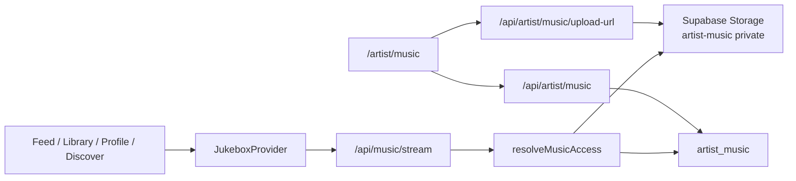

# Music Ecosystem Integration Guide

Paste-ready brief for extending Tourify’s native music upload and playback stack. Prefer this document over older setup notes.

**Canonical:** this file  
**Legacy / setup-only (do not treat as architecture):** [MUSIC_SYSTEM_SETUP.md](./MUSIC_SYSTEM_SETUP.md), [JUKEBOX_SETUP.md](./JUKEBOX_SETUP.md)  
**Related experimental:** [TAF_INTEGRATION.md](./TAF_INTEGRATION.md) (not on the live upload path)

---

## Agent instructions

You are extending Tourify’s **existing** music upload/play ecosystem. Match current language and structure; do not invent a parallel stack.

### Stack conventions

- Next.js App Router, TypeScript, Tailwind, Shadcn/Radix
- Route handlers under `app/api/**` (not server actions for music CRUD)
- Zod schemas colocated in route files; `requireApiUser` / `jsonError` from `@/lib/api/route-helpers`
- Prefer interfaces over types; `function` keyword for pure functions and components; named exports
- Filenames: lowercase with dashes (`enhanced-music-uploader.tsx`)
- RORO helpers: `resolveMusicAccess({ supabase, track, viewerUserId })`, `enqueueMusicPreviewJob({...})`
- Client UI for upload/player; minimize new global state stores (no Zustand music store)

### Hard rules

1. **Never reset the database.**
2. Audio lives in private bucket **`artist-music`**. Playback uses **server-signed URLs** via `GET /api/music/stream` — never set `<audio src="/api/music/stream?...">` as the lasting source once a signed URL is obtained.
3. Wire listening UI into **`JukeboxProvider`** / `useJukebox`. Do not add Howler, WaveSurfer, or a second global web player.
4. Canonical catalog row is **`artist_music`**. Release kind is a `type` field (`single` | `album` | `ep` | `mixtape`) — there is no separate music-albums table.
5. Entitlement / preview / full access changes go through **`resolveMusicAccess`** in `lib/music/music-access.ts` only.
6. Ignore venue mock uploaders and `hooks/useMusicReleases` mock data. Do not build on them.
7. Spotify / Apple / SoundCloud / YouTube fields are **outbound links**, not playback integrations.

---

## System map



| Layer | Owner surface | Canonical code |
|-------|---------------|----------------|
| Upload / catalog | Artist | `app/artist/music/page.tsx`, `components/music/enhanced-music-uploader.tsx`, `app/api/artist/music/*` |
| Access / commerce | Shared | `lib/music/music-access.ts`, `user_music_library`, marketplace listing sync on create/update |
| Playback | Global listener | `contexts/jukebox-context.tsx`, `components/jukebox/*`, `app/api/music/stream` |

Keep these layers separate: upload writes storage + `artist_music`; listeners never upload; access gates all streams.

---

## Current user flows

### Artist upload (production)

1. Open **`/artist/music`** (or `/artist/music/upload` → redirect to `/artist/music?upload=1`).
2. **`EnhancedMusicUploader`** collects:
   - audio file (≤100MB, `audio/*`)
   - optional cover (≤10MB, `image/*`)
   - optional preview clip file
   - metadata: title, type, genre, tags, access/preview modes, external URLs
   - **`rights_confirmed`** required to publish publicly
3. Parent **`MusicPage.handleSaveTrack`** (`app/artist/music/page.tsx`):
   1. `POST /api/artist/music/upload-url` with `{ fileName, contentType, kind: "full" | "preview" | "cover" }`
   2. Client `supabase.storage.uploadToSignedUrl(path, token, file)`
   3. Client `getAudioDuration(file)` from `lib/music/upload-helpers.ts`
   4. `POST /api/artist/music` with `storage_path` / `file_url`, rights, access_mode, etc.
4. API create:
   - Zod validate; rights required if public
   - clip + public requires `preview_status === "ready"`
   - insert `artist_music` (RLS: `auth.uid() = user_id`)
   - paid → sync marketplace listing
   - clip pending → `enqueueMusicPreviewJob`
5. On create failure, cleanup uploaded storage objects.
6. Optional: share as feed post via `POST /api/music/share`.

Progress UI is local state (rough 20→100%) passed into the uploader — not a server progress channel.

### Listener play (web)

1. Surface builds a **`JukeboxTrack`** and calls `jukebox.play(track, { source? })` (or `resume` if same track).
2. `JukeboxProvider` resolves stream: `GET /api/music/stream?trackId=…` (credentials).
3. Server loads `artist_music`, runs **`resolveMusicAccess`**, signs storage path (`createSignedUrl`, 3600s).
4. Provider sets `audio.src = signedUrl`, `audio.load()`, `audio.play()`.
5. Once: `POST /api/music/play` for analytics (`music_plays` / engagement events).
6. Mini bar + full player bind to reducer state (`currentTime`, `duration`, queue, repeat/shuffle).

### Library and playlists

1. Listener opens **`/music`** or FullPlayerView Library / Playlists tabs.
2. `GET /api/music/library` / playlist routes via `lib/services/jukebox.service.ts`.
3. Entitled tracks unlock **full** access in `resolveMusicAccess`.
4. Playlist add often requires library membership first (`TrackCard` may auto-add).

### Mobile (separate stack)

- Provider: `apps/mobile/providers/music-player-provider.tsx` (`expo-audio`)
- API client: `apps/mobile/lib/api/music.ts`
- Same stream/library endpoints; **no shared queue** with web jukebox

---

## Pages and surfaces

### Live (extend these)

| Route / surface | File | Role |
|-----------------|------|------|
| `/artist/music` | `app/artist/music/page.tsx` | Artist library + upload orchestration |
| `/artist/music/analytics` | `app/artist/music/analytics/page.tsx` | Artist music analytics |
| `/music` | `app/music/page.tsx` | Buyer library + playlists |
| `/discover` | `app/discover/page.tsx` | Discover → `jukebox.play` |
| Feed cards | `components/feed/feed-music-player.tsx`, `components/feed/music-post.tsx` | Inline play → jukebox |
| Profile | `components/profile/profile-music-showcase.tsx`, `components/profile/profile-jukebox-widget.tsx` | Play / queue / open player |
| Public artist | `components/public-artist/music/public-artist-music-section.tsx` | Public listening |
| Dashboard widget | `components/dashboard/jukebox-player.tsx` | Opens jukebox chrome |
| Admin moderation | `app/admin/dashboard/music/page.tsx` + `app/api/admin/content/music` | Content moderation |
| EPK music section | `components/epk/music-section.tsx` | Metadata / links; reads via EPK services |
| Mobile music tab | `apps/mobile/app/(tabs)/music.tsx` | Expo player |

### Redirects

| From | To |
|------|-----|
| `/artist/music/upload` | `/artist/music?upload=1` |
| `/artist/features/music` | `/artist/music` |
| `/venue/dashboard/music` | `/venue/dashboard` (venue IA consolidation) |

### Do not extend (mocks / dead / experimental)

| Item | Why |
|------|-----|
| `app/venue/components/music/music-uploader.tsx`, `components/venue/music/music-uploader.tsx` | Fake `setInterval` progress; no API |
| Venue `music-player.tsx` / library copies under venue folders | Local/mock; not jukebox |
| `hooks/useMusicReleases.ts` | Hardcoded mock releases |
| `components/music/taf-music-player.tsx` | Experimental TAF path; not wired to jukebox |
| Feature links to `/music/player`, `/music/radio`, `/music/playlists`, `/music/recording` | Routes largely missing; real library is `/music` |
| `docs/JUKEBOX_SETUP.md` `public/audio` samples | Pre-native-player demo |

---

## Data model and storage

### Canonical table: `artist_music`

Key columns (from API selects + migrations):

| Group | Columns |
|-------|---------|
| Identity | `id`, `user_id`, `artist_profile_id` |
| Content | `title`, `description`, `type`, `genre`, `release_date`, `duration`, `lyrics`, `tags`, `credits`, `metadata` |
| Media | `file_url`, `cover_art_url`, `storage_bucket`, `storage_path`, `preview_file_url`, `preview_storage_bucket`, `preview_storage_path` |
| Preview | `preview_mode` (`full` \| `clip`), `preview_duration_seconds`, `preview_status` (`not_required` \| `pending` \| `ready` \| `failed`), `preview_error`, `preview_generated_at` |
| Access | `access_mode` (`free` \| `paid`), `is_public`, `is_featured`, `is_pinned`, `is_visible`, `moderation_status` |
| Rights | `rights_confirmed`, `rights_confirmed_at` |
| Permissions | `allow_library_add`, `allow_profile_feature`, `allow_downloads` |
| Commerce | `listing_sync_status`, `listing_sync_error` (+ marketplace via `music_track_id`) |
| External | `spotify_url`, `apple_music_url`, `soundcloud_url`, `youtube_url` |
| Stats | `stats` JSONB; `created_at`, `updated_at` |

View: `public.music_tracks` — `artist_music` + profiles (`security_invoker`).

### Related tables

| Table | Purpose |
|-------|---------|
| `music_likes`, `music_comments`, `music_comment_likes`, `music_shares` | Social |
| `music_plays`, `music_engagement_events` | Plays / analytics |
| `user_music_library` | Buyer entitlements / free adds |
| `music_playlists`, `music_playlist_items`, `music_playlist_shares` | Playlists |
| `music_preview_generation_jobs` | Async clip generation |
| `user_profile_featured_tracks` | Profile featured track |

### Storage buckets

| Bucket | Privacy | Limits | Path pattern |
|--------|---------|--------|--------------|
| `artist-music` | **Private** | ~100MB; audio MIME | `{userId}/{full\|preview}/{timestamp}-{uuid}-{safeName}.{ext}` |
| `artist-photos` | **Public** | ~10MB; images | `{userId}/cover/{timestamp}-{uuid}-{safeName}.{ext}` |

Signed **upload** URLs: service role in `app/api/artist/music/upload-url/route.ts`.  
Signed **stream** URLs: user-scoped client in `app/api/music/stream/route.ts` after access check.

### Key migrations

- `supabase/migrations/20250115000000_artist_music_system.sql` — base system
- `20260326100000_artist_music_pinning.sql`
- `20260410183000_music_commerce_expansion.sql`
- `20260413300000_artist_music_rights_columns.sql`
- `20260413300002_tighten_music_storage_policies.sql`
- `20260711160518_native_music_player_ecosystem.sql`
- `20260711165607_native_music_player_hardening.sql`
- `20260711173622_music_preview_jobs.sql`

Worker: `scripts/music-preview-worker.ts` (not request-time ffmpeg).

---

## Access control

Implemented in `lib/music/music-access.ts`:

```
Owner → full
Else if not publicly playable → deny (not_visible)
Else if in user_music_library → full
Else if access_mode free AND preview_mode ≠ clip → full
Else if clip preview ready → preview
Else → deny (auth_required | not_entitled)
```

Publicly playable requires: `is_public`, `is_visible !== false`, `moderation_status` approved (default), `rights_confirmed`.

Publish API gates (`app/api/artist/music/route.ts`):

- Public requires `rights_confirmed`
- Public + `preview_mode=clip` requires preview `ready`

Storage RLS: owner folder = first path segment (`auth.uid()`). Listeners do not read private objects directly — only via signed URLs.

---

## API catalog

Auth: most mutating routes use `requireApiUser`. Stream may be anonymous for free/full public tracks.

### Artist upload / catalog

| Method | Path | Purpose |
|--------|------|---------|
| POST | `/api/artist/music/upload-url` | Signed upload URL (`kind`: full \| preview \| cover) |
| GET/POST/PATCH/DELETE | `/api/artist/music` | List / create / update / delete own tracks |
| POST | `/api/artist/music/pin` | Pin tracks |
| POST | `/api/artist/music/generate-preview` | Trigger preview |
| GET | `/api/artist/music/preview-jobs` | Preview job status |
| GET | `/api/artist/music/analytics` | Analytics |
| GET | `/api/artists/[id]/music` | Public artist tracks |
| GET/POST | `/api/storage/ensure` | Ensure buckets exist |

### Stream / access / library

| Method | Path | Purpose |
|--------|------|---------|
| GET | `/api/music/stream?trackId=` | Access check + signed playback URL |
| POST | `/api/music/play` | Play analytics |
| GET | `/api/music/cover?trackId=` | Cover redirect / signed cover |
| GET/POST/DELETE | `/api/music/library` | Buyer library |
| GET/POST | `/api/music/download` | Downloads (permission-gated) |
| * | `/api/music/playlists`, `/[playlistId]`, `/items` | Playlist CRUD |
| * | `/api/music/like`, `favorites`, `comment`, `share`, `share-message`, `report`, `social-status` | Social |
| * | `/api/music/profile-featured-track` | Featured track |
| GET | `/api/feed/music` | Discover feed tracks |
| GET | `/api/jukebox/following-tracks` | Following tab |
| * | `/api/admin/content/music` | Admin moderation |

Client helpers: `lib/services/jukebox.service.ts` (`fetchLibraryTracks`, `getStreamUrl`, `toggleLike`, etc.).

---

## Types and naming

| Shape | Location | Use for |
|-------|----------|---------|
| `JukeboxTrack` | `contexts/jukebox-context.tsx` | Any play/queue UI |
| `MusicAccessTrack` / `MusicAccessResult` | `lib/music/music-access.ts` | Server access |
| Upload helpers | `lib/music/upload-helpers.ts` | Duration, stream URL helper, errors, paid price parse |
| Preview jobs | `lib/music/preview-jobs.ts` | `enqueueMusicPreviewJob`, `previewStatusForTrack` |
| `MobileMusicTrack` | `apps/mobile/lib/api/music.ts` | Mobile only |
| Zod `createTrackSchema` / `updateTrackSchema` | `app/api/artist/music/route.ts` | API validation |

`MusicTrack` is duplicated locally in several components. **New shared fields** belong under `lib/music/` (or a new `types/music.ts`) — do not invent a third playback model. Map domain rows → `JukeboxTrack` at the UI boundary.

`JukeboxTrack` fields:

```ts
interface JukeboxTrack {
  id: string
  title: string
  artist_name: string
  artist_id?: string
  artist_avatar_url?: string
  duration?: number
  file_url: string  // often `/api/music/stream?trackId=…` until resolved
  cover_art_url?: string
  genre?: string
  tags?: string[]
  is_public?: boolean
  listing_id?: string | null
  allow_downloads?: boolean
  allow_library_add?: boolean
  access_mode?: "free" | "paid"
  in_library?: boolean
}
```

---

## Code patterns to copy

### Signed upload (API)

```ts
// app/api/artist/music/upload-url/route.ts
const uploadUrlSchema = z.object({
  fileName: z.string().min(1).max(240),
  contentType: z.string().min(1).max(120),
  kind: z.enum(["full", "preview", "cover"]),
})
// bucket: cover → artist-photos; else artist-music
// path: `${user.id}/${kind}/${Date.now()}-${uuid}-${safeName}.${ext}`
// service.storage.from(bucket).createSignedUploadUrl(path)
```

### Create gates (API)

```ts
// app/api/artist/music/route.ts
if (wantsPublic && !rightsConfirmed) → rights_confirmation_required
if (wantsPublic && preview_mode === "clip" && status !== "ready") → preview_not_ready
// require file_url or storage_path
```

### Stream (API)

```ts
// app/api/music/stream/route.ts
const access = await resolveMusicAccess({ supabase, track, viewerUserId })
if (!access.allowed) → 401/403
const storagePath = access.accessLevel === "preview"
  ? getTrackPreviewStoragePath(track)
  : getTrackFullStoragePath(track)
await supabase.storage.from(bucket).createSignedUrl(storagePath, 3600)
// return { url, accessLevel, expiresIn: 3600 }
```

### Play from UI

```ts
const jukebox = useJukebox() // or useJukeboxOptional() + toast if null
jukebox.play({
  id: track.id,
  title: track.title,
  artist_name: track.artist_name ?? "Unknown",
  file_url: `/api/music/stream?trackId=${track.id}`,
  cover_art_url: track.cover_art_url,
  // ...
}, { source: "feed" })
```

### Provider mount

```ts
// components/layout/app-chrome.tsx
<JukeboxProvider>
  {children}
  {!isAdminRoute ? (
    <>
      <PersistentPlayerBar />
      <FullPlayerView />
    </>
  ) : null}
</JukeboxProvider>
```

Full chrome: `components/jukebox/persistent-player-bar.tsx`, `components/jukebox/full-player-view.tsx`.  
Admin routes keep the provider mounted but hide player UI.  
Queue/state: `useReducer` in `contexts/jukebox-context.tsx`; persists volume/mute/shuffle/repeat/queue/theme to `localStorage` key `tourify-jukebox-state` (not `currentTrack`).

---

## Extension recipes

### 1. New metadata field on tracks

1. Migration on `artist_music` (additive; never reset DB).
2. Add to Zod `updateTrackSchema` / create schema in `app/api/artist/music/route.ts`.
3. Include in GET select list on the same route.
4. Wire form in `EnhancedMusicUploader` + save payload in `app/artist/music/page.tsx`.
5. If listeners need it, map into `JukeboxTrack` or keep display-only outside the player.
6. Tests beside `lib/music/__tests__/` or route tests if logic is non-trivial.

### 2. New listening surface

1. Fetch tracks via existing APIs (`/api/feed/music`, `/api/artists/[id]/music`, library, etc.).
2. Map each row to `JukeboxTrack`.
3. Call `useJukebox().play` / `playPlaylist` / `addToQueue`.
4. Reuse `TrackCard`, `FeedMusicPlayer`, or `PlayerSocialActions` — **do not** mount a private `<audio>` element.
5. If outside `AppChrome`, expect `useJukeboxOptional()` null → toast “Music player is unavailable”.

### 3. New entitlement rule

1. Extend **only** `resolveMusicAccess` (+ tests in `lib/music/__tests__/music-access.test.ts`).
2. Keep stream route thin: load track → resolve → sign.
3. Update library/commerce writers if new entitlement sources appear (`user_music_library` or marketplace).

### 4. Preview / clip pipeline

1. Set `preview_mode: "clip"` on create/update.
2. Either upload a preview file (`kind: "preview"`) or enqueue via `enqueueMusicPreviewJob`.
3. Worker: `scripts/music-preview-worker.ts` + `music_preview_generation_jobs`.
4. Do not publish public clip tracks until `preview_status === "ready"`.

### 5. Mobile parity

1. Use `apps/mobile/lib/api/music.ts` for stream/library.
2. Drive playback through `MusicPlayerProvider` / `useMusicPlayer`, not web jukebox.
3. Keep access semantics identical (same `/api/music/stream` response).

### 6. Paid track / marketplace

1. `access_mode: "paid"` + price/currency/license on create/update.
2. API syncs marketplace listing; buyers land in `user_music_library`.
3. Seller payout readiness via `getSellerPayoutReadiness` — preserve existing checks.

---

## Anti-patterns and known debt

| Debt | Guidance |
|------|----------|
| Venue music UI mocks + duplicate folders (`components/venue/music` vs `app/venue/components/music`) | Do not extend; redirect already points venue music away |
| Outdated `JUKEBOX_SETUP.md` (`public/audio`, sample songs) | Ignore for product work |
| TAF docs claiming auto-conversion on upload | Not part of live `EnhancedMusicUploader` path |
| External streaming URLs on tracks | Links only; EPK “import from Spotify” is a stub |
| Dual web vs mobile players | Accept for now; share APIs and access rules, not React context |
| Admin routes hide `PersistentPlayerBar` | Intentional in `AppChrome` |
| Collaboration workspace “waveform” | Stub / fake bars — unrelated to music ecosystem |
| Photo albums (`/api/photos/albums`) | Not music albums |

---

## High-signal file index

**Core**

- `contexts/jukebox-context.tsx`
- `components/layout/app-chrome.tsx`
- `components/jukebox/persistent-player-bar.tsx`
- `components/jukebox/full-player-view.tsx`
- `components/jukebox/track-card.tsx`
- `lib/services/jukebox.service.ts`
- `lib/music/music-access.ts`
- `lib/music/upload-helpers.ts`
- `lib/music/preview-jobs.ts`
- `lib/jukebox/track-social-cache.ts`

**Upload**

- `app/artist/music/page.tsx`
- `components/music/enhanced-music-uploader.tsx`
- `app/api/artist/music/route.ts`
- `app/api/artist/music/upload-url/route.ts`

**Stream / library**

- `app/api/music/stream/route.ts`
- `app/api/music/play/route.ts`
- `app/api/music/library/route.ts`
- `app/music/page.tsx`

**Surfaces**

- `components/feed/feed-music-player.tsx`
- `components/music/music-player.tsx`
- `components/dashboard/jukebox-player.tsx`
- `apps/mobile/providers/music-player-provider.tsx`

**Tests**

- `lib/music/__tests__/upload-helpers.test.ts`
- `lib/music/__tests__/music-access.test.ts`
- `app/api/music/library/__tests__/route.test.ts`
- `__tests__/feed/music-post-preview.test.ts`

---

## Paste prompt footer

When implementing against this guide:

1. Reuse the files above; do not create a second upload or player pipeline.
2. Preserve rights confirmation, private storage, and `resolveMusicAccess` gates.
3. Map playable UI to `JukeboxTrack` + `jukebox.play` (web) or mobile `MusicPlayerProvider`.
4. Prefer additive migrations; never reset the database.
5. Colocate Zod with route handlers; put shared helpers in `lib/music/`.
6. Add or update tests next to existing `lib/music/__tests__` / route tests.
7. Leave venue mock music uploaders and TAF alone unless the task explicitly targets them.
8. Never put secrets in the client; signed upload/stream tokens stay short-lived and path-scoped.
