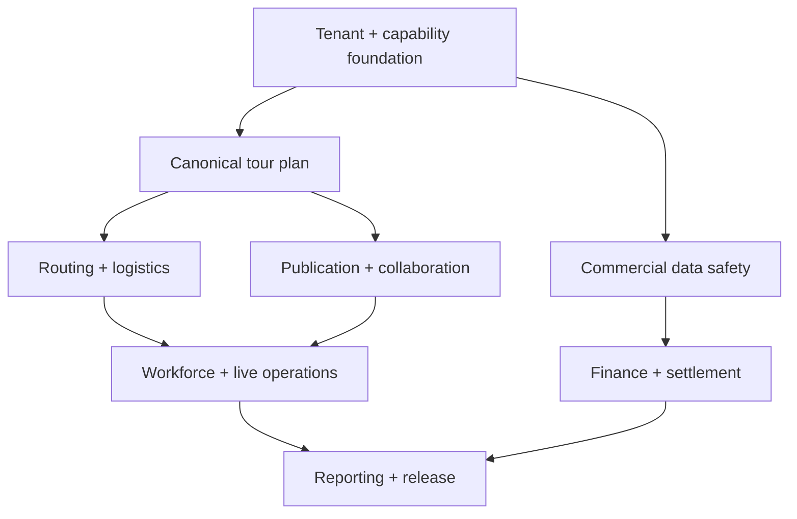

# Tourify Admin tour-management deployment blueprint

**Prepared:** July 19, 2026  
**Source baseline:** `KyleQD/Tourify`, `main`, commit `9a93667face6b4302e168b80cce2df3df2a723d1`  
**Purpose:** Convert the read-only audit into an executable product, engineering, data, security, QA, and deployment plan for organization/admin tour planning and management.

## 1. Program outcome

At completion, an authorized organization team must be able to plan, approve, publish, operate, settle, and audit a multi-stop tour without cross-tenant exposure, silent partial writes, duplicate sources of truth, or manual identifier entry. Tourify must support the complete lifecycle:

1. create a draft tour and alternatives;
2. create or attach stops/events and calculate a feasible route;
3. assign the tour party, vendors, equipment, transport, lodging, and hospitality;
4. advance every show and publish versioned operational information;
5. schedule workers and distribute day sheets, maps, travel, and changes;
6. manage tickets, costs, contracts, purchase obligations, and settlements;
7. operate the tour with reliable communications and exception handling;
8. report results and retain a complete audit trail.

The program is considered deployment-ready only when the production gates in section 8 pass. A feature that is visible in the UI but lacks tenant isolation, reconciliation, failure recovery, role-aware testing, or observability is not complete.

## 2. Documentation map

| Document | Feature coverage |
|---|---|
| `01_Platform_Tenancy_RBAC_and_Audit.md` | Acting organization, Admin roles, capabilities, RLS, API standards, audit trail, migration safety |
| `02_Tour_Portfolio_Lifecycle_and_Command_Center.md` | Tour list, create/edit, lifecycle, duplicate, archive/delete, command center, saved views, bulk actions |
| `03_Tour_Builder_Stops_Routing_and_Holds.md` | Builder, stop/event attachment, exact reconciliation, route legs, travel days, holds/options, conflicts, scenarios |
| `04_Publication_Sharing_and_Work_Mode.md` | Readiness, publication snapshots, outbox, audiences, share links, acknowledgement, retraction, offline access |
| `05_Event_Advancing_Day_Sheets_and_Live_Ops.md` | Event producer, advance, run of show, day sheet, HQ, incidents, check-in, event communications |
| `06_Workforce_Hiring_Roster_and_Scheduling.md` | Hiring, onboarding, roster, tour party, assignments, availability, credentials, shifts, conflicts, labor cost |
| `07_Travel_Transport_and_Lodging.md` | Party manifest, travel segments, flights, ground, vehicles, drivers, seats/berths, room blocks, rooming lists |
| `08_Equipment_Catering_Logistics_and_Site_Maps.md` | Shared tasks, equipment/rentals, custody, catering/hospitality, site maps, operational checklists |
| `09_Ticketing_Admissions_and_Guest_Lists.md` | Ticket configuration, inventory, allocations, holds, comps, promos, sales, credentials, check-in, refunds |
| `10_Finance_Budgets_Expenses_and_Settlements.md` | Budget versions, commitments, expenses, POs, receipts, per diems, currencies/tax, settlements, profitability |
| `11_Vendors_Procurement_and_Contracts.md` | Vendor master, engagements, RFP/quotes, compliance, contracts, signatures, obligations, invoices, performance |
| `12_Calendar_Communications_and_Notifications.md` | Unified calendar, domain commands, ICS, channels, notifications, inbox, escalation, acknowledgement |
| `13_Reporting_Exports_and_Analytics.md` | Command-center read models, KPI definitions, dashboards, exports, tour books, audit/compliance reporting |
| `14_QA_Observability_Migrations_and_Deployment.md` | CI/CD, environments, test strategy, performance, accessibility, telemetry, backups, migrations, rollout/runbooks |

The original audit remains the evidence record for current-state findings and source links. These documents specify the target state and implementation work.

### Audited capability traceability

| Audited feature | Primary specification | Supporting specification(s) |
|---|---|---|
| Tour portfolio/list | 02 | 01, 13, 14 |
| Tour builder | 03 | 02, 04, 14 |
| Route planning | 03 | 07, 08, 13 |
| Event/stop management | 03 | 02, 05 |
| Tour command center | 02 | 13, 14 |
| Event producer/builder | 05 | 03, 04 |
| Advancing | 05 | 04, 08, 12 |
| Day sheets/run of show/live operations | 05 | 04, 08, 12 |
| Workforce/hiring/onboarding | 06 | 01, 11, 12 |
| Scheduling/shifts/availability | 06 | 03, 05, 12 |
| Tour team/jobs/people | 06 | 02, 11 |
| Generic logistics tasks | 08 | 03, 05, 07 |
| Travel/flights/ground transportation | 07 | 03, 06, 12 |
| Lodging/rooming | 07 | 06, 10, 11 |
| Rentals/equipment | 08 | 03, 07, 10, 11 |
| Catering/hospitality | 08 | 05, 06, 10, 11 |
| Site-map collaboration | 08 | 01, 04, 05 |
| Calendar/ICS/feed | 12 | 03, 05, 06 |
| Ticketing/guest lists/admissions | 09 | 05, 10, 13 |
| Finance/budgets/settlements | 10 | 09, 11, 13 |
| Vendors/procurement/contracts | 11 | 08, 10 |
| Communications/inbox/notifications | 12 | 04, 05 |
| Sharing/export/tour books | 04, 13 | 05, 08, 12 |
| RBAC/audit/security | 01 | Every feature; release assurance in 14 |

All audited Admin tour-planning and management capabilities are therefore assigned a primary implementation specification, supporting dependencies, detailed task IDs, tests, and a deployment gate.

## 3. Governing decisions required in Phase 0

Record each decision as an architecture decision record before implementation begins.

| ADR | Decision | Required answer |
|---|---|---|
| ADR-001 | Acting account | How an Admin selects an organization, how it is signed into the session, and how ambiguous membership is rejected |
| ADR-002 | Ownership | Organization creator/master invariants, transfer behavior, and whether every tour/event must have an organization owner |
| ADR-003 | Capabilities | Capability catalog, default roles, custom roles, inheritance, and emergency support access |
| ADR-004 | Canonical event/tour records | Authority of `tours`, `events_v2`, and normalized `tour_stops`; legacy adapter and retirement dates |
| ADR-005 | Publication | What “published” means, whether publication is a snapshot, audience rules, acknowledgement, retraction, and correction behavior |
| ADR-006 | Readiness | Mandatory blockers versus warnings, including whether venue profiles and staffing are required before publication |
| ADR-007 | Ticketing | July 2026 ticketing foundation as the sole destination model; legacy read/write cutoff and migration policy |
| ADR-008 | Financial accounting boundary | Operational subledger scope, approval thresholds, settlement rules, and external accounting integration boundary |
| ADR-009 | Deletion/retention | Archive versus delete for tours/events and retention requirements for finance, tickets, contracts, incidents, and audit logs |
| ADR-010 | Time/currency | Storage in UTC, venue-local display, daylight-saving behavior, base/reporting currency, FX source, and rounding rules |

## 4. Delivery phases and release outcomes

| Phase | Duration | Release outcome | Primary documents |
|---|---:|---|---|
| 0. Decisions and safety harness | 1 week | Approved invariants, deployed-schema snapshot, multi-org fixtures, flags and rollback strategy | 01, 14 |
| 1. Tenant and API convergence | 2–3 weeks | One acting-org resolver, capability enforcement, safe RLS, canonical service boundary | 01, 02, 09, 10, 14 |
| 2. Authoritative planning and publication | 3–4 weeks | Versioned tour plans, exact stop reconciliation, readiness gate, durable publication | 02, 03, 04 |
| 3. Structured routing and logistics | 4–5 weeks | Feasible route, party itinerary, transport/lodging/equipment/catering operations | 03, 07, 08 |
| 4. Workforce, advancing, and live operations | 3–4 weeks | Tour-wide staffing and advance matrix; acknowledged day-of operations | 05, 06, 12 |
| 5. Commercial operations | 3–4 weeks | Canonical ticketing, budgets, procurement, contracts, invoices, settlements | 09, 10, 11 |
| 6. Reporting and production hardening | 2–3 weeks | Trusted dashboards/exports and complete production-readiness gates | 12, 13, 14 |

**Planning range:** 18–24 weeks with two full-stack engineers and shared product, design, QA, and DevOps support. The duration assumes feature flags and incremental migration rather than a big-bang rewrite.

## 5. Dependency model

Work may overlap only after its upstream contract is stable. For example, lodging UI can be designed during Phase 2, but production writes must wait for tenant keys, canonical tour stops, route legs, and party identities.

## 6. Workstream responsibilities

| Workstream | Accountable outcomes |
|---|---|
| Product | Workflow decisions, readiness policy, role matrix, operational terminology, acceptance sign-off |
| Design | Information architecture, responsive flows, error/degraded states, accessibility, tour-book/offline presentation |
| Backend/data | Canonical commands/read models, migrations, RLS, idempotency, outbox, audit, integration boundaries |
| Frontend | Acting-context visibility, role-aware controls, typed clients, autosave/conflict handling, mobile/offline UX |
| QA/security | Multi-org matrix, authorization abuse cases, migration verification, E2E critical paths, accessibility/performance |
| DevOps/reliability | CI, environments, secrets, telemetry, alerting, backups, rollback, staged rollout and incident runbooks |

Each task has one directly responsible owner. Schema/API contracts require product, backend, frontend, and QA review before implementation starts.

## 7. Feature delivery states

Use these states consistently in the backlog and release dashboard:

- **Defined:** approved workflow, roles, business rules, API/schema contract, and acceptance examples.
- **Implementing:** code is behind a disabled organization feature flag; migrations are reversible or expand-only.
- **Internal-ready:** unit, contract, integration, accessibility, and multi-org tests pass in an internal environment.
- **Pilot-ready:** backfill verified, monitoring active, support runbook written, and selected organizations enabled.
- **Generally available:** release gates pass, legacy write path is disabled, SLOs hold through pilot, and rollback is proven.
- **Retired:** legacy data is reconciled/archived, reads are removed, policies are dropped, and code is deleted.

## 8. Program-level production gates

### Security and tenant isolation

- Every operational record has a non-null `org_id` or an explicitly documented platform scope.
- Every request resolves one acting organization from trusted session state.
- Capability and target-organization checks execute server-side for every mutation and sensitive read.
- RLS denies cross-organization select/insert/update/delete for direct client access.
- Multi-org tests cover guessed identifiers, child-record access, exports, shares, service-role jobs, and bulk operations.
- Support impersonation, if allowed, requires short-lived approval, visible banner, reason, and immutable audit events.

### Data integrity and migrations

- Canonical sources are documented; legacy dual writes are temporary, measured, and reconciled.
- Multi-table writes are transactional or use an idempotent saga/outbox with visible recovery state.
- Every production migration has dry-run counts, unresolved-row handling, time/lock estimates, rollback/forward-fix plan, and post-deploy queries.
- Published, ticketed, contracted, or settled records cannot be destructively changed without explicit policy and audit.

### Functional reliability

- Critical paths pass for owner, tour manager, department manager, viewer, worker, and unauthorized user.
- Concurrent editing results in deterministic merge or an explicit version conflict; no silent overwrite.
- Error, unavailable, permission-denied, and empty states are distinct.
- Notifications and publications are retryable, deduplicated, observable, and show delivery/acknowledgement state.
- Exports reproduce a named version and do not leak fields outside the audience policy.

### Quality and operations

- Typecheck, lint policy, unit/contract/integration/E2E suites, migration validation, and production build pass on the supported Node version.
- Critical Admin pages meet agreed Core Web Vitals and bundle budgets on representative tour data.
- WCAG 2.2 AA checks cover keyboard navigation, focus, contrast, labels, errors, dialogs, tables, and mobile layouts.
- Logs, metrics, traces, and audit events carry correlation, actor, acting organization, and target identifiers without exposing protected data.
- Backup restore, migration rollback/forward-fix, publication retry, and provider-outage runbooks have been exercised.

## 9. Recommended release train

1. **Internal dogfood:** one synthetic organization, complete multi-stop tour, and failure injection.
2. **Design partner pilot:** 2–3 organizations with feature flags, read-only legacy comparison, daily reconciliation, and direct support channel.
3. **Limited availability:** 10–20 organizations; legacy writes disabled per tenant; weekly SLO/security review.
4. **General availability:** migration complete, compatibility adapters read-only, support/incident ownership established.
5. **Legacy retirement:** archive/reconcile remaining rows, remove old policies/routes/UI, and publish migration completion report.

Rollouts must be organization-scoped and reversible. Never mix old and new write paths for the same organization without an explicit dual-write/reconciliation design.

## 10. Critical path acceptance scenario

Before general availability, an automated and human-tested scenario must prove that two organizations can independently:

1. create similar tours with overlapping dates and identical venue names;
2. create/attach/reorder/remove stops and resolve a concurrent edit;
3. assign a party and produce conflict-free travel, lodging, equipment, meals, and schedules;
4. advance, approve, and publish a versioned tour book to selected workers;
5. revise a published show and deliver a visible diff requiring acknowledgement;
6. sell/allocate/scan/refund tickets without cross-org visibility;
7. approve costs, execute a show settlement, and view tour profitability;
8. export authorized reports and audit every privileged action;
9. verify that Org A cannot discover or mutate any Org B parent or child record by list, search, identifier, token, export, or direct database client.
