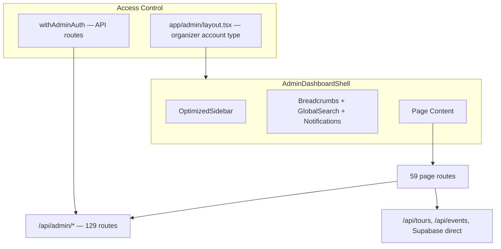

# Admin Dashboard — Full Audit Checklist

> **Purpose:** Actionable checklist for completing and hardening the admin dashboard after the recent restructure. Work through items top-to-bottom by tier. Each item is a standalone checkbox you can tick off manually.
>
> **Last audited:** June 11, 2026 (expanded: zero-mock policy + disconnected components)  
> **Scope:** 59 pages, 129 API routes, 91 shared components under `components/admin/`

---

## Zero mock data policy

**Production rule:** No mock, hardcoded, sample, or synthetic data may be shown in the admin UI. Every visible surface must read from and write to real APIs or Supabase (with RLS). If an API is not ready, hide the UI — do not show fake data.

This audit distinguishes three problems:

| Problem | Meaning | Fix |
|---------|---------|-----|
| **Live mock** | Component is mounted and shows fake data to users | Wire to API immediately or unmount |
| **Disconnected** | Component exists and may be API-ready, but no page imports/renders it | Connect to the correct page/tab |
| **Dead code** | Component has mock data and is not imported anywhere | Wire + connect, or delete |

---

## How to use this document

1. **Tier 0** — Mock data currently shown in live UI (highest priority).
2. **Tier 1** — Broken wiring, runtime errors, nav items that lead nowhere.
3. **Tier 2** — Disconnected components + APIs without UI + orphaned pages.
4. **Tier 3** — UX/UI consistency (headers, loading, errors, layout).
5. **Tier 4** — Polish, dev-tool cleanup, technical debt.

**Gold-standard reference pages** (copy this pattern everywhere):

```
AdminPageHeader → AdminStatCard (optional) → AdminFilterBar (optional) → content
Loading: AdminPageSkeleton | Error: AdminErrorCard | Empty: AdminEmptyState
```

Reference implementations: [events/page.tsx](../../app/admin/dashboard/events/page.tsx), [tours/page.tsx](../../app/admin/dashboard/tours/page.tsx), [store/page.tsx](../../app/admin/dashboard/store/page.tsx)

**Shared UI primitives:** [admin-page-header.tsx](../../app/admin/dashboard/components/admin-page-header.tsx), [admin-filter-bar.tsx](../../app/admin/dashboard/components/admin-filter-bar.tsx), [admin-empty-state.tsx](../../app/admin/dashboard/components/admin-empty-state.tsx), [admin-page-skeleton.tsx](../../app/admin/dashboard/components/admin-page-skeleton.tsx), [admin-error-card.tsx](../../app/admin/dashboard/components/admin-error-card.tsx)

---

## Architecture overview



---

## Completeness by area

| Area | Status | Main gaps |
|------|--------|-----------|
| Dashboard home | High | Embedded analytics has mock chart areas |
| Events | High | Simple create has mock artists; planner is huge but wired |
| Tours | High | List page uses non-admin API |
| Staff / Hiring | High | Neural Command tab stub; synthetic ID handling |
| Finances | High | Budget form asks for raw UUIDs |
| Ticketing | High | Trend metrics TODO in API |
| Marketplace | High | Page UI deviates from standard pattern |
| Logistics | Medium–High | **`LodgingManagement` disconnected**; mock logistics components exist but unused; page uses real hooks |
| Site maps | High | Complex but API-rich |
| RBAC | High | Custom layout (acceptable for complexity) |
| Content / Feed | High | — |
| Artists / Venues | Medium–High | Venues list uses search API; music/epk/website read-only |
| Analytics | Medium | Chart placeholders; enhanced dashboard component uses mocks |
| Calendar | **None** | Stub page; API exists but unwired |
| Contracts | **None** | Stub page |
| Communications | High | **Not in sidebar** |
| Agencies | High | Staffing agency requires manual user ID entry |

---

# Disconnected components registry

These components **already exist** in `components/admin/` but are **not imported by any page** (verified by import graph). Several are fully or partially API-ready — the work is connection, not building from scratch.

## Priority connections (component → page → API)

| Component | Wire to page | Target API / hook | Notes |
|-----------|--------------|-------------------|-------|
| [`enhanced-calendar.tsx`](../../components/admin/enhanced-calendar.tsx) | [`calendar/page.tsx`](../../app/admin/dashboard/calendar/page.tsx) | `GET/POST /api/admin/calendar` | Full calendar UI (~1100 lines). Only fetches team members today; needs calendar events from API. Replaces Phase 3 stub. |
| [`lodging-management.tsx`](../../components/admin/lodging-management.tsx) | [`logistics/page.tsx`](../../app/admin/dashboard/logistics/page.tsx) accommodations tab | `hooks/use-lodging` → `/api/admin/lodging` | **Already uses real hooks.** Logistics tab currently renders `TravelCoordinationHub` only — add or swap in `LodgingManagement`. |
| [`equipment-catalog.tsx`](../../components/admin/logistics/equipment-catalog.tsx) | Logistics equipment tab or inventory page | `GET/POST /api/admin/logistics/equipment/catalog` | API exists. Component builds catalog from local symbols instead of API. |
| [`vendor-dashboard.tsx`](../../components/admin/logistics/vendor-dashboard.tsx) | Logistics vendors tab | `/api/admin/logistics/vendors`, `/api/admin/logistics/vendor/dashboard` | APIs exist. |
| [`vendor-management.tsx`](../../components/admin/logistics/vendor-management.tsx) | Logistics vendors tab | `GET/POST /api/admin/logistics/vendors` | Uses mock vendors internally — replace with API then connect. |
| [`equipment-inventory-manager.tsx`](../../components/admin/logistics/equipment-inventory-manager.tsx) | Logistics equipment tab | `/api/admin/logistics/items`, `/api/admin/logistics/metrics` | Mock data — wire to items API then connect. |
| [`neural-staff-command.tsx`](../../components/admin/neural-staff-command.tsx) | Staff neural-command tab | TBD (AI/scheduling APIs) | Staff page has **inline placeholder** instead of importing this component. |
| [`enhanced-onboarding-system.tsx`](../../components/admin/enhanced-onboarding-system.tsx) | [`onboarding/page.tsx`](../../app/admin/dashboard/onboarding/page.tsx) | `/api/admin/onboarding/*` | Composes kanban, dashboard, candidate manager — onboarding page uses its own inline editor instead. |
| [`create-tour-form.tsx`](../../components/admin/create-tour-form.tsx) | Tours list or planner entry | `/api/admin/tours`, `/api/admin/artists` | Has mock artists. Wire artists API; connect where simple create is needed. |
| [`tour-event-selector.tsx`](../../components/admin/tour-event-selector.tsx) | Event/tour context bars, logistics filter | `/api/admin/tours`, `/api/admin/events` | Mock data — wire then add to shell or logistics. |
| [`contextual-navigation.tsx`](../../components/admin/contextual-navigation.tsx) | `AdminDashboardShell` (below breadcrumbs) | Current route + `/api/admin/tours`, `/api/admin/events` | Mock context — wire then mount in shell. |
| [`realtime-activity-feed.tsx`](../../components/admin/realtime-activity-feed.tsx) | Dashboard home sidebar/widget | Supabase realtime or `/api/admin/audit` | Mock activities — wire then add to dashboard. |
| [`customizable-dashboard.tsx`](../../components/admin/customizable-dashboard.tsx) | Dashboard home | Widget APIs per type | Widget bodies stubbed — wire each widget or remove. |
| [`platform/global-sync-dashboard.tsx`](../../components/admin/platform/global-sync-dashboard.tsx) | Connect or settings page | Connect/sync APIs | Not mounted anywhere. |
| [`communication/message-board.tsx`](../../components/admin/communication/message-board.tsx) | Communications or staff tab | `/api/admin/communications` | Not mounted; overlaps with `AdminUnifiedInbox`. |
| [`event-planner-support.tsx`](../../components/admin/event-planner-support.tsx) | Events planner | Planner APIs | Not imported. |
| [`onboarding-management.tsx`](../../components/admin/onboarding-management.tsx) | Onboarding page | `/api/admin/onboarding/*` | Not imported. |

## Dead imports (imported but never rendered)

| File | Imports | Actually renders | Action |
|------|---------|------------------|--------|
| [`staff/page.tsx`](../../app/admin/dashboard/staff/page.tsx) | `EnhancedTeamManagement`, `EnhancedAnalyticsDashboard` | `StaffRosterPanel`, `StaffAnalyticsPanel`, `StaffSchedulingTab` instead | Remove dead imports; delete or wire orphaned components |

## Orphan site-map builder files

These files under `logistics/site-map-builder/` are not imported (superseded by `simcity-site-map-viewer` chain). Audit before connecting — may be safe to delete:

- `canvas-renderer.tsx`, `duplication-system.tsx`, `element-toolbox.tsx`, `enhanced-element-toolbox.tsx`, `enhanced-toolbar.tsx`, `measurement-canvas.tsx`, `measurement-panel.tsx`, `measurement-tools.tsx`, `sleek-element-toolbox.tsx`
- `layer-manager.tsx`, `measurement-tools.tsx` (top-level logistics)

---

# APIs built but no UI

These admin API routes exist and are ready (or mostly ready) but no page consumes them:

| API route | Intended UI | Action |
|-----------|-------------|--------|
| [`/api/admin/calendar`](../../app/api/admin/calendar/route.ts) | Calendar page | Mount `EnhancedCalendar`; fix mock attendee emails in API |
| [`/api/admin/logistics/equipment/catalog`](../../app/api/admin/logistics/equipment/catalog/route.ts) | Equipment catalog tab | Connect `equipment-catalog.tsx` |
| [`/api/admin/logistics/vendors`](../../app/api/admin/logistics/vendors/route.ts) | Vendor management tab | Connect `vendor-management.tsx` or `vendor-dashboard.tsx` |
| [`/api/admin/logistics/vendor/dashboard`](../../app/api/admin/logistics/vendor/dashboard/route.ts) | Vendor dashboard | Connect `vendor-dashboard.tsx` |
| [`/api/admin/logistics/vendor/inventory`](../../app/api/admin/logistics/vendor/inventory/route.ts) | Vendor inventory UI | Connect or build thin wrapper |
| [`/api/admin/logistics/vendor/workflows`](../../app/api/admin/logistics/vendor/workflows/route.ts) | Automated workflows tab | Connect `automated-setup-workflows.tsx` (after removing mocks) |
| [`PATCH /api/admin/tasks/[id]`](../../lib/api/admin.ts) | Task status updates | **Route missing** — add handler; used by `lib/api/admin.updateTask` |
| [`/api/admin/messages/*`](../../app/api/admin/messages/threads/route.ts) | Messages page | Page exists but not in sidebar; consolidate with Communications |

---

# Tier 0 — Live mock data (fix first)

Mock or hardcoded data **currently reachable** by users in the admin UI.

## Pages showing mock data

- [ ] **Events simple create — hardcoded artists** — [`events/create/page.tsx`](../../app/admin/dashboard/events/create/page.tsx) lines 79–99. **Wire to:** `GET /api/admin/artists?search=`.
- [ ] **Analytics page — chart placeholders** — [`analytics/page.tsx`](../../app/admin/dashboard/analytics/page.tsx) `ChartPlaceholderCard` for revenue trend + audience. **Wire to:** `/api/admin/finances`, `/api/admin/analytics/top-performers`, or hide sections until data exists.
- [ ] **Dashboard embedded analytics — mock chart** — [`analytics-dashboard.tsx`](../../app/admin/dashboard/components/analytics-dashboard.tsx) ~line 586. **Wire to:** same analytics APIs used elsewhere on the page.
- [ ] **Staff Neural Command tab — inline placeholder** — [`staff/page.tsx`](../../app/admin/dashboard/staff/page.tsx) shows static "in development" card. **Wire to:** `neural-staff-command.tsx` + real APIs, or remove tab from nav.
- [ ] **Calendar page — empty stub in nav** — Sidebar links to Phase 3 empty state while users expect a calendar. **Wire to:** `enhanced-calendar.tsx` + `/api/admin/calendar`, or remove sidebar link immediately.

## Components imported into live pages with mock data

- [ ] **Enhanced global search — unreachable mock fallback** — [`enhanced-global-search.tsx`](../../components/admin/enhanced-global-search.tsx) lines 180+. Dead code after return, but delete mock block to prevent future regressions.
- [ ] **Enhanced team management — sample shifts/zones** — [`enhanced-team-management.tsx`](../../components/admin/enhanced-team-management.tsx) lines 185–268. **Not rendered** (dead import on staff page) but fix before connecting: wire to `/api/admin/staffing/shifts`, `/api/admin/staffing/zones`.
- [ ] **Enhanced analytics dashboard — full mock dataset** — [`enhanced-analytics-dashboard.tsx`](../../components/admin/enhanced-analytics-dashboard.tsx). **Not rendered** (dead import). Wire to `/api/admin/staffing/performance` or delete.

## Service-layer mock fallbacks (can inject fake records)

- [ ] **`admin-onboarding-staff.service.ts`** — creates `mock-message-*`, `mock-shift-*` IDs on failure. **Fix:** throw user-facing errors; never return synthetic records in production.
- [ ] **`job-board.service.ts`** — creates `mock-job-*`, `mock-venue-*` on failure. **Fix:** fail loudly.
- [ ] **API filters for `mock-` / `fallback-` IDs** — [`job-postings/route.ts`](../../app/api/admin/job-postings/route.ts), [`onboarding/route.ts`](../../app/api/admin/onboarding/route.ts). **Fix:** purge synthetic rows from DB; remove filter once clean.

## API responses still using mock values

- [ ] **Calendar API — mock attendee emails** — [`calendar/route.ts`](../../app/api/admin/calendar/route.ts) ~line 391. **Wire to:** real participant emails from events/tours/staff.
- [ ] **Ticketing enhanced — TODO trend calculations** — [`ticketing/enhanced/route.ts`](../../app/api/admin/ticketing/enhanced/route.ts). **Wire to:** real historical ticket data.

---

# Tier 1 — Critical

Broken wiring, dead-end navigation, or features that will fail at runtime.

## Navigation & discoverability

- [ ] **Add Communications to sidebar** — Page exists at [`/admin/dashboard/communications`](../../app/admin/dashboard/communications/page.tsx) with a working `AdminUnifiedInbox`, but it is not in [`optimized-sidebar.tsx`](../../app/admin/dashboard/components/optimized-sidebar.tsx). Users cannot discover it.
- [ ] **Consolidate or expose Messages** — [`/admin/dashboard/messages`](../../app/admin/dashboard/messages/page.tsx) is a separate, older messaging UI (broadcast + threads). Decide: merge into Communications, redirect, or add a sidebar link. Currently orphaned and duplicates Staff → Communications tab.
- [ ] **Resolve Calendar nav mismatch** — Calendar is in sidebar (`isNew: true`) but [`calendar/page.tsx`](../../app/admin/dashboard/calendar/page.tsx) is a Phase 3 stub. Either wire it to [`/api/admin/calendar`](../../app/api/admin/calendar/route.ts) or remove/hide from nav until ready.
- [ ] **Resolve Contracts discoverability** — [`contracts/page.tsx`](../../app/admin/dashboard/contracts/page.tsx) is a stub with no sidebar link. Add when built, or ensure no other UI links to it as if functional.

## Broken API wiring

- [ ] **Fix `updateTask` missing route** — [`lib/api/admin.ts`](../../lib/api/admin.ts) calls `PATCH /api/admin/tasks/${taskId}` but only [`app/api/admin/tasks/route.ts`](../../app/api/admin/tasks/route.ts) exists (GET only). Add `tasks/[id]/route.ts` or remove the client helper.
- [ ] **Align tours list API** — [`tours/page.tsx`](../../app/admin/dashboard/tours/page.tsx) fetches `/api/tours` while [`/api/admin/tours`](../../app/api/admin/tours/route.ts) exists. Switch to admin route for consistent org scoping and auth.
- [ ] **Align venues list API** — [`venues/page.tsx`](../../app/admin/dashboard/venues/page.tsx) uses `/api/search?type=venues` instead of [`/api/admin/venues`](../../app/api/admin/venues/route.ts).

## Explicit feature stubs linked in nav

- [ ] **Build Calendar page or hide nav item** — Mount [`enhanced-calendar.tsx`](../../components/admin/enhanced-calendar.tsx) on [`calendar/page.tsx`](../../app/admin/dashboard/calendar/page.tsx) with `/api/admin/calendar`, or remove sidebar link.
- [ ] **Build Contracts page or defer entirely** — Currently only shows `AdminEmptyState` ("Contract management coming soon").

## Auth & data integrity

- [ ] **Audit UI gate vs API gate alignment** — UI uses organizer account type in [`app/admin/layout.tsx`](../../app/admin/layout.tsx); APIs use `withAdminAuth`. Verify edge cases where a user passes UI gate but API returns 403.
- [ ] **Remove or migrate synthetic records** — APIs filter IDs starting with `mock-` or `fallback-` ([`job-postings/route.ts`](../../app/api/admin/job-postings/route.ts), [`onboarding/route.ts`](../../app/api/admin/onboarding/route.ts)). [`staff/page.tsx`](../../app/admin/dashboard/staff/page.tsx) warns about these. Clean DB or document as dev-only.

---

# Tier 2 — Disconnected wiring & orphaned surfaces

Components, pages, and APIs that exist but are not properly connected.

## Connect existing components to pages

- [ ] **Calendar:** Replace stub in [`calendar/page.tsx`](../../app/admin/dashboard/calendar/page.tsx) with [`EnhancedCalendar`](../../components/admin/enhanced-calendar.tsx) + `/api/admin/calendar`.
- [ ] **Lodging:** Add [`LodgingManagement`](../../components/admin/lodging-management.tsx) to logistics accommodations tab (uses `use-lodging` → `/api/admin/lodging` already).
- [ ] **Equipment catalog:** Mount [`equipment-catalog.tsx`](../../components/admin/logistics/equipment-catalog.tsx) on logistics equipment tab; fetch from `/api/admin/logistics/equipment/catalog`.
- [ ] **Vendors:** Mount [`vendor-management.tsx`](../../components/admin/logistics/vendor-management.tsx) or [`vendor-dashboard.tsx`](../../components/admin/logistics/vendor-dashboard.tsx) on logistics; wire to `/api/admin/logistics/vendors`.
- [ ] **Equipment inventory:** Mount [`equipment-inventory-manager.tsx`](../../components/admin/logistics/equipment-inventory-manager.tsx); wire to `/api/admin/logistics/items` + `/api/admin/logistics/metrics`.
- [ ] **Vendor workflows:** Mount [`automated-setup-workflows.tsx`](../../components/admin/logistics/automated-setup-workflows.tsx); wire to `/api/admin/logistics/vendor/workflows`.
- [ ] **Real-time tracker:** Mount [`real-time-equipment-tracker.tsx`](../../components/admin/logistics/real-time-equipment-tracker.tsx) only after GPS/tracking API exists; do not ship with mocks.
- [ ] **Vendor collaboration:** Mount [`vendor-collaboration-hub.tsx`](../../components/admin/logistics/vendor-collaboration-hub.tsx); wire to vendor messaging APIs or defer.
- [ ] **Onboarding hub:** Replace inline editor on [`onboarding/page.tsx`](../../app/admin/dashboard/onboarding/page.tsx) with [`enhanced-onboarding-system.tsx`](../../components/admin/enhanced-onboarding-system.tsx).
- [ ] **Tour create:** Wire [`create-tour-form.tsx`](../../components/admin/create-tour-form.tsx) to tours flow with `/api/admin/artists` (remove mock artists).
- [ ] **Contextual nav:** Mount [`contextual-navigation.tsx`](../../components/admin/contextual-navigation.tsx) in shell with real tour/event from route.
- [ ] **Activity feed:** Mount [`realtime-activity-feed.tsx`](../../components/admin/realtime-activity-feed.tsx) on dashboard with Supabase realtime or audit API.
- [ ] **Remove dead imports** on [`staff/page.tsx`](../../app/admin/dashboard/staff/page.tsx): `EnhancedTeamManagement`, `EnhancedAnalyticsDashboard`.

## Mock-only components (not connected — wire before mounting)

These are **not shown to users today** but contain mock data. Do not connect until wired:

- [ ] [`equipment-inventory-manager.tsx`](../../components/admin/logistics/equipment-inventory-manager.tsx)
- [ ] [`real-time-equipment-tracker.tsx`](../../components/admin/logistics/real-time-equipment-tracker.tsx)
- [ ] [`vendor-collaboration-hub.tsx`](../../components/admin/logistics/vendor-collaboration-hub.tsx)
- [ ] [`vendor-management.tsx`](../../components/admin/logistics/vendor-management.tsx)
- [ ] [`automated-setup-workflows.tsx`](../../components/admin/logistics/automated-setup-workflows.tsx)
- [ ] [`equipment-catalog.tsx`](../../components/admin/logistics/equipment-catalog.tsx) — partial mock from symbols
- [ ] [`enhanced-team-management.tsx`](../../components/admin/enhanced-team-management.tsx) — sample shifts/zones only
- [ ] [`enhanced-analytics-dashboard.tsx`](../../components/admin/enhanced-analytics-dashboard.tsx) — full mock dataset
- [ ] [`contextual-navigation.tsx`](../../components/admin/contextual-navigation.tsx)
- [ ] [`realtime-activity-feed.tsx`](../../components/admin/realtime-activity-feed.tsx)
- [ ] [`tour-event-selector.tsx`](../../components/admin/tour-event-selector.tsx)
- [ ] [`create-tour-form.tsx`](../../components/admin/create-tour-form.tsx)

## Navigation & page orphans

- [ ] **Add Communications to sidebar** — [`communications/page.tsx`](../../app/admin/dashboard/communications/page.tsx) + `AdminUnifiedInbox` works but not in [`optimized-sidebar.tsx`](../../app/admin/dashboard/components/optimized-sidebar.tsx).
- [ ] **Consolidate Messages** — [`messages/page.tsx`](../../app/admin/dashboard/messages/page.tsx) uses `/api/admin/messages/*`; merge into Communications or redirect.
- [ ] **Contracts page** — stub only; no sidebar link. Build or remove route.

## API path inconsistencies

- [ ] **Tours list** — [`tours/page.tsx`](../../app/admin/dashboard/tours/page.tsx) uses `/api/tours`; switch to `/api/admin/tours`.
- [ ] **Venues list** — [`venues/page.tsx`](../../app/admin/dashboard/venues/page.tsx) uses `/api/search?type=venues`; switch to `/api/admin/venues`.
- [ ] **Fix `updateTask`** — add `app/api/admin/tasks/[id]/route.ts` or remove [`lib/api/admin.ts`](../../lib/api/admin.ts) helper.

## Stubs & incomplete features

- [ ] **PDF generator** — [`pdf-generator.ts`](../../app/admin/dashboard/components/lib/pdf-generator.ts) returns "not implemented"; wire or remove export buttons.
- [ ] **Slack service** — [`slack-service.ts`](../../app/admin/dashboard/components/lib/slack-service.ts) all TODO; wire or hide Slack UI.
- [ ] **Teams performance tab** — [`teams/[jobId]/page.tsx`](../../app/admin/(dashboard-shell)/teams/[jobId]/page.tsx) "coming soon".
- [ ] **Lodging calendar sub-feature** — [`lodging-management.tsx`](../../components/admin/lodging-management.tsx) "Calendar integration coming soon" (component itself is API-ready via hooks).
- [ ] **Customizable dashboard widgets** — [`customizable-dashboard.tsx`](../../components/admin/customizable-dashboard.tsx) stub widgets.

## Duplicate entry points

- [ ] **Site maps** — consolidate [`logistics/site-maps-enhanced`](../../app/admin/dashboard/logistics/site-maps-enhanced/page.tsx) with logistics tab.
- [ ] **Ticketing enhanced redirect** — remove or implement [`ticketing/enhanced/page.tsx`](../../app/admin/dashboard/ticketing/enhanced/page.tsx).

## Read-only monitors (need actions or honest labeling)

- [ ] **Music, EPK, Website pages** — RSC read-only monitors; add moderation actions or rename UI to "Monitor".

## Form UX (real data, poor wiring)

- [ ] **Finances budget form** — raw tour/event UUIDs → searchable selects.
- [ ] **RBAC role assignment** — raw user ID → user search (`/api/admin/users/search`).
- [ ] **Agencies staffing** — manual user ID → user lookup.

---

# Tier 3 — UX/UI consistency

Standardize visual patterns so every admin page feels like one product.

## Canonical page pattern adoption

**Target:** Every list/hub page uses `AdminPageHeader` + optional `AdminFilterBar` + `AdminPageSkeleton` / `AdminErrorCard` / `AdminEmptyState`.

### Pages missing `AdminPageHeader` (align to events/tours pattern)

- [ ] [`dashboard/page.tsx`](../../app/admin/dashboard/page.tsx) — uses `OptimizedDashboardClient` (acceptable if intentional; audit widget consistency).
- [ ] [`marketplace/page.tsx`](../../app/admin/dashboard/marketplace/page.tsx) — custom `text-2xl` header + inline icon.
- [ ] [`jobs/page.tsx`](../../app/admin/dashboard/jobs/page.tsx) — gradient hero card header.
- [ ] [`onboarding/page.tsx`](../../app/admin/dashboard/onboarding/page.tsx) — no page-level header.
- [ ] [`rbac/page.tsx`](../../app/admin/dashboard/rbac/page.tsx) — custom Shield layout (may keep if complex; still align title/actions spacing).
- [ ] [`marketplace/orders/[id]/page.tsx`](../../app/admin/dashboard/marketplace/orders/[id]/page.tsx) — verify header pattern.
- [ ] Detail/sub-pages: `events/[id]`, `hq`, `command-center`, `check-in`, `tours/[id]`, `venues/[id]` — document intentional wizard/detail layouts or add lightweight headers.

### Pages needing `AdminFilterBar`

Currently only used on: events, staff, tours, store, marketplace/orders.

- [ ] Add `AdminFilterBar` to **marketplace** (replace inline selects/inputs).
- [ ] Add `AdminFilterBar` to **jobs** (replace hero inline search).
- [ ] Add `AdminFilterBar` to **network** (replace card-wrapped search).
- [ ] Add `AdminFilterBar` to **inventory** (replace custom search chip).
- [ ] Add `AdminFilterBar` to **content** and **feed** if list filtering is needed.

## Loading state standardization

Pick **`AdminPageSkeleton`** as the default full-page loader.

| Current pattern | Pages | Action |
|-----------------|-------|--------|
| `AdminPageSkeleton` | events, tours, staff, finances, venues, audit, marketplace/orders | Keep |
| `BrandLoadingScreen` | route `loading.tsx` | Align with skeleton or document as route-level only |
| `Loader2` spinner | network, content, jobs, logistics, detail pages | Migrate to skeleton |
| Text-only "Loading…" | marketplace, messages | Migrate to skeleton |
| Inline/partial | analytics stat cards | Keep for refresh; use skeleton on initial load |

- [ ] **Marketplace** — replace "Loading moderation queue…" text with `AdminPageSkeleton`.
- [ ] **Messages** — replace "Loading threads…" text with `AdminPageSkeleton`.
- [ ] **Logistics** — replace centered `Loader2` / border spinner with `AdminPageSkeleton`.
- [ ] **Jobs, network, content** — replace spinners with skeleton.

## Error state standardization

Pick **`AdminErrorCard`** (+ toast for transient failures) as the default.

- [ ] **Staff page** — replace custom red `Card` error with `AdminErrorCard`.
- [ ] **Logistics page** — replace custom full-page red `Card` with `AdminErrorCard`.
- [ ] **Finances page** — add inline `AdminErrorCard` on fetch failure (currently toast-only).
- [ ] **Marketplace page** — add inline `AdminErrorCard` (currently toast-only).
- [ ] **Analytics page** — replace amber inline text with `AdminErrorCard`.
- [ ] **Messages page** — replace amber warning card with `AdminErrorCard`.
- [ ] **Dashboard home** — `OptimizedDashboardClient` swallows errors (`statsError` hardcoded null); surface errors to user.

## Empty state standardization

- [ ] **Marketplace** — replace plain text empty with `AdminEmptyState`.
- [ ] **Network** — replace minimal empty with `AdminEmptyState`.
- [ ] **Messages** — replace minimal empty with `AdminEmptyState`.
- [ ] **Staff tabs** (job postings, onboarding, neural command) — replace bespoke centered icons with `AdminEmptyState`.
- [ ] **Messages page** — add `icon` prop to `AdminPageHeader` (currently missing; inconsistent with peers).

## Layout & spacing fixes

- [ ] **Logistics — remove duplicate `Header`** — [`logistics/page.tsx`](../../app/admin/dashboard/logistics/page.tsx) imports `@/components/header` inside admin shell (duplicate top chrome).
- [ ] **Logistics & inventory — fix double padding** — `container mx-auto p-4` inside shell that already applies `p-4 sm:p-6`.
- [ ] **Events page — container consistency** — uses `container mx-auto`; decide whether all list pages use container or none.
- [ ] **Staff tabs overflow** — `TabsList` uses `grid-cols-8` but there are 10 tabs. Fix grid or use scrollable tabs.

## Visual token consistency

| Token | Standard | Deviations to fix |
|-------|----------|-------------------|
| Page title | `AdminPageHeader` → `text-3xl font-bold text-white` | marketplace, jobs use `text-2xl` |
| Primary button | `bg-gradient-to-r from-purple-600 to-blue-600` | jobs uses flat `bg-purple-600` |
| Card surface | `rounded-sm bg-slate-900/60 border-slate-700/50 backdrop-blur-sm` | jobs `rounded-xl bg-slate-800/60`; marketplace missing `backdrop-blur-sm` |
| Tab active state | purple→blue gradient | marketplace solid purple; jobs slate only |
| Border radius | prefer `rounded-sm` on admin cards | mix of `rounded-lg`, `rounded-xl`, `rounded-2xl` |

- [ ] **Marketplace** — align cards, tabs, header, buttons to standard tokens.
- [ ] **Jobs** — align hero card, tabs, buttons to standard tokens.
- [ ] **Route error boundary** — [`error.tsx`](../../app/admin/dashboard/error.tsx) uses `rounded-2xl` violet/fuchsia gradient; align with page-level error styling.

## Messaging surface consolidation (UX)

Three separate comms surfaces exist:

1. **Communications** — `/admin/dashboard/communications` (unified inbox)
2. **Messages** — `/admin/dashboard/messages` (broadcast + threads)
3. **Staff → Communications tab** — embedded in staff page

- [ ] **Define single comms UX** — One nav item, one primary inbox, optional broadcast as sub-feature. Document IA decision and deprecate duplicates.

---

# Tier 4 — Low priority & cleanup

Polish, dev tools, and technical debt.

## Dev / maintenance pages (gate from production)

| Route | Purpose |
|-------|---------|
| [`/admin/dashboard/test-api`](../../app/admin/dashboard/test-api/page.tsx) | Manual API tester |
| [`/admin/(dashboard-shell)/debug`](../../app/admin/(dashboard-shell)/debug/page.tsx) | Auth/onboarding debug |
| [`/admin/(dashboard-shell)/setup`](../../app/admin/(dashboard-shell)/setup/page.tsx) | SQL table setup runner |
| [`/admin/(dashboard-shell)/create-tables`](../../app/admin/(dashboard-shell)/create-tables/page.tsx) | Migration API caller |
| [`/admin/(dashboard-shell)/reset-onboarding`](../../app/admin/(dashboard-shell)/reset-onboarding/page.tsx) | Delete onboarding record |
| [`/admin/(dashboard-shell)/request`](../../app/admin/(dashboard-shell)/request/page.tsx) | Submit admin access request |

- [ ] **Gate dev pages** — Hide behind `NODE_ENV === 'development'`, feature flag, or super-admin role.
- [ ] **Remove test-api from production builds** or move to internal tools route.

## Technical debt

- [ ] **Duplicate Shadcn UI kit** — [`app/admin/dashboard/components/ui/`](../../app/admin/dashboard/components/ui/) (~40 components) duplicates `@/components/ui/`. Migrate imports and delete duplicate kit.
- [ ] **Placeholder Supabase types** — [`app/admin/dashboard/components/types/supabase.ts`](../../app/admin/dashboard/components/types/supabase.ts) marked "placeholder structure". Replace with generated types.
- [ ] **Remove console.log debug** — [`enhanced-analytics-dashboard.tsx`](../../components/admin/enhanced-analytics-dashboard.tsx) and scattered admin files.
- [ ] **Empty catch blocks** — Staff permissions, team fetch, and others use `catch {}` silently. Add logging or user-facing error.
- [ ] **Service-layer mock fallbacks** — [`lib/services/admin-onboarding-staff.service.ts`](../../lib/services/admin-onboarding-staff.service.ts) and [`lib/services/job-board.service.ts`](../../lib/services/job-board.service.ts) create `mock-*` IDs on failure. Fail loudly in production instead.

## Sidebar & badge polish

- [ ] **Calendar `isNew` badge** — Remove when feature ships or rename to "Preview" while stub.
- [ ] **Connect Telemetry "New" badge** — Review if still needed.
- [ ] **Verify sidebar badge counts** — [`use-admin-stats.ts`](../../app/admin/dashboard/hooks/use-admin-stats.ts) falls back to zeros on error; consider error indicator on sidebar.

---

# Per-page checklist (all 59 routes)

Quick reference for page-level status. ✅ = wired & usable, ⚠️ = partial/mock, ❌ = stub, 🔧 = dev-only.

| Route | Status | Notes |
|-------|--------|-------|
| `/admin` | ✅ | Redirect to dashboard |
| `/admin/settings` | ✅ | Redirect to dashboard settings |
| `/admin/dashboard` | ⚠️ | Widget layout; some analytics mock areas |
| `/admin/dashboard/events` | ✅ | Gold standard |
| `/admin/dashboard/events/[id]` | ✅ | Large feature hub |
| `/admin/dashboard/events/[id]/hq` | ✅ | Bulletins, resources, calendar, jobs |
| `/admin/dashboard/events/[id]/command-center` | ✅ | Command center view |
| `/admin/dashboard/events/[id]/day-sheet` | ✅ | Day sheet + distribute |
| `/admin/dashboard/events/[id]/check-in` | ✅ | Ticket check-in |
| `/admin/dashboard/events/[id]/advancing` | ✅ | Advancing form |
| `/admin/dashboard/events/create` | ⚠️ | Mock artists |
| `/admin/dashboard/events/planner` | ✅ | Massive wizard, wired |
| `/admin/dashboard/tours` | ⚠️ | Uses `/api/tours` not admin API |
| `/admin/dashboard/tours/[id]` | ✅ | Heavily wired |
| `/admin/dashboard/tours/planner` | ✅ | Multi-step wizard |
| `/admin/dashboard/staff` | ⚠️ | Neural command stub; synthetic IDs |
| `/admin/dashboard/jobs` | ⚠️ | UI pattern drift |
| `/admin/dashboard/finances` | ⚠️ | Budget UUID UX; toast-only errors |
| `/admin/dashboard/ticketing` | ✅ | Overview + promos |
| `/admin/dashboard/ticketing/enhanced` | 🔧 | Redirect only |
| `/admin/dashboard/marketplace` | ⚠️ | UI drift; text loading |
| `/admin/dashboard/marketplace/orders` | ✅ | Gold standard |
| `/admin/dashboard/marketplace/orders/[id]` | ✅ | Order detail + payout retry |
| `/admin/dashboard/inventory` | ✅ | CRUD wired; table layout |
| `/admin/dashboard/store` | ✅ | Gold standard |
| `/admin/dashboard/features` | ✅ | Feature flags CRUD |
| `/admin/dashboard/rbac` | ✅ | Custom layout |
| `/admin/dashboard/onboarding` | ⚠️ | No page header |
| `/admin/dashboard/content` | ✅ | Moderation |
| `/admin/dashboard/feed` | ✅ | Feed moderation |
| `/admin/dashboard/network` | ⚠️ | Toast-only errors |
| `/admin/dashboard/artists` | ✅ | Roster CRUD |
| `/admin/dashboard/artists/[id]` | ✅ | Detail/edit |
| `/admin/dashboard/artists/new` | ✅ | Create artist |
| `/admin/dashboard/venues` | ⚠️ | Uses search API |
| `/admin/dashboard/venues/[id]` | ✅ | Venue detail |
| `/admin/dashboard/agencies` | ⚠️ | Manual user ID for staffing |
| `/admin/dashboard/connect` | ✅ | Connect telemetry |
| `/admin/dashboard/settings` | ✅ | Account settings |
| `/admin/dashboard/settings/audit` | ✅ | Audit log |
| `/admin/dashboard/analytics` | ⚠️ | Chart placeholders |
| `/admin/dashboard/logistics` | ⚠️ | Real hooks wired; `LodgingManagement` not mounted; mock components exist but unused |
| `/admin/dashboard/logistics/site-maps-enhanced` | ⚠️ | Duplicate entry |
| `/admin/dashboard/communications` | ⚠️ | Wired but not in nav |
| `/admin/dashboard/messages` | ⚠️ | Orphaned; older UI |
| `/admin/dashboard/contracts` | ❌ | Stub |
| `/admin/dashboard/calendar` | ❌ | Stub; API exists |
| `/admin/dashboard/music` | ⚠️ | Read-only monitor |
| `/admin/dashboard/epk` | ⚠️ | Read-only monitor |
| `/admin/dashboard/website` | ⚠️ | Read-only monitor |
| `/admin/dashboard/test-api` | 🔧 | Dev only |
| `/admin/applications` | ✅ | Application review |
| `/admin/(dashboard-shell)/job-postings/new` | ✅ | New job form |
| `/admin/(dashboard-shell)/teams/[jobId]` | ⚠️ | Performance tab stub |
| `/admin/(dashboard-shell)/debug` | 🔧 | Dev only |
| `/admin/(dashboard-shell)/setup` | 🔧 | Dev only |
| `/admin/(dashboard-shell)/create-tables` | 🔧 | Dev only |
| `/admin/(dashboard-shell)/reset-onboarding` | 🔧 | Dev only |
| `/admin/(dashboard-shell)/request` | ✅ | Admin access request |

---

# Shared components audit (`components/admin/`)

Legend: **Live** = mounted in UI | **Orphan** = not imported | **Mock** = uses fake data | **Ready** = uses real APIs

| Component | State | Connect to | API |
|-----------|-------|--------------|-----|
| `lodging-management.tsx` | Orphan, **Ready** | Logistics accommodations tab | `use-lodging` → `/api/admin/lodging` |
| `enhanced-calendar.tsx` | Orphan, partial | Calendar page | `/api/admin/calendar` (+ team-members) |
| `vendor-dashboard.tsx` | Orphan | Logistics vendors tab | `/api/admin/logistics/vendor/dashboard` |
| `vendor-management.tsx` | Orphan, Mock | Logistics vendors tab | `/api/admin/logistics/vendors` |
| `equipment-catalog.tsx` | Orphan, Mock | Logistics equipment tab | `/api/admin/logistics/equipment/catalog` |
| `equipment-inventory-manager.tsx` | Orphan, Mock | Logistics equipment tab | `/api/admin/logistics/items` |
| `automated-setup-workflows.tsx` | Orphan, Mock | Logistics workflows tab | `/api/admin/logistics/vendor/workflows` |
| `real-time-equipment-tracker.tsx` | Orphan, Mock | Defer until tracking API | TBD |
| `vendor-collaboration-hub.tsx` | Orphan, Mock | Defer or vendor comms tab | TBD |
| `enhanced-onboarding-system.tsx` | Orphan | Onboarding page | `/api/admin/onboarding/*` |
| `onboarding-management.tsx` | Orphan | Onboarding page | `/api/admin/onboarding/*` |
| `create-tour-form.tsx` | Orphan, Mock | Tours create flow | `/api/admin/artists`, `/api/admin/tours` |
| `neural-staff-command.tsx` | Orphan | Staff neural-command tab | TBD |
| `contextual-navigation.tsx` | Orphan, Mock | Admin shell | route + tour/event APIs |
| `realtime-activity-feed.tsx` | Orphan, Mock | Dashboard widget | audit/realtime |
| `customizable-dashboard.tsx` | Orphan, Mock | Dashboard home | per-widget |
| `tour-event-selector.tsx` | Orphan, Mock | Logistics / shell | `/api/admin/tours`, `/api/admin/events` |
| `enhanced-team-management.tsx` | Orphan, Mock | Replace dead import on staff | `/api/admin/staffing/*` |
| `enhanced-analytics-dashboard.tsx` | Orphan, Mock | Delete or staff analytics | `/api/admin/staffing/performance` |
| `create-event-form.tsx` | **Live**, Ready | Events page | `/api/admin/events` |
| `enhanced-global-search.tsx` | **Live**, Ready | Shell (remove dead mock block) | search APIs |
| `logistics/site-map/*` | **Live**, Ready | Logistics, events | site-map APIs |
| `staff-scheduling-tab.tsx` | **Live**, Ready | Staff scheduling tab | `/api/admin/staffing/*` |
| `staff-analytics-panel.tsx` | **Live**, Ready | Staff analytics tab | `/api/admin/staff`, applications |
| `staff-roster-panel.tsx` | **Live**, Ready | Staff team-management tab | `/api/admin/staff` |
| `travel-coordination-hub.tsx` | **Live**, Ready | Logistics accommodations | `/api/admin/travel-coordination` |
| `logistics-dynamic-manager.tsx` | **Live**, Ready | Logistics, events, tours | `/api/admin/logistics/items` |
| `event-*` / `tour-*` managers | **Live**, Ready | Event/tour detail pages | various |
| `enhanced-application-review.tsx` | **Live**, Ready | Staff applications tab | `/api/admin/applications` |
| `enhanced-job-posting-form.tsx` | **Live**, Ready | Staff jobs dialog | job-postings API |
| `admin-unified-inbox.tsx` | **Live**, Ready | Communications page (not in nav) | `/api/admin/communications` |

---

# Suggested work order (sprints)

### Sprint 1 — Zero mock in live UI (Tier 0)
1. Events create — wire artists to `/api/admin/artists`
2. Analytics — replace chart placeholders with real data or hide
3. Calendar — mount `EnhancedCalendar` or remove sidebar link
4. Remove service-layer mock fallbacks (`mock-*` IDs)

### Sprint 2 — Connect what already exists (Tier 2)
1. **`LodgingManagement`** → logistics accommodations tab (fast win — hooks already work)
2. **`EnhancedCalendar`** → calendar page + `/api/admin/calendar`
3. Communications → sidebar; merge Messages
4. Equipment catalog + vendor components → logistics tabs
5. Remove dead imports on staff page

### Sprint 3 — Broken wiring (Tier 1)
1. Fix `updateTask` route
2. Align tours/venues to admin APIs
3. Auth gate audit

### Sprint 4 — UX consistency (Tier 3)
1. Marketplace + jobs page alignment
2. Loading/error standardization
3. Logistics layout fixes (remove duplicate Header)

### Sprint 5 — Polish (Tier 4)
1. Dev page gating
2. Delete orphan site-map-builder files
3. Contracts feature (when prioritized)

---

# Verification checklist (after each item)

When completing any item above, verify:

- [ ] Page loads without console errors
- [ ] **No mock arrays, sample data, or `mock-*` IDs** in UI or API responses
- [ ] Data comes from real API / Supabase (with org scoping + RLS)
- [ ] Component is **imported and rendered** on the correct page (not just built)
- [ ] Loading state uses `AdminPageSkeleton` (or documented exception)
- [ ] Error state uses `AdminErrorCard` or toast + inline message
- [ ] Empty state uses `AdminEmptyState` with actionable CTA
- [ ] Page uses `AdminPageHeader` with icon + subtitle + actions
- [ ] API route uses `withAdminAuth` and org scoping
- [ ] Feature is reachable from sidebar (or intentionally hidden)
- [ ] Mobile layout checked (`sm:` breakpoints, sidebar collapse)

---

*Generated from codebase audit. Policy: zero mock data in production UI. Update this document as items are completed.*
