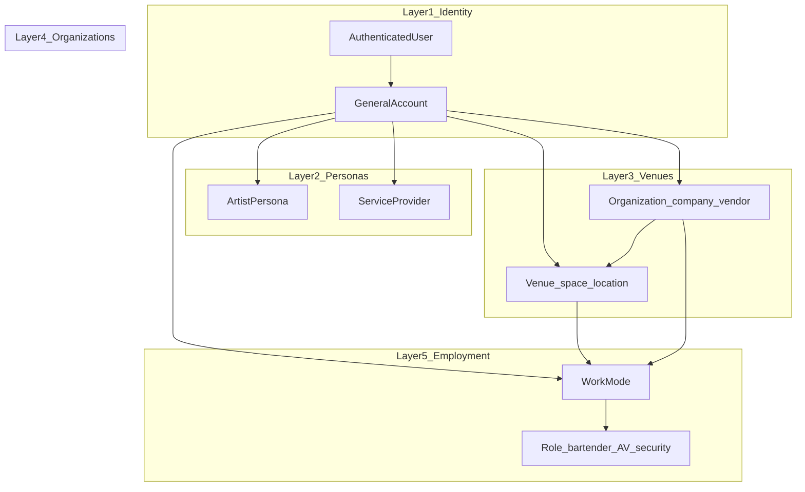
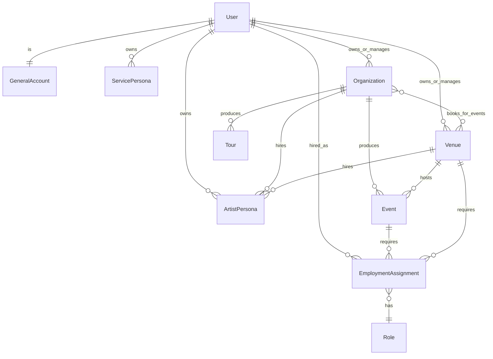
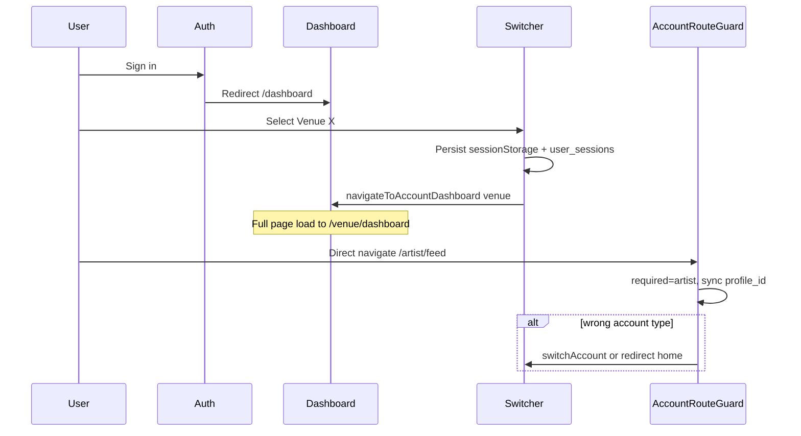
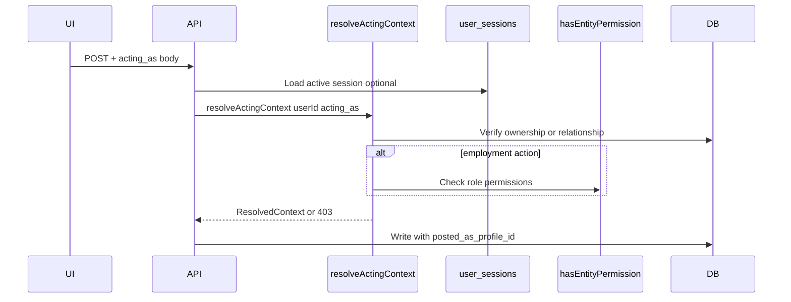
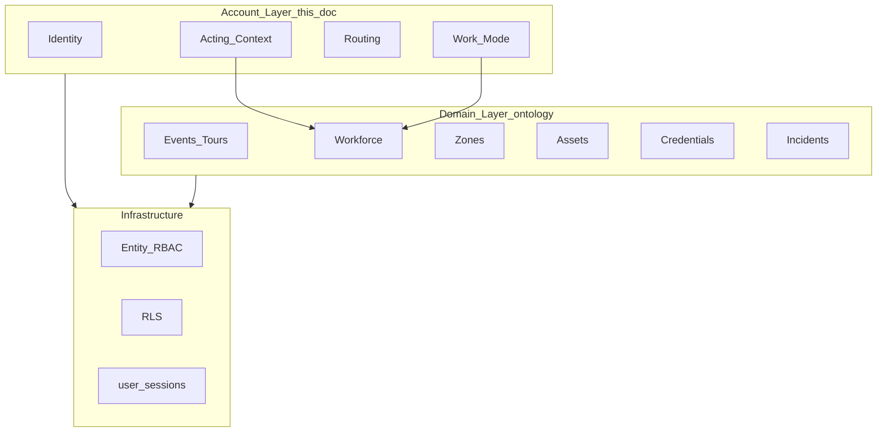

# Tourify Multi-Account System — Architecture Foundation

**Status:** Canonical specification (Phase 0)  
**Last updated:** 2026-06-08  
**Audience:** Engineering, product, and future contributors  

This document is the **single source of truth** for how accounts, routing, permissions, and feature scoping work in Tourify. All implementation work on account switching, feed attribution, jobs, and staffing must align with this spec before shipping.

**Companion documents:**

- [`strategic-architecture-review.md`](strategic-architecture-review.md) — Strategic evaluation of platform-wide recommendations (entities, workforce, event OS, credentialing)
- [`../domain/live-events-ontology.md`](../domain/live-events-ontology.md) — Live events industry domain model; prerequisite for new domain tables and features

---

## Table of Contents

1. [Vision & Invariants](#1-vision--invariants)
2. [Terminology Glossary](#2-terminology-glossary)
3. [Entity Hierarchy](#3-entity-hierarchy)
4. [Data Model](#4-data-model)
5. [Routing Specification](#5-routing-specification)
6. [Acting Context Protocol](#6-acting-context-protocol)
7. [Permission Matrix](#7-permission-matrix)
8. [Work Mode Specification](#8-work-mode-specification)
9. [Feature Catalog](#9-feature-catalog)
10. [Migration & Deprecation Map](#10-migration--deprecation-map)
11. [Implementation Phases](#11-implementation-phases)
12. [Open Questions & Review Notes](#12-open-questions--review-notes)
13. [Strategic Architecture Alignment](#13-strategic-architecture-alignment)
14. [Architectural Review Requirement](#14-architectural-review-requirement)

---

## 1. Vision & Invariants

### 1.1 Formal Statement

Tourify is a **multi-entity platform** where one authenticated human (**Identity**) can operate many **distinct public and operational entities**. Each entity has its own feed, permissions, and dashboard.

**Every user action must be attributed to exactly one acting entity at the time of the action.**

The Identity is the login (email → `auth.users` / `profiles`). It is **not** the same as an artist page, venue page, or organization page—even when the same person owns all of them.

### 1.2 Sign-In & Home Base

1. User signs in with their email → lands on **`/dashboard`** (General / personal home base).
2. The dashboard is the hub to explore features, view the personal feed, and **create or switch** to other entities (artist persona, venue, organization).
3. Switching entity navigates to that entity's canonical home route (see [Section 5](#5-routing-specification)).

### 1.3 Core Invariants

| ID | Invariant | Example |
|----|-----------|---------|
| **I1** | One auth user maps to exactly one General account | Email login → `profiles.id = auth.users.id` |
| **I2** | Each entity type has a distinct public identity | Artist feed ≠ Venue feed ≠ Org feed ≠ Personal feed |
| **I3** | Actions attribute to the **active acting context** | Repost as General → personal feed; repost as Venue X → Venue X feed |
| **I4** | Server validates acting context on mutations | Client switcher alone is never sufficient for writes |
| **I5** | Multiple entities of the same type require explicit `profile_id` | Two venues → switcher must carry venue UUID, not "first venue" |
| **I6** | Employment (Work Mode) is separate from persona pages | Bartender role ≠ a public "staff page"; it's operational context |
| **I7** | Organizations can operate at venues they do not own | Org runs event at third-party venue; hires artists and staff |

### 1.4 Layer Model



---

## 2. Terminology Glossary

### 2.1 Layer 1 — Identity

| Term | Code type | DB anchor | Description |
|------|-----------|-----------|-------------|
| **Identity** | — | `auth.users` | The real person; one email login |
| **General Account** | `general` | `profiles` (id = user id) | Personal dashboard, personal feed, account hub |
| **Personal feed** | — | posts where `posted_as_account_type = 'general'` | Content attributed to the individual |

**UI label:** "Personal" or user's display name  
**Home route:** `/dashboard`

### 2.2 Layer 2 — Personas

Individual professional identities owned by the Identity. These are **public-facing profiles** with their own feeds.

| Term | Code type (target) | DB anchor | Description |
|------|-------------------|-----------|-------------|
| **Artist** | `artist` | `artist_profiles` | Music/creative persona; bookings, artist feed |
| **Service Provider** | `service` | TBD: `service_profiles` or `artist_profiles.service_categories` | Photographer, dancer, DJ, A/V freelancer, etc. |
| **Team Member** | *(not a switcher type)* | employment assignment | Capacity to be hired; surfaced via Work Mode |

**Notes:**
- "Staff" in product copy = **employment relationship**, not a top-level switcher persona.
- "Team" = collective staffing for an event, venue, or tour.
- A person can be a Team Member (Work Mode) **and** have an Artist or Service persona.

**Home routes:** `/artist` (artist); `/services/{slug}` (service — future)

### 2.3 Layer 3 — Venues

| Term | Code type | DB anchor | Description |
|------|-----------|-----------|-------------|
| **Venue** | `venue` | `venue_profiles` | Physical/logical space: address, capacity, owner, venue events, venue feed |

**Ownership:** General user or Organization.  
**Home route:** `/venue/dashboard` → future `/venue/{slug}/dashboard`

### 2.4 Layer 4 — Organizations

| Term | Code type (target) | Legacy code type | DB anchor | Description |
|------|-------------------|------------------|-----------|-------------|
| **Organization** | `organization` | `admin` | `organizer_accounts`, `profiles.account_settings` | Company, vendor, promoter, conglomerate; tours, events, hiring |

**UI label:** "Organizer" or organization name (migrate to "Organization" over time).  
**Home route:** `/admin/dashboard` → future `/org/{slug}/dashboard`

Routes remain `/admin/*` until slug migration (Phase-later). Wave 5 added a forward-only alias `/org/:slug/dashboard` → `/admin/dashboard` — see `docs/audits/ADMIN_ORG_RENAME.md` (AUD-0114).

### 2.5 Layer 5 — Employment (Work Mode)

| Term | Code type | Description |
|------|-----------|-------------|
| **Work Mode** | `employment` (context object) | Operational scope: venue, event, or tour + role + permissions |
| **Employment Assignment** | — | Record linking Identity to scope + role |
| **Role** | enum / job title | Bartender, Security, Bar Back, A/V Tech, Stage Manager, etc. |

Work Mode is **not** a public profile page. The user stays authenticated as their General identity but actions in Work Mode attribute to the operational context per role permissions.

### 2.6 Code Type Migration Map

| Legacy / current | Target canonical | Alias period |
|------------------|------------------|--------------|
| `general` | `general` | — |
| `artist` | `artist` | — |
| `admin` | `organization` | Accept both in code during Phases 1–2 |
| `staff` | *(deprecated as switcher type)* | Map to Work Mode |
| `primary` (enhanced-accounts) | `general` | Remove |
| `organizer` (enhanced-accounts) | `organization` | Remove |
| `business` (enhanced-accounts) | `venue` or `organization` | Remove |

---

## 3. Entity Hierarchy

### 3.1 Relationship Diagram



### 3.2 Ownership vs Operation

| Scenario | Rule |
|----------|------|
| Venue owned by individual | `venue_profiles.user_id = auth user` |
| Venue owned by organization | Organization has ownership via `account_relationships` or org-venue link (TBD) |
| Org runs event at external venue | Org manages event; venue provides space; separate acting contexts |
| Artist hired for event | Application tied to `artist_profile_id`; contract under org or venue |
| Staff hired for shift | `EmploymentAssignment` with role; Work Mode entry |

### 3.3 Service Provider Model (Decision Required)

**Recommended approach (Phase 1 doc default):** Extend `artist_profiles` with optional `persona_kind: 'artist' | 'service'` and `service_categories: string[]` (photographer, dancer, etc.) rather than a new table immediately.

**Alternative (Phase 4+):** Dedicated `service_profiles` table mirroring `artist_profiles`.

See [Section 12](#12-open-questions--review-notes) for review items.

---

## 4. Data Model

### 4.1 Core Tables (Existing)

| Table | Entity | Key columns | Notes |
|-------|--------|-------------|-------|
| `auth.users` | Identity | `id`, `email` | Supabase Auth |
| `profiles` | General | `id` (= user id), `account_settings` JSON | Personal account; legacy organizer data in JSON |
| `artist_profiles` | Artist / Service | `id`, `user_id`, `main_profile_id`, `artist_name` | Multiple per user allowed |
| `venue_profiles` | Venue | `id`, `user_id`, `main_profile_id`, `url_slug` | Multiple per user allowed |
| `organizer_accounts` | Organization | `id`, `user_id`, `organization_name` | Target rename to `organizations` (future) |
| `user_sessions` | Active context | `user_id`, `active_profile_id`, `active_account_type`, `session_data` | Server-readable session; **add `staff`/`organization` to CHECK** |
| `account_relationships` | Delegated ownership | `owner_user_id`, `owned_profile_id`, `account_type`, `permissions` | **Re-enable for listing + validation** |
| `account_activity_log` | Audit | `user_id`, `profile_id`, `action_type` | Switch/create audit |
| `cross_account_permissions` | Grants | `grantor_profile_id`, `grantee_user_id`, `permission_type` | Post-as, manage content |
| `venue_team_members` | Legacy staff | `venue_id`, `user_id`, `role`, `status` | **Deprecated** → `staff_members` |
| `staff_members` | Unified roster | `entity_type`, `entity_id`, `user_id` | Canonical staffing table |
| `job_posting_templates` | Venue/org staffing jobs | `venue_id`, ... | RBAC via `has_entity_permission` |
| `artist_jobs` | Gig board | `posted_by`, `posted_by_type`, `poster_profile_id` | `poster_profile_id` exists in types but **not enforced in API** |
| `posts` | Social content | `user_id` only in live schema | Archive migration adds `posted_as_*`; **not in production types yet** |

### 4.2 Target Tables (To Add)

| Table | Purpose | Key columns |
|-------|---------|-------------|
| `employment_assignments` | Work Mode source of truth | `id`, `user_id`, `venue_id?`, `event_id?`, `tour_id?`, `role_title`, `role_category`, `permissions` JSONB, `status`, `starts_at`, `ends_at` |
| `acting_context_snapshots` | Optional audit on mutations | `mutation_id`, `acting_profile_id`, `acting_account_type`, `work_assignment_id?` |

### 4.3 Posts Schema Target

Extend `posts` (new migration required):

```sql
-- Target columns (align with migrations/0004_multi_account_system.sql)
posted_as_profile_id UUID
posted_as_account_type TEXT CHECK (posted_as_account_type IN (
  'general', 'artist', 'service', 'venue', 'organization'
))
posted_as_display_name TEXT
posted_as_avatar_url TEXT
work_assignment_id UUID REFERENCES employment_assignments(id) NULL
```

RLS must allow insert when `auth.uid()` owns or has delegated access to `posted_as_profile_id`.

### 4.4 User Session Target

Extend `user_sessions`:

```typescript
interface UserSession {
  user_id: string
  active_profile_id: string
  active_account_type: 'general' | 'artist' | 'service' | 'venue' | 'organization'
  session_data: {
    work_mode?: {
      assignment_id: string
      role_title: string
      venue_id?: string
      event_id?: string
      tour_id?: string
    }
  }
}
```

Remove `'staff'` from `active_account_type`; staff flows use `session_data.work_mode`.

### 4.5 Account Loading (Target)

`AccountManagementService.getUserAccounts()` must:

1. Load General from `profiles`
2. Load all `artist_profiles`, `venue_profiles`, `organizer_accounts` for user
3. Load delegated accounts from `account_relationships` (re-enable)
4. Load active Work Mode assignments from `employment_assignments`
5. Merge permissions from ownership + relationships + RBAC (not hardcoded defaults)

**Current gap:** Permissions are hardcoded in `getUserAccounts()`; `account_relationships` reads are skipped (~line 357 in `account-management.service.ts`).

---

## 5. Routing Specification

### 5.1 Canonical Home Routes

| Account type | Home route | Code reference |
|--------------|------------|----------------|
| `general` | `/dashboard` | `getDashboardPathForAccountType` |
| `artist` | `/artist` | same |
| `service` | `/artist` (interim) or `/services/{slug}` | TBD |
| `venue` | `/venue/dashboard` | same |
| `organization` | `/admin/dashboard` | same (`admin` alias) |
| Work Mode | Context surface (e.g. `/venue/staff`, event ops) | Not a type home |

Source: `lib/navigation/account-dashboard-routes.ts`

### 5.2 URL Strategy (Hybrid — Approved)

**Phase 1–4 (current):** Session-only flat prefixes (`/artist/*`, `/venue/*`, `/admin/*`). Active account from switcher + `user_sessions`.

**Phase 5 (future):** Optional slug in URL:

| Pattern | Resolution |
|---------|------------|
| `/venue/{slug}/dashboard` | Slug → `venue_profiles.url_slug` wins over session |
| `/artist/{slug}` | Slug → `artist_profiles` slug wins |
| `/org/{slug}/dashboard` | Slug → organization slug wins |
| No slug in URL | Fall back to `user_sessions.active_profile_id` |

Deep links must never silently switch to "first account of type."

### 5.3 Route ↔ Account Sync

| Path prefix | Required acting context | Guard |
|-------------|------------------------|-------|
| `/dashboard`, `/feed` | `general` preferred; mutations use **active switcher** | No type lock; show context banner when not general |
| `/artist/*` | `artist` + specific `profile_id` | `AccountRouteGuard` |
| `/venue/*` (except staff ops) | `venue` + specific `profile_id` | `AccountRouteGuard` |
| `/admin/*` | `organization` + specific `profile_id` | `AccountRouteGuard` + admin layout check |
| `/jobs` | Active acting context on mutations | No type lock; enforce on API |
| Work Mode surfaces | `employment` in `session_data` | Role permission check |

**Current gaps in `AccountRouteGuard`:**
- Picks **first active account of matching type** when syncing URL → account (line 55–57 in `account-route-guard.tsx`)
- Does not cover `/dashboard`, `/feed`, `/jobs`

### 5.4 Sign-In & Navigation Flow



### 5.5 Middleware (Server Edge)

Current: `middleware.ts` checks auth, admin surface access, artist profile existence.  
**Does not** read `user_sessions` or propagate acting context.

Target: Middleware remains auth + surface eligibility only. Acting context validation happens in API layer via `resolveActingContext` (Section 6).

### 5.6 Account Switcher Contract

```typescript
interface ActingContext {
  account_type: 'general' | 'artist' | 'service' | 'venue' | 'organization'
  profile_id: string
  display_name: string
  avatar_url?: string
}

interface WorkContext {
  assignment_id: string
  role_title: string
  role_category?: string
  venue_id?: string
  event_id?: string
  tour_id?: string
  permissions: EmploymentPermissions
}

interface ActiveSessionState {
  acting: ActingContext
  work_mode?: WorkContext | null
}
```

**Persistence order:** React state → `sessionStorage` (`tourify.active-account`) → `user_sessions` (server source of truth).

---

## 6. Acting Context Protocol

### 6.1 Principle

Every **mutating** API request must resolve and validate acting context server-side. The client switcher is a UX affordance; the server is authoritative.

### 6.2 Request Flow



### 6.3 Server Helper (To Implement)

```typescript
// lib/auth/resolve-acting-context.ts (target)

interface ResolveActingContextInput {
  userId: string
  acting_as?: {
    account_type: string
    profile_id: string
  }
  work_assignment_id?: string
}

interface ResolvedActingContext {
  account_type: 'general' | 'artist' | 'service' | 'venue' | 'organization'
  profile_id: string
  display_name: string
  work_assignment_id?: string
  permissions: AccountPermissions
}

async function resolveActingContext(
  supabase: SupabaseClient,
  input: ResolveActingContextInput
): Promise<ResolvedActingContext | null>
```

**Validation rules:**

| Account type | Validation |
|--------------|------------|
| `general` | `profile_id === userId` |
| `artist` | `artist_profiles.user_id = userId` OR `account_relationships` |
| `service` | Same as artist (interim) or `service_profiles` |
| `venue` | `venue_profiles.user_id = userId` OR relationship OR entity RBAC |
| `organization` | `organizer_accounts.user_id = userId` OR relationship |
| Work Mode | `employment_assignments.user_id = userId` + active status + scope match |

If `acting_as` is omitted, fall back to `user_sessions` row. If both missing, default to `general` for read; reject writes that require entity context.

### 6.4 Client Contract

All mutation hooks/components send:

```json
{
  "acting_as": {
    "account_type": "venue",
    "profile_id": "uuid-of-venue_profiles"
  }
}
```

Optional for Work Mode actions:

```json
{
  "work_assignment_id": "uuid",
  "acting_as": { "account_type": "general", "profile_id": "user-uuid" }
}
```

### 6.5 Efficiency at Scale

- O(1) indexed lookups per request (`user_id`, `profile_id`, `assignment_id`)
- Session cached in `user_sessions` (one row per user) — no fan-out
- No middleware rewrite per route; validate only on mutations
- RLS as defense-in-depth on `posted_as_profile_id`

---

## 7. Permission Matrix

### 7.1 Permission Sources (Priority Order)

1. **Ownership** — creator/owner of profile row
2. **`account_relationships.permissions`** — delegated access
3. **Entity RBAC** — `has_entity_permission` RPC (`lib/services/rbac.ts`)
4. **Employment assignment** — role → permission set (Work Mode)
5. **Org RBAC** — `org_role_permissions` (see `supabase/migrations/20250816132000_org_rbac.sql`)

### 7.2 Account Permission Flags

```typescript
interface AccountPermissions {
  can_post?: boolean
  can_manage_settings?: boolean
  can_view_analytics?: boolean
  can_manage_content?: boolean
  can_manage_events?: boolean
  can_manage_tours?: boolean
  can_moderate?: boolean
  can_manage_users?: boolean
  can_hire?: boolean
  can_manage_staff?: boolean
  can_official_comms?: boolean  // Work Mode: post on behalf of venue/event
}
```

### 7.3 Action × Entity Matrix

| Action | General | Artist / Service | Venue | Organization | Work Mode |
|--------|---------|------------------|-------|--------------|-----------|
| Post to own feed | ✅ | ✅ | ✅ | ✅ | ❌ (default) |
| Official comms post | ❌ | ❌ | ✅ (owner) | ✅ (owner) | ✅ if `can_official_comms` |
| Repost / share content | Personal feed | Artist feed | Venue feed | Org feed | Per role |
| Comment / like | ✅ as self | ✅ as persona | ✅ as venue | ✅ as org | ✅ scoped to assignment |
| Create artist gig job | ✅ limited | ✅ | ❌ | ❌ | ❌ |
| Create staffing job | ❌ | ❌ | ✅ | ✅ | ❌ |
| Apply to job | ✅ | ✅ (as persona) | ❌ | ❌ | N/A |
| Repost job | ✅ as self | ✅ as persona | ✅ as venue | ✅ as org | ❌ |
| Manage venue settings | ❌ | ❌ | ✅ owner/delegate | ✅ if org owns venue | ❌ |
| Manage event / tour | ❌ | ❌ | ✅ venue events | ✅ | Per role |
| Hire / onboard staff | ❌ | ❌ | ✅ | ✅ | ❌ |
| View analytics | Personal | Persona | Venue | Org | Shift/event scoped |
| Manage team roster | ❌ | ❌ | ✅ | ✅ | View assigned shift only |
| Admin communications | ❌ | ❌ | ❌ | ✅ | ❌ |
| Clock in / Work Mode | ✅ (if assigned) | ✅ | ✅ | ✅ | Entry point |

### 7.4 Entity RBAC Permissions (Existing)

Used by venue staffing (`create-job-posting.ts`):

| Permission | Typical use |
|------------|-------------|
| `ASSIGN_EVENT_ROLES` | Create/publish job postings |
| `MANAGE_MEMBERS` | Team roster |
| `EDIT_EVENT_LOGISTICS` | Event ops |

Reference: `docs/JOBS_STAFFING_RBAC_MATRIX.md`

### 7.5 Org Roles (Existing)

| Role | Capabilities |
|------|--------------|
| `owner` | Full org control |
| `admin` | Admin ops, staffing |
| `production` | Event production, limited HR |
| `finance` | Financial views |

---

## 8. Work Mode Specification

### 8.1 Concept

Work Mode lets a **real person** (General account) perform **operational actions** under a hired role at a venue, event, or tour—without impersonating a public venue/artist page.

**Both layers (approved model):**
- **Personal layer:** General account for personal feed, personal settings, job seeking
- **Work layer:** Work Mode when on shift / assigned to event

### 8.2 Entry & Exit

| Event | Behavior |
|-------|----------|
| User hired via job/onboarding | Create `employment_assignments` row |
| User opens app with active assignment | Show "Work Mode" toggle in nav |
| User enters Work Mode | Set `user_sessions.session_data.work_mode`; UI shows role + scope |
| User exits Work Mode | Clear `work_mode`; return to previous `acting` context |
| Assignment ends | Auto-exit Work Mode; assignment status → `completed` |

### 8.3 Role Catalog (Starter)

| Category | Example titles |
|----------|----------------|
| **Bar & service** | Bartender, Bar Back, Server, Cashier |
| **Security** | Security, Door, Crowd Control |
| **Technical** | A/V Tech, Lighting, Stage Hand, Runner |
| **Production** | Stage Manager, Production Assistant, Backline Tech |
| **Hospitality** | Host, Coat Check, VIP Host |
| **Creative** | Photographer, Videographer, Dancer (when hired, not persona) |

Roles map from `job_posting_templates` / onboarding flows.

### 8.4 Work Mode Permissions (By Role Category)

| Permission | Bar/Service | Security | A/V Tech | Stage Mgr |
|------------|-------------|----------|----------|-----------|
| View shift schedule | ✅ | ✅ | ✅ | ✅ |
| Check in / out | ✅ | ✅ | ✅ | ✅ |
| View event run sheet | ✅ | limited | ✅ | ✅ |
| Post official comms | ❌ | ❌ | ❌ | ✅ |
| Manage other staff | ❌ | ❌ | ❌ | ✅ |
| Access staff docs | own only | own only | own only | team |

Store as JSONB on `employment_assignments.permissions` with role templates.

### 8.5 Deprecation: `staff` Switcher Type

**Current:** `ProfileType 'staff'` from `venue_team_members` → `/venue/staff` in switcher.

**Target:** Remove from account type switcher. `/venue/staff` becomes a **Work Mode surface** accessible when user has active assignment at that venue. Venue owners still manage roster from venue dashboard.

---

## 9. Feature Catalog

Each entry follows the scoping contract template.

---

### Feature: Create Post (Social)

- **Acting entities allowed:** general, artist, service, venue, organization
- **Attribution fields:** `posted_as_profile_id`, `posted_as_account_type`, `posted_as_display_name`
- **Feed impact:** Appears on acting entity's feed; followers of that entity see it
- **API routes affected:**
  - `POST /api/feed/posts` — **legacy; always `user_id` only**
  - `POST /api/posts/create` — route inference; venue/admin fall back to primary
- **RLS policy:** `auth.uid()` owns or delegates `posted_as_profile_id`
- **UI entry points:** `QuickPostCreator`, `compact-post-creator`, `enhanced-post-creator`, dashboard feed
- **Current gap:** Two APIs; no unified acting context; `posted_as_*` columns not in live schema
- **Target behavior:** Single API; `resolveActingContext`; write attribution columns; dashboard posts use active switcher

---

### Feature: Feed Read

- **Acting entities allowed:** all (read)
- **Attribution fields:** filter by `posted_as_profile_id` for entity feeds
- **Feed impact:** Personal feed = general; entity feeds filter by profile
- **API routes affected:** `GET /api/feed/posts`
- **Current gap:** Filters by `user_id` only; enriches from `profiles` not `posted_as_profile_id`
- **Target behavior:** Entity feed endpoint accepts `profile_id` + `account_type`; union feed on dashboard shows all owned entities with labels

---

### Feature: Repost / Share (Social)

- **Acting entities allowed:** general, artist, service, venue, organization
- **Attribution fields:** new post inherits acting context of reposter
- **API routes affected:** `POST /api/posts/share`
- **Current gap:** Likely user-scoped (verify on implement)
- **Target behavior:** Repost creates new post under active acting entity feed

---

### Feature: Artist Job — Create

- **Acting entities allowed:** general, artist, service, venue, organization (via `posted_by_type`)
- **Attribution fields:** `posted_by`, `posted_by_type`, `poster_profile_id`
- **API routes affected:** `POST /api/artist-jobs`
- **UI entry points:** `job-posting-modal`, `/jobs`
- **Current gap:** Defaults `posted_by_type: 'artist'`; ignores switcher; `poster_profile_id` not set
- **Target behavior:** Resolve acting context; set `poster_profile_id` to acting profile; validate type matches entity

---

### Feature: Artist Job — Repost

- **Acting entities allowed:** same as original poster type or active entity with permission
- **Attribution fields:** new row copies fields; reset status; set poster from acting context
- **API routes affected:** `POST /api/artist-jobs/[id]/repost`
- **Current gap:** Clones if `posted_by === user.id`; no acting context
- **Target behavior:** Repost as active venue → new job with `posted_by_type: 'venue'`, `poster_profile_id: venue.id`

---

### Feature: Artist Job — Apply

- **Acting entities allowed:** general, artist, service (applicant persona)
- **Attribution fields:** `applicant_id`, `artist_profile_id`
- **API routes affected:** `POST /api/artist-jobs/[id]/applications`
- **Current gap:** Partial; may not enforce applicant persona from switcher
- **Target behavior:** Application attributed to selected artist/service persona when applicable

---

### Feature: Venue Staffing Job — Create

- **Acting entities allowed:** venue, organization
- **Attribution fields:** `job_posting_templates.venue_id`, org context
- **API routes affected:** `app/actions/staffing/create-job-posting.ts`
- **RLS / RBAC:** `hasEntityPermission(..., 'Venue', venueId, 'ASSIGN_EVENT_ROLES')`
- **Current gap:** Requires explicit `venueId`; correct pattern but UI must pass venue from active context
- **Target behavior:** When switched to venue X, default `venueId` to active `profile_id`

---

### Feature: Job Board (`/jobs`)

- **Acting entities allowed:** all (read); mutations use active context
- **UI entry points:** `app/jobs/page.tsx`
- **Current gap:** `currentAccount` used for analytics/UI only (`isAdminAccount`)
- **Target behavior:** Create/repost/apply respect switcher; show acting-entity badge on actions

---

### Feature: Events — Create / Manage

- **Acting entities allowed:** venue (venue events), organization (tours/events)
- **Attribution fields:** event owner entity id
- **Current gap:** Multiple event systems; account context inconsistent
- **Target behavior:** Event CRUD validates acting organization or venue profile

---

### Feature: Staff Onboarding

- **Acting entities allowed:** venue, organization (hirer); general (hiree)
- **UI entry points:** `staff-onboarding-system`, `enhanced-staff-onboarding`, `cross-account-onboarding`
- **Current gap:** Creates `venue_team_members`; conflates staff as switcher type
- **Target behavior:** On completion → `employment_assignments` + optional `staff_members` roster entry

---

### Feature: Work Mode — Clock In / Shift

- **Acting entities allowed:** employment assignment
- **API routes affected:** TBD (new)
- **Current gap:** Not implemented as Work Mode
- **Target behavior:** Toggle Work Mode; scope UI to assignment; enforce role permissions

---

### Feature: Admin Dashboard & Communications

- **Acting entities allowed:** organization
- **UI entry points:** `app/admin/*`, `app/api/admin/communications/route.ts`
- **Current gap:** `AdminDashboardContext` exposes `currentAccount`; APIs use admin auth not always org profile
- **Target behavior:** Communications sent as organization profile; validate org acting context

---

### Feature: Notifications

- **Acting entities allowed:** all
- **Attribution fields:** `notification.account_id` or `target_profile_id` (TBD)
- **UI entry points:** `enhanced-notification-center.tsx`
- **Current gap:** Account-scoped filtering disabled; column does not exist
- **Target behavior:** Filter by active acting entity; store target entity on create

---

### Feature: Analytics Dashboards

- **Acting entities allowed:** per entity type
- **Current gap:** Mixed; some dashboards user-scoped
- **Target behavior:** Analytics keyed to `profile_id` of acting entity

---

### Feature: Account Switcher

- **Acting entities allowed:** general, artist, service, venue, organization
- **UI entry points:** `account-switcher.tsx`, `compact-account-switcher.tsx`, `enhanced-account-status-bar.tsx`
- **Current gap:** `findAccountInList` falls back to first of type; compact vs full switcher navigation differs
- **Target behavior:** Always persist exact `profile_id`; unified navigation via `navigateToAccountDashboard`

---

### Feature: Settings

- **Acting entities allowed:** per entity
- **UI entry points:** `account-scoped-settings.tsx`, `*-account-settings.tsx`
- **Current gap:** Partially scoped
- **Target behavior:** Settings edit the active entity's profile row only

---

### Feature: Collaborations

- **Acting entities allowed:** artist, service, organization
- **UI entry points:** `enhanced-collaboration-hub`, `collaboration-detail`
- **Current gap:** Uses artist context (first profile)
- **Target behavior:** Active artist/service persona

---

### Feature: Cross-Platform Composer

- **Acting entities allowed:** all post-capable entities
- **UI entry points:** `cross-platform-composer.tsx`
- **Current gap:** Uses `use-enhanced-accounts` (legacy)
- **Target behavior:** Migrate to `useMultiAccount`; pass `acting_as`

---

## 10. Migration & Deprecation Map

### 10.1 Parallel Systems to Consolidate

| Legacy | Location | Replacement |
|--------|----------|-------------|
| `use-enhanced-accounts` | `hooks/use-enhanced-accounts.ts` | `use-multi-account.tsx` |
| `enhanced-account.service` | `lib/services/enhanced-account.service.ts` | `account-management.service.ts` |
| Account types `primary`, `organizer`, `business` | enhanced-account service | `general`, `organization`, `venue` |
| Type `admin` | Throughout codebase | `organization` (alias) |
| Type `staff` in switcher | `ProfileType`, route guard | Work Mode |
| `POST /api/feed/posts` | feed API | Unified posts API with acting context |
| Route inference posting | `app/api/posts/create/route.ts` | `resolveActingContext` |
| Hardcoded permissions | `getUserAccounts()` | `account_relationships` + RBAC |
| `venue_team_members` | DB | `staff_members` (migration started) |
| `user_accounts` table reference | feed API | Remove or implement properly |
| Archive `posted_as_*` SQL | `migrations/0004_*` | New active Supabase migration |

### 10.2 Files to Modify (Implementation Reference)

| Area | Primary files |
|------|---------------|
| Account state | `hooks/use-multi-account.tsx` |
| Account service | `lib/services/account-management.service.ts` |
| Routes | `lib/navigation/account-dashboard-routes.ts`, `navigate-to-account-dashboard.ts` |
| Guard | `components/account/account-route-guard.tsx` |
| Switcher UI | `components/account-switcher.tsx`, `compact-account-switcher.tsx` |
| Auth helper | `lib/auth/resolve-acting-context.ts` *(new)* |
| Posts | `app/api/posts/create/route.ts`, `app/api/feed/posts/route.ts` |
| Jobs | `app/api/artist-jobs/route.ts`, `app/api/artist-jobs/[id]/repost/route.ts` |
| RBAC | `lib/services/rbac.ts` |
| Middleware | `middleware.ts` |
| Types | `lib/database.types.ts` |

### 10.3 Naming Migration Checklist

- [ ] Add `organization` as alias for `admin` in types and guards
- [ ] Update UI strings: "Organizer" → "Organization" where appropriate
- [ ] Add `service` persona kind to artist profiles (or new table)
- [ ] Remove `staff` from `ProfileType` and `user_sessions` CHECK
- [ ] Deprecate `use-enhanced-accounts` exports; grep and replace consumers
- [ ] Enable `account_relationships` in account listing
- [ ] Migrate posts schema; regenerate types

---

## 11. Implementation Phases

| Phase | Scope | Exit criteria |
|-------|-------|---------------|
| **0** | This document | Approved by product owner |
| **1** | Type aliases; switcher `profile_id` fidelity; guard uses exact profile not first-match | Switch between two venues preserves correct venue |
| **2** | `resolveActingContext` + `user_sessions` as server truth | Mutations reject invalid acting context |
| **3** | Unified post API; migrate `posted_as_*`; fix job create/repost attribution | Post as venue appears on venue feed |
| **4** | Work Mode UI + `employment_assignments`; remove staff switcher type | Hired bartender enters Work Mode, not staff account |
| **5** | Hybrid slug URLs; per-entity notifications/analytics; remove legacy hooks | Deep link `/venue/{slug}` works; no enhanced-accounts usage |

### Phase 1 Tasks (Detailed)

1. Extend `findAccountInList` — remove first-of-type fallback in guard; require explicit `profile_id`
2. Store `profile_id` in URL query during transition: `/venue/dashboard?account={id}` (optional bridge to slugs)
3. Add `organization` type alias alongside `admin` in `ProfileType`
4. Unify switcher navigation to always use `navigateToAccountDashboard`

### Phase 2 Tasks (Detailed)

1. Create `lib/auth/resolve-acting-context.ts`
2. API middleware helper: `requireActingContext(request)`
3. Re-enable `account_relationships` reads in `getUserAccounts`
4. Update `user_sessions` CHECK constraint migration

### Phase 3 Tasks (Detailed)

1. Supabase migration: add `posted_as_*` to `posts`
2. Deprecate `POST /api/feed/posts` → redirect to unified create
3. Update all post creators to send `acting_as`
4. Fix artist job create/repost to set `poster_profile_id`

### Phase 4 Tasks (Detailed)

1. Create `employment_assignments` table
2. Work Mode toggle in `unified-navigation.tsx`
3. Migrate onboarding flows to create assignments
4. Redirect `/venue/staff` for non-owners to Work Mode entry

### Phase 5 Tasks (Detailed)

1. Slug-based route segments
2. `notifications.account_id` column + filtering
3. Remove `use-enhanced-accounts` and `enhanced-account.service`
4. Load test: session resolution at scale

---

## 12. Open Questions & Review Notes

Items for product owner review before Phase 1 implementation.

### 12.1 Service Provider Model

**Question:** Should photographers/dancers be a subtype of `artist_profiles` or a separate `service_profiles` table?

**Recommendation:** Start with `persona_kind` on `artist_profiles`; split table only if service-specific fields diverge significantly.

### 12.2 Organization Owns Venue

**Question:** When an organization owns a venue, does the venue appear in the switcher under the org context only, or also as a standalone venue entry for the user?

**Recommendation:** Standalone venue entry with `owner_type: 'organization'` metadata; org dashboard shows owned venues as related entities.

### 12.3 General Account on Typed Routes

**Question:** Should visiting `/dashboard` while switched to venue auto-switch back to general, or show a banner only?

**Recommendation:** Banner + mutations still use active switcher if user explicitly switched; optional "Return to personal" action.

### 12.4 Work Mode + Venue Switcher

**Question:** Can a user be in Work Mode for Venue A while switched to Venue B in the entity switcher?

**Recommendation:** No — entering Work Mode locks operational scope; entity switcher disabled until Work Mode exit.

### 12.5 Job Repost Across Entities

**Question:** Can a venue repost an artist's job listing (with attribution), or only re-publish their own closed jobs?

**Recommendation:** Repost creates a **new** job row under acting entity; cross-entity repost of others' content is a separate "share to feed" action (social repost), not job clone.

---

## 13. Strategic Architecture Alignment

Tourify's long-term vision is a **workforce operating system for the live events industry**. The multi-account architecture (this document) addresses **who can act**. The **live events ontology** addresses **what exists in the domain** (events, workforce, zones, credentials, assets).

A full strategic evaluation of 13 architecture recommendations is in [`strategic-architecture-review.md`](strategic-architecture-review.md). Summary of decisions that affect this spec:

| Topic | Decision | Impact on multi-account |
|-------|----------|-------------------------|
| Universal `entities` table | **Reject** — keep specialized tables + `entities_all` view + RBAC | No change to profile tables |
| Persona vs assignment | **Adopt now** | Work Mode + `employment_assignments` (Phase 4) |
| Role templates (DB) | **Later** — seed from `onboarding-position-templates.ts` | Permissions flow into Work Mode |
| Event OS (departments, teams, zones) | **Phased** — see ontology | Zones/credentials reference acting + assignment context |
| Credentialing vs permissions | **Separate concerns** | Digital = RBAC; physical = future `credentials` table |
| Live events ontology | **Prerequisite for new domain work** | [`../domain/live-events-ontology.md`](../domain/live-events-ontology.md) |

### Platform layer model



**Primary weakness today:** account architecture is sound but **domain modeling** (workforce assignments, unified zones, credentialing) is incomplete. Implement multi-account Phases 1–4 in parallel with ontology-driven domain consolidation—not a universal entity rewrite.

### Recommended sequence (combined)

1. **Now:** Multi-account Phase 1–2 (routing, `resolveActingContext`)
2. **Now:** Live events ontology maintained as domain source of truth
3. **Next:** `employment_assignments` + Work Mode (Phase 4)
4. **Next:** Unify cert/document APIs; zone unification (`staff_zones` ↔ `site_map_zones`)
5. **Later:** DB role templates, credentialing OS, asset checkout, incident workflow

---

## 14. Architectural Review Requirement

Before creating any new table, service, module, workflow, or feature related to accounts or cross-domain behavior:

| # | Question | Action if yes |
|---|----------|---------------|
| 1 | Is this a new **entity**? | Add to [`live-events-ontology.md`](../domain/live-events-ontology.md); use specialized table + `entity_type` RBAC |
| 2 | Is this a **relationship**? | Use `account_relationships`, junction table, or FK — not a new entity |
| 3 | Is this a **permission**? | Use RBAC (`has_entity_permission`) or `account_relationships.permissions` |
| 4 | Is this an **assignment**? | Use `employment_assignments`, `staff_shifts`, or `event_participants` |
| 5 | Is this an **activity**? | Log to `account_activity_log` or domain audit table |

**If none apply:** challenge the implementation. Document rationale in PR or ontology amendment.

### Account-specific anti-patterns

- Using `auth.uid()` alone for mutations that should attribute to venue/artist/org
- Adding `staff` as a switcher persona instead of Work Mode
- Creating a parallel account system (e.g. `use-enhanced-accounts`) for new features
- Route-only inference of acting context without `user_sessions` validation
- Physical access credentials stored as RBAC permissions

### Domain-expanding changes

Also evaluate against [`strategic-architecture-review.md`](strategic-architecture-review.md) recommendations 1–13 before adding schema.

---

## Appendix A: Current vs Target Quick Reference

| Concern | Current | Target |
|---------|---------|--------|
| Active account storage | Client-first; `user_sessions` best-effort | Server `user_sessions` authoritative |
| URL identity | Session-only flat routes | Hybrid with optional slugs |
| Post attribution | `user_id` or route guess | Validated `posted_as_profile_id` |
| Job attribution | `posted_by = auth user` | `poster_profile_id` from acting context |
| Staff | Switcher type `staff` | Work Mode + employment assignments |
| Permissions | Hardcoded in service | Relationships + RBAC + role templates |
| Admin type | `admin` in code | `organization` canonical |

---

## Appendix B: Related Documents

### Account & architecture

- [`strategic-architecture-review.md`](strategic-architecture-review.md) — Evaluation of 13 strategic recommendations with decisions
- [`../domain/live-events-ontology.md`](../domain/live-events-ontology.md) — Live events industry domain model (workforce, events, zones, credentials)
- [`architecture.mmd`](architecture.mmd) — High-level architecture diagram
- [`../ENTITY_RBAC_EXPANSION_PLAN.md`](../ENTITY_RBAC_EXPANSION_PLAN.md) — Entity-scoped RBAC expansion

### Staffing & permissions

- [`../JOBS_STAFFING_RBAC_MATRIX.md`](../JOBS_STAFFING_RBAC_MATRIX.md) — Staffing RBAC matrix
- [`../STAFF_MANAGEMENT_ENHANCEMENT_PLAN.md`](../STAFF_MANAGEMENT_ENHANCEMENT_PLAN.md) — Staffing feature roadmap

### Schema

- [`../../migrations/0004_multi_account_system.sql`](../../migrations/0004_multi_account_system.sql) — Original multi-account migration
- [`../../supabase/migrations/20260607120000_account_relationships_ownership_rls.sql`](../../supabase/migrations/20260607120000_account_relationships_ownership_rls.sql) — Relationship RLS
- [`../../supabase/migrations/20250812094000_entity_views.sql`](../../supabase/migrations/20250812094000_entity_views.sql) — Entity compatibility views
- [`../../supabase/migrations/20250812090000_entity_rbac_core.sql`](../../supabase/migrations/20250812090000_entity_rbac_core.sql) — Polymorphic entity RBAC

### Code references

- `lib/staff/onboarding-position-templates.ts` — Interim role templates (seed for future DB templates)
- `lib/services/rbac.ts` — `has_entity_permission` helper

---

*End of specification. Phase 0 complete. Maintain in sync with ontology and strategic review.*
