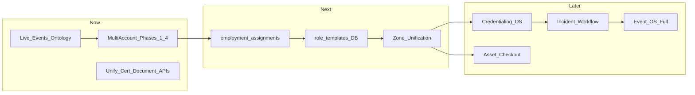

# Tourify Strategic Architecture Review

**Status:** Architectural evaluation (not implementation requirements)  
**Last updated:** 2026-06-08  
**Related:** [`multi-account-system.md`](multi-account-system.md), [`../domain/live-events-ontology.md`](../domain/live-events-ontology.md)

---

## Purpose

This document challenges the current Tourify platform design and identifies opportunities to improve scalability, maintainability, and alignment with the long-term vision of Tourify as a **workforce operating system for the live events industry**.

Recommendations are evaluated against the existing codebase, schema, roadmap, and multi-account architecture. **Nothing in this document should be implemented automatically.** Each item includes a decision and priority.

### Evaluation Criteria (Applied to Every Recommendation)

1. Is this already implemented?
2. Is there an equivalent system already planned?
3. Does this align with Tourify's vision?
4. Does it improve scalability?
5. Does it simplify future development?
6. Does it reduce technical debt?
7. Does it create unnecessary complexity?
8. Would it improve developer experience?
9. Would it improve user experience?
10. Should it be implemented now, later, or rejected?

---

## Current Assessment

### Multi-Account Architecture — Strong Foundation

| Strength | Evidence |
|----------|----------|
| Identity vs entity separation | `profiles` (general) vs `artist_profiles`, `venue_profiles`, `organizer_accounts` |
| Acting context architecture | Spec in `multi-account-system.md`; `user_sessions`, switcher hooks |
| Multi-tenant design | Entity-scoped RBAC (`rbac_user_entity_roles`) |
| Ownership vs employment distinction | Work Mode spec; `staff_members` unification in progress |
| Session-based context switching | `use-multi-account.tsx`, `user_sessions` |
| Organization and venue separation | Distinct profile tables and route surfaces |
| Future Work Mode model | Documented; not yet in active migrations |

The primary weakness is **not** account architecture. It is **incomplete domain modeling of the live events industry itself**.

| Defined today | Must define for workforce OS |
|---------------|------------------------------|
| Accounts, routing, permissions, context switching | Workforce, events, assets, logistics, operations |
| | Credentials, incident management, scheduling |

---

## Recommendation 1: Universal Entity Architecture

### Current State

- **No physical `entities` table.** Polymorphism exists via:
  - Compatibility views: `entities_individuals`, `entities_artists`, `entities_venues`, `entities_all` — `supabase/migrations/20250812094000_entity_views.sql`
  - RBAC: `rbac_user_entity_roles` with `entity_type` + `entity_id` — `20250812090000_entity_rbac_core.sql`
  - Domain tables: `event_participants`, `equipment_assets`, `entity_managers` — `20250812090500_entity_domain_expansion.sql`
- Planned expansion: `docs/ENTITY_RBAC_EXPANSION_PLAN.md` (agencies, locations, packages — additive, not a universal table)
- App code still uses direct FKs to profile tables in most paths

### Benefits

- Unified references for feeds, notifications, analytics
- Single permission check pattern (partially achieved via `has_entity_permission`)
- Easier cross-entity search and reporting

### Risks

- Major migration if replacing specialized tables with one `entities` table
- Loss of type-specific constraints and indexes
- Over-abstraction for early-stage product (events, tours, jobs have different lifecycles)

### Impact

**High** if pursued as physical table replacement; **Medium** if views + RBAC pattern extended

### Decision

**Preserve specialized entity tables. Extend the existing polymorphic pattern (views + RBAC), do not introduce a universal `entities` physical table.**

Rationale: Tourify already invested in `entity_type`/`entity_id` RBAC and compatibility views. A single `entities` table would duplicate `profiles`, `artist_profiles`, `venue_profiles`, and `organizer_accounts` without clear win. The ENTITY_RBAC_EXPANSION_PLAN correctly adds domain tables with polymorphic links rather than collapsing everything.

### Implementation Priority

**Later** — Extend `entities_all` view to include organizations; ensure new tables use `entity_type`/`entity_id` consistently. Revisit physical registry only if notification/analytics fan-out becomes a proven bottleneck.

---

## Recommendation 2: Workforce Domain Expansion

### Current State

| Capability | Status | Location |
|------------|--------|----------|
| Profile certifications | Implemented | `profile_certifications` — `20250819102000_profile_content_core.sql` |
| Skill endorsements | Implemented | `skill_endorsements` → migrated to `endorsements` |
| Achievements / reputation signals | Implemented | `achievements`, `user_achievements`, `work_achievements_rewards_resume` |
| Job-required skills/certs | Partial | `job_posting_templates.skills`, `required_certifications` (JSON/text) |
| Worker skills table | Legacy only | `user_skills` in archive migrations, not active chain |
| Career progression | Not implemented | — |
| Unified worker reputation score | Not implemented | Fragmented metrics only |

Planned: `docs/STAFF_MANAGEMENT_ENHANCEMENT_PLAN.md`, achievements in hiring gate (`hiring-eligibility.service.ts`)

### Benefits

- Better hiring matching and discovery
- Credential compliance at scale
- Workforce analytics for orgs and venues

### Risks

- Schema sprawl if every skill/cert is normalized before product validation
- Duplicate of `profile_certifications` + `staff_documents` + onboarding vault

### Impact

**High** for staffing OS vision; **Medium** for near-term social/artist features

### Decision

**Implement incrementally:**

| Entity | Priority |
|--------|----------|
| `role_templates` (see R3) | Later (Phase 4 workforce) |
| `skills` + `worker_skills` | Later — start with tags on profiles + job templates |
| `certifications` + `worker_certifications` | **Now (partial)** — unify `profile_certifications` + `staff_documents` under one read model; defer new tables |
| Career progression | Not required (v1) |
| Worker reputation | Later — use achievements + hiring metrics until unified score is needed |

### Implementation Priority

**Later** for new tables; **Now** for consolidating existing cert/document stores into a single API surface.

---

## Recommendation 3: Role Templates

### Current State

- **Code-only templates:** `ONBOARDING_POSITION_TEMPLATES` in `lib/staff/onboarding-position-templates.ts` — includes department, position, `requiredCredentials`, tags (Security Guard, Forklift Operator, etc.)
- **No `role_templates` table** in active migrations
- Shifts use text `role_assignment`; departments are text on `job_posting_templates`, `staff_members`
- Planned: `docs/STAFF_MANAGEMENT_ENHANCEMENT_PLAN.md`

### Benefits

- Structured permissions per role (not string matching)
- Job posting → onboarding → shift assignment consistency
- Workforce matching by required skills/certs

### Risks

- Premature if shift/scheduling UI not wired to templates yet
- Migration from TS constants to DB requires seed + admin UI

### Impact

**High** for staffing at scale; **Low** for current MVP flows that work with position templates in code

### Decision

**Later — DB-backed role templates after Phase 4 workforce scheduling is wired.**

Preserve `onboarding-position-templates.ts` as seed source. When implementing:
- Add `role_templates` with department, required_skills, required_certifications (FK to cert types), default_permissions JSONB
- Link `job_posting_templates.role_template_id` and `staff_shifts.role_template_id`

Do not replace working TS templates until scheduling consumes them.

### Implementation Priority

**Later** (Phase 4 workforce, after `employment_assignments`)

---

## Recommendation 4: Public Persona vs Operational Assignment

### Current State

| Layer | Support |
|-------|---------|
| Public persona | `artist_profiles`, service persona (planned), feeds, followers |
| Operational assignment | `staff_members`, `staff_shifts`, `staff_onboarding_candidates` — no Work Mode yet |
| Distinction in architecture | **Specified** in `multi-account-system.md` (Persona vs Work Mode) |
| Distinction in code | **Not enforced** — `staff` still a switcher type; no `employment_assignments` |

Photographer example:
- Persona: artist/service profile, portfolio, posts
- Assignment: shift on `staff_shifts`, docs in `staff_documents`, no unified assignment entity

### Benefits

- Clear UX: personal vs on-shift
- Correct feed attribution (personal repost vs venue operational comms)
- Credential access scoped to assignment, not public profile

### Risks

- Two context layers (acting entity + work mode) increases client complexity
- Must not duplicate persona pages for every hired role

### Impact

**Critical** — directly aligns with multi-account vision and user-stated requirements

### Decision

**Implement now (Phase 1–4 of multi-account plan).** Architecture already specifies this; execution is the gap.

Strategy:
1. Deprecate `staff` switcher type
2. Add `employment_assignments` linking user → venue/event/tour + role
3. Work Mode toggle in nav; lock entity switcher while active
4. Keep persona (artist/service) separate from assignment (shift, timesheet, credential)

### Implementation Priority

**Now** — Phase 4 of `multi-account-system.md`; prerequisite for correct staffing UX

---

## Recommendation 5: Event Operating System

### Current State

| Component | Status |
|-----------|--------|
| Event core | `events_v2` with commercial lifecycle — `20250816133000_event_core.sql` |
| Participants | `event_participants` (polymorphic) |
| Advancing | `advancing_documents`, `day_sheets` — `20260602110000_advancing_and_daysheets.sql` |
| Calendar items | `event_calendar_items` (load-in, soundcheck, etc.) |
| Staffing | `staff_zones`, `staff_shifts`, admin staffing APIs |
| Site map / zones | `site_map_zones` (separate from `staff_zones`) |
| Incidents | Basic `incidents` table + API |
| Credentials | Document-based, not access-control credentials |
| Assets | Multiple parallel models (see R10) |
| Communications | Admin comms API; event task messages (partial) |

Missing as first-class: departments, teams hierarchy, zone-unified model, credentialing OS, full incident workflow, unified asset checkout.

### Benefits

- Positions Tourify as event ops platform, not just social + jobs
- Single event command center for festivals and tours

### Risks

- Large surface area; building all components before core account routing is fixed creates more fragmentation

### Impact

**Transformational** long-term; **Medium** short-term if phased

### Decision

**Adopt as north-star model in live-events ontology. Implement in priority order (see R6–R12), not as big-bang.**

Priority order:
1. Fix acting context + employment (multi-account Phases 1–4)
2. Unify zones (`staff_zones` ↔ `site_map_zones`)
3. Event departments (text → reference, or enum)
4. Credentialing (physical access vs digital permissions)
5. Incident workflow expansion
6. Asset checkout ledger

### Implementation Priority

**Later** (phased per ontology); **Now** for ontology doc only

---

## Recommendation 6: Event Departments

### Current State

- `department` as **text column** on `staff_members`, `job_posting_templates`, `onboarding_workflows`
- Position templates include department: Security, Operations, Production, etc.
- **No `event_departments` table**

### Benefits

- Department-scoped permissions and comms
- Run sheets and staffing organized by production / security / medical

### Risks

- Over-modeling for small events that only need role strings
- Duplication with org RBAC departments

### Impact

**Medium** for large festivals; **Low** for club/single-venue shows

### Decision

**Later — promote department from text to reference table when event command center needs department-scoped views.**

Interim: standardize department enum in `role_templates` / position templates (Production, Operations, Security, Medical, Transportation, Vendor Management, Hospitality, Marketing).

Do not add `event_departments` until an event has >1 department with distinct leads and permissions.

### Implementation Priority

**Later** (after role templates DB)

---

## Recommendation 7: Event Teams

### Current State

- No `event_teams` table
- Rosters: `event_participants`, `staff_members`, deprecated `venue_team_members`
- Planned mapping: `docs/tourify-rebuild-phase-0-1-dependency-map.md` suggests extending `event_participants` + `staff_members` rather than new `event_teams`
- Orphaned: `event_crew_assignments` referenced in `staff-management.service.ts` (table only in archive)

### Benefits

- Hierarchy: Production → Audio → A1, Lighting → LD
- Clear reporting lines during show

### Risks

- Another roster concept alongside `staff_members` and `event_participants`
- Crew assignment service already broken (missing table)

### Impact

**Medium** for large productions; **Low** for current staffing MVP

### Decision

**Later — model teams as grouped `staff_members` or `event_participants` with `team_id` / parent group, not a parallel roster system.**

Fix or remove `event_crew_assignments` service references. If teams are needed, add `event_teams` + `event_team_members` as **views or thin grouping** over `staff_members`, not a third roster.

### Implementation Priority

**Later** (Phase 4+ workforce)

---

## Recommendation 8: Event Zones

### Current State

| System | Table | Purpose |
|--------|-------|---------|
| Staffing | `staff_zones` | security, vip, backstage, etc. |
| Site map | `site_map_zones` | logistics / map layout |
| Shifts | `staff_shifts.zone_assignment` | **text**, not FK |

APIs: `/api/admin/staffing/zones`, site map viewer components

### Benefits

- Zone-scoped credentials, incidents, assets, permissions
- Festival multi-stage operations

### Risks

- Two zone systems not linked today
- Premature zone FK on all entities before unification

### Impact

**High** for festivals; **Medium** for venues

### Decision

**Later for zone as universal FK; Now for unification plan.**

1. Document canonical zone model in ontology
2. Bridge `staff_zones` ↔ `site_map_zones` via `event_id` + optional `site_map_zone_id` on `staff_zones`
3. Migrate `staff_shifts.zone_assignment` text → `zone_id` FK
4. Then attach credentials, incidents, assets to zones

### Implementation Priority

**Later** (after zone unification spike); planning **Now**

---

## Recommendation 9: Credentialing Architecture

### Current State

| Store | Purpose |
|-------|---------|
| `profile_certifications` | User profile certs |
| `staff_documents` | Onboarding docs, `verified_status`, `expires_at` |
| Encrypted onboarding vault | `employee-credentials-vault.ts` |
| Position templates | Required credentials (code) |
| Hiring eligibility | `hiring_eligibility_snapshots`, gate evaluator |

**No** `credentials`, `credential_templates`, `credential_access` tables.  
Physical access credentials (wristbands, laminates) not modeled separately from digital permissions.

### Benefits

- Foundational distinction: **credentials = physical access**; **permissions = digital access**
- Compliance and audit for festivals
- Zone + role + credential intersection

### Risks

- Hardware/badge integrations are partner-dependent
- Overlap with `staff_documents` if not designed carefully

### Impact

**High** for festival/security vertical; **Medium** for general platform

### Decision

**Later for full credentialing OS; Now for conceptual separation in ontology and API design.**

Preserve:
- `staff_documents` + `profile_certifications` for **verified documents**
- RBAC for **digital permissions**

When implementing credentialing:
- Add `credential_templates` (Artist, VIP, Vendor, Production, Medical)
- Add `credentials` issued per event with `zone_access[]`, `valid_from`/`valid_until`
- Do not conflate with `has_entity_permission`

### Implementation Priority

**Later** (post Phase 4 workforce); document distinction **Now**

---

## Recommendation 10: Asset Management

### Current State

| Model | Table |
|-------|-------|
| Entity-owned | `equipment_assets` (polymorphic owner) |
| Venue equipment | `venue_equipment` |
| Site map | `equipment_catalog`, `equipment_instances` |
| Rentals | `rental_agreements`, `rental_agreement_items` (pickup/return status) |
| Legacy | `equipment_assignments` (backup only) |

Services: `equipment-assets.service.ts`, `/api/assets`, admin inventory pages  
Permission: `MANAGE_ASSETS` in entity RBAC

### Benefits

- Radios, forklifts, generators tracked per event
- Checkout/return audit for loss prevention

### Risks

- Four parallel asset models today
- Full CMMS is out of scope for core product

### Impact

**Medium** for production companies and rentals; **Low** for artist social layer

### Decision

**Later — unify read model first; defer full checkout ledger.**

Align with ENTITY_RBAC_EXPANSION_PLAN Option B (`equipment_assets` as canonical). Bridge `equipment_instances` for site-map UI. Add `asset_checkouts` only when rental/ops customers require it.

### Implementation Priority

**Later** (after equipment_assets consolidation)

---

## Recommendation 11: Incident Management

### Current State

- `incidents` table: `event_id`, `severity`, `title`, `notes`, `reported_by` — `20250816140000_incidents.sql`
- API: `GET/POST /api/events/[id]/incidents`
- Action: `createIncidentAction`
- No workflow (status, assignee, resolution), no zone/staff links, no types

### Benefits

- Medical, security, weather, equipment incidents during live ops
- Links to workforce performance and compliance

### Risks

- Competing with external tools (Radio, CAD systems) at enterprise tier
- Low usage if event ops UI incomplete

### Impact

**Medium** for on-site ops; **Low** until event command center is primary UX

### Decision

**Later — extend basic incidents incrementally.**

Next steps when prioritized:
- Add `status`, `incident_type`, `zone_id`, `assigned_to`
- `incident_comments`, `incident_assignments`
- Do not build full ICS until event OS Phase 2

### Implementation Priority

**Later** (after zone unification)

---

## Recommendation 12: Event Lifecycle Model

### Current State

`events_v2.status`: `inquiry`, `hold`, `offer`, `confirmed`, `advancing`, `onsite`, `settled`, `archived`

Related: `advancing_documents`, `day_sheets`, `event_calendar_items` (load-in, soundcheck, performance, load-out)

**Not modeled:** explicit Planning, Build, Show, Strike phases as first-class state machines

### Benefits

- Permissions and tasks per phase
- Workforce scheduling aligned to build/show/strike

### Risks

- Two lifecycle taxonomies (commercial vs production) confuse users if merged poorly
- Forcing lifecycle on jobs, assets, credentials prematurely

### Impact

**High** for production ops mental model; **Medium** if mapped onto existing `events_v2.status`

### Decision

**Later — map production phases onto calendar items and optional `event_phase` enum, do not replace `events_v2.status`.**

| Production phase | Map to |
|------------------|--------|
| Planning | `inquiry`–`confirmed` |
| Advance | `advancing` + advancing_documents |
| Build | calendar: load-in, setup |
| Show | `onsite` + performance items |
| Strike | load-out, teardown calendar items |
| Archive | `archived` / `settled` |

Apply lifecycle state machines to **assignments, credentials, shifts** when those domains mature—not globally on day one.

### Implementation Priority

**Later** (documentation **Now** in ontology)

---

## Recommendation 13: Live Events Ontology

### Current State

- `docs/architecture/multi-account-system.md` — account/domain boundary
- `docs/ENTITY_RBAC_EXPANSION_PLAN.md` — RBAC + entities
- `docs/STAFF_MANAGEMENT_ENHANCEMENT_PLAN.md` — staffing
- `.agents/plans/phase-2-events.md`, `phase-4-workforce.md` — roadmap
- **No single ontology document** until now

### Benefits

- Source of truth for DB, API, RBAC, scheduling, credentialing
- Prevents orphan features
- Prerequisite for large-scale feature development

### Risks

- Doc drift if not maintained alongside migrations

### Impact

**Critical** for coherent platform evolution

### Decision

**Implement now — create `docs/domain/live-events-ontology.md`.**

Make it a **prerequisite** for new domain tables and major features. Pair with architectural review checklist below.

### Implementation Priority

**Now**

---

## Architectural Review Requirement

Before creating any new table, service, module, workflow, or feature, answer:

| # | Question | If yes → |
|---|----------|----------|
| 1 | Is this a new **entity**? | Add to ontology; use specialized table + `entity_type` RBAC |
| 2 | Is this a **relationship**? | Link existing entities; prefer `account_relationships` or junction table |
| 3 | Is this a **permission**? | Use RBAC role/permission, not a new table |
| 4 | Is this an **assignment**? | Use `employment_assignments`, `staff_shifts`, or `event_participants` |
| 5 | Is this an **activity**? | Log to `account_activity_log` or domain audit; usually not a new entity |

**If none apply:** challenge the implementation. Document why the feature belongs in the architecture.

### Anti-patterns to reject

- New roster table when `staff_members` + `event_participants` suffice
- Universal `entities` physical table replacing profile tables
- Credentials table that duplicates `staff_documents` without physical-access semantics
- Staff as switcher persona instead of Work Mode assignment
- Parallel post APIs without acting context

---

## Summary Decision Matrix

| # | Recommendation | Decision | Priority |
|---|----------------|----------|----------|
| 1 | Universal entity table | **Reject** physical table; extend views + RBAC | Later |
| 2 | Workforce domain expansion | **Incremental**; unify certs first | Partial now |
| 3 | Role templates (DB) | **Adopt** after scheduling wired | Later |
| 4 | Persona vs assignment | **Adopt** — already in multi-account spec | **Now** |
| 5 | Event operating system | **Adopt** as north star, phased | Later |
| 6 | Event departments | **Defer**; enum interim | Later |
| 7 | Event teams | **Defer**; group over `staff_members` | Later |
| 8 | Event zones | **Unify** staff + site map zones first | Later |
| 9 | Credentialing OS | **Adopt** distinction; build later | Later |
| 10 | Asset management | **Consolidate** `equipment_assets` first | Later |
| 11 | Incident management | **Extend** basic model later | Later |
| 12 | Event lifecycle | **Map** to existing status + calendar | Later |
| 13 | Live events ontology | **Create now** | **Now** |

---

## Recommended Implementation Sequence

---

## Related Documents

- [`multi-account-system.md`](multi-account-system.md) — Account, routing, acting context
- [`../domain/live-events-ontology.md`](../domain/live-events-ontology.md) — Industry domain model
- [`../ENTITY_RBAC_EXPANSION_PLAN.md`](../ENTITY_RBAC_EXPANSION_PLAN.md) — RBAC expansion
- [`../STAFF_MANAGEMENT_ENHANCEMENT_PLAN.md`](../STAFF_MANAGEMENT_ENHANCEMENT_PLAN.md) — Staffing roadmap
- [`../JOBS_STAFFING_RBAC_MATRIX.md`](../JOBS_STAFFING_RBAC_MATRIX.md) — Staffing permissions

---

*End of strategic architecture review.*
