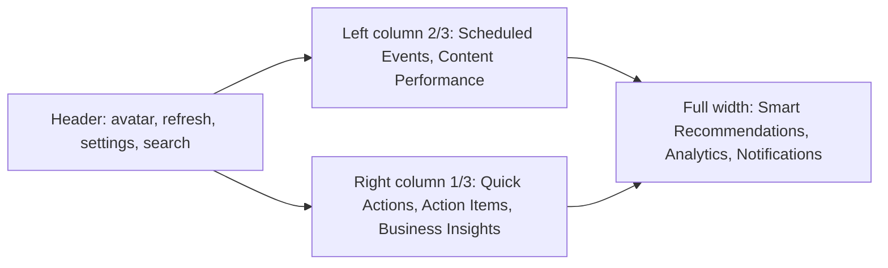

# Tourify Artist Dashboard — Wireframe Map & Implementation Contract

This document is the **single source of truth** for layout (Desktop / Tablet / Mobile), navigation drill-downs, interactions, backend wiring, refresh behavior, per-user isolation, and widget customization. It aligns with [`app/artist/page.tsx`](../app/artist/page.tsx) and dashboard components under [`components/dashboard/`](../components/dashboard/).

---

## 1. Data isolation & no mock data (non-negotiable)

| Rule | Implementation |
|------|------------------|
| Author scope | All reads use `auth.uid()`; content/events also respect `artist_profile_id` where the schema requires it. |
| RLS | Supabase RLS must deny cross-user reads; dashboard never uses service-role keys in the browser. |
| No synthetic metrics | UI shows **empty states**, **skeletons**, or **CTAs** (e.g. connect integration) when data is missing—never placeholder dollar amounts or fake growth %. |
| Drill-down parity | Side-sheets and detail routes use the **same** filters as parent widgets. |
| Layout storage | [`artist_dashboard_layouts`](../supabase/migrations/20250325120000_artist_dashboard_layouts.sql) stores JSON per `user_id` with RLS **owner-only**. |

---

## 2. Desktop wireframe (3-column)

**Placement**

| Zone | Widgets |
|------|---------|
| Header | Welcome, View Public Profile, Refresh (stats + widget data), Settings, search |
| Main left | Scheduled Events (next event + summary), Content Performance (counts + list) |
| Main right | Quick Actions grid, Action Items (profile/tasks from real data), Business Insights (stats-derived copy only) |
| Bottom full width | Smart Recommendations, Analytics Overview, Notifications |

---

## 3. Tablet wireframe

- **2 columns**: merge right column under left (Quick Actions + Action Items + Business Insights stack above or below Content Performance).
- **Right panel** becomes a **stacked card group** (same order as desktop right column).
- **Search** remains in header; **Refresh** stays visible.

---

## 4. Mobile wireframe

- **Single column**: Header → Stats row (scroll horizontal optional) → Events → Content → Quick Actions (2×2) → Action Items → Business Insights → Recommendations → Analytics → Notifications.
- **Bottom nav**: existing [`MobileArtistNav`](../components/artist/mobile-artist-nav.tsx) (`/artist`, `/artist/feed`, `/artist/music`, `/artist/events`, More).

---

## 5. Navigation & route mapping

| Nav / CTA | Route |
|-----------|--------|
| Dashboard | `/artist` |
| Profile | `/artist/profile` |
| Music | `/artist/music` |
| Content | `/artist/content` |
| Community | `/artist/community` |
| Business | `/artist/business` |
| Events | `/artist/events` |
| Settings | `/artist/settings` |
| Messages | `/artist/messages` |
| Feed | `/artist/feed` |
| Marketing / boost | `/artist/business/marketing` |

**Widget drill-downs**

| Widget | Action | Target |
|--------|--------|--------|
| Metric card | Open analytics | `/artist/business` or analytics tab (same data scope) |
| Smart Recommendations | Promote track | `/artist/content` (composer) |
| | Create content | `/artist/music/upload`, `/artist/content/videos/record`, `/artist/content/photos/upload` |
| | Boost event | `/artist/business/marketing` |
| | Collaborate | `/artist/messages` |
| Events row | View all | `/artist/events` |
| Notifications | Item CTA | `action_url` from DB or default route by type |

---

## 6. Interaction contracts (per panel)

| Panel | Click / filter | Notes |
|-------|----------------|-------|
| Metrics | Card → detail (future side-sheet) | Values from `get_enhanced_artist_stats` / [`ArtistContext`](../contexts/artist-context.tsx); trend line hidden if no period data |
| Smart Recommendations | Type chips + sort | List from [`buildArtistRecommendations`](../lib/artist/build-artist-recommendations.ts) only |
| Content Performance | List rows | Owner-scoped [`artistContentService`](../lib/services/artist-content.service.ts) with `ownerScope` |
| Scheduled Events | Summary + empty CTA | `artist_events` only, owner scope |
| Action Items | — | Built from profile gaps + content counts (no mock tasks) |
| Notifications | All / Unread / High | Supabase `notifications` + RLS; mark read scoped by `user_id` |
| Analytics tabs | Overview / Audience / … | Built from stats; empty demographic/revenue breakdown when unknown |

---

## 7. AI recommendation card structure & routing

| Field | Source |
|-------|--------|
| `priority` | Order from builder (1 = highest) |
| `impact` / `effort` | Heuristic from stats (e.g. no tracks → high impact upload) |
| `confidence` | Fixed bands per rule type (not fake ML %) |
| `estimatedValue` | Rough score from streams/fans when present, else 0 |
| `actionUrl` / `actionText` | Real routes (see §5) |

---

## 8. Event & action data sources (unified)

- **Events**: single source **`artist_events`** via `getEvents(..., { ownerScope: true })`. Do not mix `events` (venue) table on this dashboard without an explicit join contract.
- **Action items**: derived from **artist profile completeness** and **content counts** (and optionally notifications later)—not hardcoded arrays.

---

## 9. Refresh cadence & stale state

| Area | Cadence | UX |
|------|---------|-----|
| Stats | On load + manual Refresh + optional **15 min** interval | [`refreshStats`](../contexts/artist-context.tsx) |
| Events / content | Reload with stats refresh | Last updated label optional |
| Notifications | On mount + realtime **optional** (filter `user_id`) | Empty state if none |

---

## 10. Backend mapping (widgets → services)

| Widget | Primary source |
|--------|----------------|
| Metrics | `rpc('get_enhanced_artist_stats')` via `ArtistContext` |
| Content | `artistContentService.getMusic/getVideos/getPhotos` + `ownerScope` |
| Events | `artistContentService.getEvents` + `ownerScope` |
| Recommendations | `buildArtistRecommendations(stats, content, events, profile)` |
| Analytics UI | `buildAnalyticsDataFromArtistStats(stats)` |
| Notifications | Supabase client → `notifications` table |
| Layout | `artist_dashboard_layouts` + [`artistDashboardLayoutService`](../lib/services/artist-dashboard-layout.service.ts) |

**Edge functions (indirect)**

- Social analytics / posting: [`supabase/functions/social-analytics`](../supabase/functions/social-analytics/index.ts), [`social-post`](../supabase/functions/social-post/index.ts)—feed follower counts into stats over time, not mock UI numbers.

---

## 11. Widget customization (DnD + persistence)

- **Model**: `{ order: WidgetId[], hidden: WidgetId[] }` for bottom sections: `recommendations`, `analytics`, `notifications`.
- **UX**: Customize mode (optional) → drag reorder → Save persists to `artist_dashboard_layouts`.
- **Pattern**: Mirrors interaction model in [`customizable-dashboard.tsx`](../components/admin/customizable-dashboard.tsx) (handles, visibility)—artist variant in [`artist-dashboard-bottom-sections.tsx`](../components/dashboard/artist-dashboard-bottom-sections.tsx) + [`sortable-widget-section.tsx`](../components/dashboard/sortable-widget-section.tsx).

---

## 12. Acceptance checklist

- [ ] Desktop / Tablet / Mobile layouts documented (§2–4).
- [ ] Every widget maps to a real backend path (§10).
- [ ] No mock arrays in production dashboard components.
- [ ] RLS-safe client queries only for notifications and layout.
- [ ] Empty states for zero content / zero notifications / zero recommendations.
