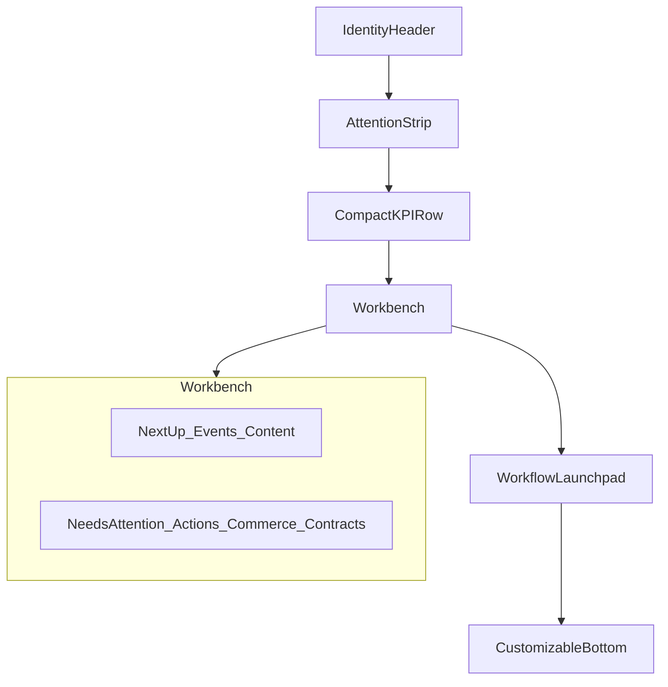

# Tourify Artist Dashboard — Wireframe Map & Implementation Contract

This document is the **single source of truth** for layout (Desktop / Tablet / Mobile), navigation drill-downs, interactions, backend wiring, refresh behavior, per-user isolation, and widget customization. It aligns with [`app/artist/page.tsx`](../app/artist/page.tsx) and dashboard components under [`components/dashboard/`](../components/dashboard/).

**Product model:** `/artist` is an **Account Command Center** — attention first, then workflows into the full `/artist/*` feature set.

---

## 1. Data isolation & no mock data (non-negotiable)

| Rule | Implementation |
|------|------------------|
| Author scope | All reads use `auth.uid()`; content/events also respect `artist_profile_id` where the schema requires it. |
| RLS | Supabase RLS must deny cross-user reads; dashboard never uses service-role keys in the browser. |
| No synthetic metrics | UI shows **empty states**, **skeletons**, or **CTAs** (e.g. connect integration) when data is missing—never placeholder dollar amounts or fake growth %. |
| Drill-down parity | Side-sheets and detail routes use the **same** filters as parent widgets. |
| Layout storage | [`artist_dashboard_layouts`](../supabase/migrations/20250325120000_artist_dashboard_layouts.sql) stores JSON per `user_id` with RLS **owner-only**. |

---

## 2. Desktop wireframe (Command Center)

```mermaid
flowchart TB
  Header[IdentityHeader]
  Attention[AttentionStrip]
  KPIs[CompactKPIRow]
  Workbench[Workbench]
  Launchpad[WorkflowLaunchpad]
  Bottom[CustomizableBottom]

  Header --> Attention --> KPIs --> Workbench --> Launchpad --> Bottom

  subgraph workbenchCols [Workbench]
    NextUp[NextUp_Events_Content]
    Needs[NeedsAttention_Actions_Commerce_Contracts]
  end

  Workbench --> workbenchCols
```

**Placement**

| Zone | Widgets / contents |
|------|-------------------|
| Identity header | Avatar, display name, profile completion %, View Public (`url_slug`), Edit Profile, Settings (`/artist/settings`), Refresh. No decorative search. |
| Attention strip | Chips: action items, unread notifications, commerce blockers. Chip click scrolls to `#needs-attention` or `#bottom-insights`. |
| KPI row | Revenue, Fans, Streams, Engagement — clickable to Business / Community / Music / analytics. No fake period deltas. |
| Workbench left (`#next-up`) | [`ArtistEventsOverview`](../components/dashboard/artist-events-overview.tsx), [`ArtistContentOverview`](../components/dashboard/artist-content-overview.tsx) |
| Workbench right (`#needs-attention`) | [`ArtistActionItems`](../components/dashboard/artist-action-items.tsx), Commerce Health, [`DashboardContractsCard`](../components/dashboard/dashboard-contracts-card.tsx) |
| Workflow launchpad (`#workflows`) | Music, Content, Events, EPK, Store, Community, Business, Messages |
| Bottom (`#bottom-insights`) | DnD: Smart Recommendations, Analytics Overview, Notifications |

**Orchestrator:** [`artist-page-client.tsx`](../components/dashboard/artist-page-client.tsx)  
**Extracted shells:** [`artist-dashboard-header.tsx`](../components/dashboard/artist-dashboard-header.tsx), [`artist-attention-strip.tsx`](../components/dashboard/artist-attention-strip.tsx), [`artist-workflow-launchpad.tsx`](../components/dashboard/artist-workflow-launchpad.tsx)

---

## 3. Tablet wireframe

- KPI row: 2×2.
- Workbench stacks: Needs Attention under Next Up (single column below `lg`).
- Launchpad: 2×4 or 4×2.
- Attention strip wraps chips.

---

## 4. Mobile wireframe

- **Single column:** Identity → Attention → KPIs → Needs Attention → Next Up → Launchpad (2×4) → Insights.
- **Bottom nav:** [`MobileArtistNav`](../components/artist/mobile-artist-nav.tsx) — Dashboard, Feed, Music, Events, More (grouped sheet matching sidebar IA).

---

## 5. Navigation & route mapping

### Grouped sidebar ([`app-sidebar.tsx`](../components/app-sidebar.tsx))

| Group | Item | Route |
|-------|------|--------|
| — | Home | `/artist` |
| Create & Publish | Feed | `/artist/feed` |
| | Content | `/artist/content` |
| | Music | `/artist/music` |
| | EPK | `/artist/epk` |
| Live & Sell | Events | `/artist/events` |
| | Store | `/artist/store` |
| Audience | Community | `/artist/community` |
| | Messages | `/artist/messages` |
| Career | Business | `/artist/business` |
| | Profile | `/artist/profile` |
| Footer | Settings | `/artist/settings` |

Features hub (`/artist/features`) stays reachable from Business/Community hubs but is **not** primary nav.

Public profile CTAs use [`getArtistPublicProfilePath`](../lib/utils/public-profile-routes.ts) with `url_slug` (fallback `artist_name`).

### Widget drill-downs

| Widget | Action | Target |
|--------|--------|--------|
| Metric card | Open related area | `/artist/business`, `/artist/community`, `/artist/music`, `/artist/business/analytics` |
| Smart Recommendations | Promote / create / boost / collab | `/artist/content`, `/artist/music/upload`, `/artist/business/marketing`, `/artist/messages` |
| Events | View all / create | `/artist/events` |
| Content analytics CTA | Business analytics | `/artist/business/analytics` |
| Action items | Item CTA | `href` from [`buildDashboardActionItems`](../lib/artist/build-action-items.ts) |
| Commerce health | Fix blockers | `/artist/store`, `/artist/store?tab=payments` |
| Notifications | Item CTA | `action_url` from DB or default by type |
| Launchpad | Direct | Routes in §5 table |

---

## 6. Interaction contracts (per panel)

| Panel | Click / filter | Notes |
|-------|----------------|-------|
| Metrics | Card → linked route | Values from `get_enhanced_artist_stats` / [`ArtistContext`](../contexts/artist-context.tsx); no fabricated period deltas |
| Attention strip | Chip → scroll | Targets `#needs-attention`, `#bottom-insights`, `#workflows` |
| Smart Recommendations | Type chips + sort | List from [`buildArtistRecommendations`](../lib/artist/build-artist-recommendations.ts) only |
| Content Performance | List rows | Owner-scoped [`artistContentService`](../lib/services/artist-content.service.ts) with `ownerScope` |
| Scheduled Events | Summary + empty CTA | `artist_events` only, owner scope |
| Action Items | — | Profile gaps, EPK, commerce, catalog counts — [`buildDashboardActionItems`](../lib/artist/build-action-items.ts) |
| Notifications | All / Unread / High | Supabase `notifications` + RLS; mark read scoped by `user_id` |
| Analytics tabs | Overview / Audience / … | Built from stats; empty demographic/revenue breakdown when unknown |

---

## 7. AI recommendation card structure & routing

| Field | Source |
|-------|--------|
| `priority` | Order from builder (1 = highest) |
| `impact` / `effort` | Heuristic from stats (e.g. no tracks → high impact upload) |
| `confidence` | Fixed bands per rule type (not fake ML %) |
| `estimatedValue` | Rough score from streams/fans when present, else 0 |
| `actionUrl` / `actionText` | Real routes (see §5) |

---

## 8. Event & action data sources (unified)

- **Events**: single source **`artist_events`** via `getEvents(..., { ownerScope: true })`. Do not mix `events` (venue) table on this dashboard without an explicit join contract.
- **Action items**: derived from profile completeness (`bio`, `genres`, `artist_name`, `url_slug`), EPK presence (`artist_epk_settings`), commerce (Stripe / seller agreement), and content/event counts — not hardcoded arrays.

---

## 9. Refresh cadence & stale state

| Area | Cadence | UX |
|------|---------|-----|
| Stats | On load + manual Refresh + optional **15 min** interval | [`refreshStats`](../contexts/artist-context.tsx) |
| Events / content / commerce / EPK signal | Reload with stats refresh | Last updated label in header |
| Notifications | On mount + count for attention strip | Empty state if none |

---

## 10. Backend mapping (widgets → services)

| Widget | Primary source |
|--------|----------------|
| Metrics | `rpc('get_enhanced_artist_stats')` via `ArtistContext` |
| Content | `artistContentService.getMusic/getVideos/getPhotos` + `ownerScope` |
| Events | `artistContentService.getEvents` + `ownerScope` |
| Recommendations | `buildArtistRecommendations(stats, content, events, profile)` |
| Analytics UI | `buildAnalyticsDataFromArtistStats(stats)` |
| Notifications | Supabase client → `notifications` table |
| EPK presence | `artist_epk_settings` (id for user) |
| Commerce health | `/api/marketplace/*`, `/api/stripe/connect` |
| Layout | `artist_dashboard_layouts` + [`artistDashboardLayoutService`](../lib/services/artist-dashboard-layout.service.ts) |

**Edge functions (indirect)**

- Social analytics / posting: [`supabase/functions/social-analytics`](../supabase/functions/social-analytics/index.ts), [`social-post`](../supabase/functions/social-post/index.ts)—feed follower counts into stats over time, not mock UI numbers.

---

## 11. Widget customization (DnD + persistence)

- **Model**: `{ order: WidgetId[], hidden: WidgetId[] }` for bottom sections: `recommendations`, `analytics`, `notifications`.
- **UX**: Customize mode → drag reorder → Save persists to `artist_dashboard_layouts`.
- **Pattern**: [`artist-dashboard-bottom-sections.tsx`](../components/dashboard/artist-dashboard-bottom-sections.tsx) + [`sortable-widget-section.tsx`](../components/dashboard/sortable-widget-section.tsx).

---

## 12. Acceptance checklist

- [x] Desktop / Tablet / Mobile layouts documented (§2–4).
- [x] Every widget maps to a real backend path (§10).
- [x] No mock arrays in production dashboard components.
- [x] RLS-safe client queries only for notifications, EPK presence, and layout.
- [x] Empty states for zero content / zero notifications / zero recommendations.
- [x] Profile, EPK, Music, Events, Store, Feed/Content, Messages, Business, Community reachable in ≤2 clicks from `/artist`.
- [x] Sidebar Settings and View Profile use `/artist/settings` and `url_slug`.
