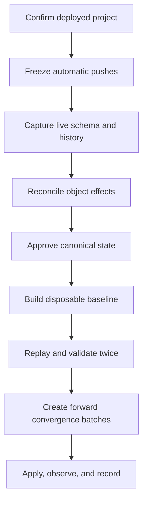

# Non-Destructive Database Recovery

## Problem statement

Migration history is not a reliable source of truth:

- 324 local migration files.
- 180 remote history records.
- Only 144 matching versions.
- 180 local-only versions.
- 37 remote-only versions.
- At least two timestamp/name collisions:

| Version | Local name | Remote name |
|---|---|---|
| `20250120000000` | `event_social_features` | `extend_artist_jobs_for_collaborations` |
| `20250818122000` | `job_board_core` | `logistics_tasks_align` |

Several local-only migrations correspond to columns currently missing from the connected live schema. The checked-in generated database types also contain fields not present live. Neither filenames nor generated types can be used as unquestioned production truth.

## Absolute safeguards

Against any data-bearing shared environment:

- Do not run `supabase db reset --linked`.
- Do not recreate or restore-over the project.
- Do not replay all 324 local migrations.
- Do not mark all local migrations as applied.
- Do not rename or edit migrations that may have run in a shared environment.
- Do not use `DROP TABLE`, `DROP COLUMN`, `TRUNCATE`, destructive type rewrites, or `CASCADE`.
- Do not combine a structural migration with an unbounded data backfill.
- Do not infer production identity from the project display name.

Disposable local or branch databases may be reset repeatedly after their isolation is proven.

## Recovery architecture

## Workstream A — Environment identity and containment

### Required actions

1. Map production, staging, development, preview, and disposable deployments to exact project refs.
2. Verify the production ref from deployment configuration with secret values redacted.
3. Pause the automatic `supabase db push` trigger on `main`.
4. Retain a manual, approval-only migration workflow.
5. Pin one Supabase CLI version everywhere.
6. Record backup/PITR availability, restore ownership, and recovery-time expectations without executing a restore.

### Exit evidence

- Signed environment matrix.
- Workflow diff showing automatic production pushes disabled.
- Target-verification check demonstrated against a non-production fixture.
- Backup/PITR readiness record.

## Workstream B — Preserve immutable evidence

Capture before any database write:

- Schema-only dumps for `public` and customized `auth`/`storage` objects.
- Remote migration ledger: version, name, applied timestamp.
- Local ledger: version, filename, SHA-256, domains touched, destructive-statement flags.
- Public objects, columns, types, constraints, indexes, triggers, policies, grants, and function signatures.
- Table row-count bands and data-quality baselines.
- Function-grant inventory.
- Supabase advisor findings.
- Active runtime error signatures.
- Storage bucket and policy registry.

Evidence should be timestamped, checksummed, access-controlled, and referenced from the task tracker.

## Workstream C — Reconcile history by effect

Create one ledger with these classifications:

- `MATCHED`
- `LOCAL_ONLY`
- `REMOTE_ONLY`
- `COLLISION`
- `SUPERSEDED`

Each row must include:

| Field | Requirement |
|---|---|
| Version | Exact timestamp/version |
| Local filename/checksum | Required when local exists |
| Remote name/applied time | Required when remote exists |
| Classification | One approved status |
| Object effects | Tables, columns, functions, triggers, policies, grants, data changes |
| Risk | Authorization, data loss, lock, backfill, external assumption |
| Domain owner | One accountable owner |
| Canonical decision | Apply, supersede, gate, retain compatibility, or reject |
| Evidence | Schema diff, ADR, test, or migration record |

For timestamp collisions, compare resulting object effects. Never decide based only on the filename.

## Workstream D — Approve canonical state

Every code/live mismatch receives one product classification:

- `ACTIVE_REQUIRED`
- `FUTURE_GATED`
- `LEGACY_REFERENCE`
- `ADMIN_ONLY`
- `INVALID_REFERENCE`

For every active table change, define:

- Tenant/entity ownership key.
- Existing-row interpretation.
- Null/default behavior.
- Backfill mapping rules.
- Ambiguous-row quarantine behavior.
- RLS and grant model.
- Foreign keys and online-safe indexes.
- Compatibility window.
- Observability and rollback switch.

## Workstream E — Build the disposable baseline

1. Create an isolated database recovery environment using synthetic data.
2. Produce baseline SQL that represents the approved current state.
3. Preserve legacy migrations in Git history and an immutable ledger.
4. Recreate the disposable database from the baseline.
5. Recreate it again and require an empty or fully explained second schema diff.
6. Run database unit tests, RLS persona tests, grant assertions, advisors, and representative queries.
7. Generate TypeScript types from the disposable database.
8. Compare those types to production application references.

The baseline is approved only when another engineer can reproduce it from a clean environment using documented commands.

## Workstream F — Converge production additively

Create one forward-only migration batch per bounded domain. Each batch should:

1. Add new nullable structures.
2. Add policies before client exposure.
3. Add verified indexes using an online-safe approach.
4. Deploy compatible application reads/writes behind a server-side flag.
5. Backfill in bounded, resumable batches.
6. Quarantine ambiguous mappings instead of guessing.
7. Validate counts, nulls, orphans, duplicates, grants, and personas.
8. Enable for internal/canary accounts.
9. Observe errors and integrity metrics.
10. Record the resulting schema and migration state.

### Migration construction standards

- One domain and one purpose per migration.
- Conservative `lock_timeout` and `statement_timeout`.
- Add nullable columns before enforcing non-null.
- Use `NOT VALID` constraints where appropriate, then validate separately.
- Inspect `pg_constraint`; PostgreSQL lacks `ADD CONSTRAINT IF NOT EXISTS`.
- Prefer scalar subquery forms such as `(select auth.uid())` only after semantic validation.
- Keep privileged functions on fixed safe search paths and schema-qualify references.
- Do not place large backfills in long DDL transactions.

## Migration-history repair rule

A local-only migration may be adopted/repaired only when all five conditions pass:

1. Its intended object effects are identified.
2. The approved target already contains equivalent effects or a superseding forward migration.
3. Data backfill requirements were verified separately.
4. A disposable environment proves the result.
5. The decision is recorded in the reconciliation ledger.

## Database recovery completion gate

- Production identity is confirmed.
- Production was not reset.
- The clean baseline replays deterministically.
- Completed production domains match the approved target.
- Generated types come from that target.
- Future dry runs propose only intentionally pending migrations.
- Every convergence batch has data, authorization, performance, and rollback evidence.

## Related tracker prefixes

`P0-*`, `DB-*`, `CON-*`, `REL-*`
