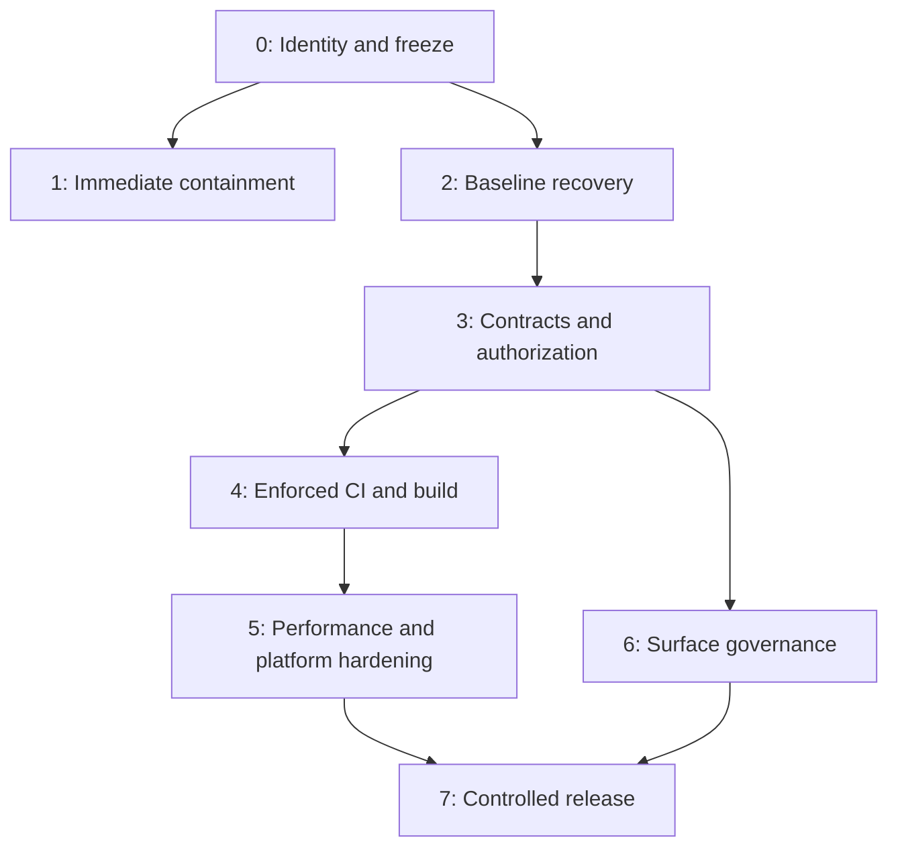

# Phased Implementation Roadmap

## Dependency model

Code-only containment in Phase 1 may run while Phase 0 evidence is being captured. No production database write may run before production identity and approval are established.

## Phase dashboard

| Phase | Priority | Estimated effort | Primary outcome | Initial state |
|---:|---|---:|---|---|
| 0 | P0 | 1–2 engineering days | Correct target, freeze, immutable evidence | Ready |
| 1 | P0/P1 | 2–4 engineering days | Privacy/security/debug/runtime containment | Partial/blockers |
| 2 | P0 | 5–10 engineering days | Reproducible authoritative baseline | Blocked by Phase 0 |
| 3 | P0/P1 | 8–15 engineering days | Active contracts and database authorization restored | Blocked by Phase 2 |
| 4 | P1 | 4–8 engineering days | Required CI and clean release build | Contract decisions required |
| 5 | P1/P2 | 1–2 sprints | Measured performance, Auth, storage | Correctness first |
| 6 | P2 | 1 sprint to establish | Ownership and lifecycle governance | Registries required |
| 7 | P1 | Per release batch | Controlled production rollout | Phases 0–5 required |

## Phase 0 — Identity, freeze, evidence

### Work

- Confirm deployed project.
- Record all environment refs.
- Pause automatic production migration pushes.
- Pin CLI.
- Capture schema/history/grants/advisors/errors/buckets.
- Verify backup/PITR readiness.
- Assign task owners.

### Exit gate

- Production database identity is independently confirmed.
- Automatic pushes are paused.
- Evidence is preserved and checksummed.
- No production write occurred.

## Phase 1 — Immediate containment

### Work

- Fix parent-aware comment visibility and safe errors.
- Map and contain eight anonymous privileged-function exposures.
- Remove production feed debug ingest.
- Require debug scanning.
- Register live errors.
- Server-gate unreleased schema-dependent modules.

### Exit gate

- Restricted-parent comments cannot be disclosed.
- Anonymous privileged behavior is resolved or explicitly approved.
- Debug scan is green and enforced.
- Every active schema error has an owner and containment decision.

## Phase 2 — Migration reconciliation and baseline

### Work

- Build local/remote object-effect ledger.
- Classify all migrations and collisions.
- Decide active/gated/legacy canonical states.
- Build and replay a clean disposable baseline twice.
- Run RLS/grant/advisor/representative-query tests.
- Generate canonical types.
- Prepare forward convergence migrations.

### Exit gate

- Baseline is reproducible.
- Production was not reset.
- Completed domains match approved target.
- Migration dry runs are predictable.

## Phase 3 — Runtime contracts and authorization

### Work

- Build schema-contract CI manifest.
- Restore feed/social contracts.
- Restore music/artist/merch/tour contracts.
- Build or gate marketplace integration/fulfillment.
- Restore hiring/staffing/logistics membership boundaries.
- Classify all absent RPCs.
- Review all 136 definers and active RLS policies.

### Exit gate

- Active paths reference no absent target.
- Future paths are gated.
- Target error signatures remain zero through observation.
- Privileged functions and RLS have owners and passing tests.

## Phase 4 — CI, tests, dependency, build

### Work

- Establish npm/lockfile policy.
- Repair Jest and Vitest contracts.
- Add disposable migration replay and schema checks.
- Add grant/RLS/advisor gates.
- Add debug scan and Vitest to required checks.
- Establish lint warning budget.
- Produce a clean deployment-equivalent build.

### Exit gate

- Both maintained suites are green.
- Required jobs run and block merges.
- Build exits cleanly.
- No new lint warnings.

## Phase 5 — Performance, Auth, storage

### Work

- Optimize RLS and indexes by measured domain.
- Trace and reduce journey request fan-out.
- Add pagination and safe caching.
- Enable leaked-password protection.
- Roll out MFA for privileged roles.
- Align storage buckets, prefixes, policies, and operations.

### Exit gate

- No authorization regression.
- Agreed performance budgets pass.
- Privileged Auth hardening is operational.
- Storage ownership tests pass.

## Phase 6 — Governance

### Work

- Generate schema and route registries.
- Classify overlapping families.
- Add lifecycle/owner requirements.
- Archive misleading historical docs.
- Define—but do not execute—retirement policy.

### Exit gate

- Active objects/routes have owners.
- New work cannot create unowned surfaces.
- Legacy objects are contained, not deleted.

## Phase 7 — Controlled release

### Per-batch sequence

1. Merge after all required checks.
2. Verify project and branch.
3. Verify backup/PITR.
4. Run dry run.
5. Compare versions/checksums.
6. Review lock/backfill plan.
7. Apply expansion.
8. Run smoke queries and personas.
9. Run bounded backfill.
10. Validate data/advisors.
11. Enable internal canary.
12. Expand rollout.
13. Observe and record.

### Exit gate

- Release candidate evidence is complete.
- Error/latency/integrity thresholds remain within budget.
- Observation window passes.
- Migration workflow may be re-enabled only with written sign-off.

## Recommended pull-request boundaries

| PR | Scope | Production DB write |
|---|---|---:|
| PR-01 | Pause automatic migration push; pin CLI; target checks | No |
| PR-02 | Remove debug ingest; require scanner | No |
| PR-03 | Comment visibility, bulk authors, safe errors | No initially |
| PR-04 | Cron and `server-only` test harness contracts | No |
| PR-05 | Migration/schema inventory tooling | No |
| PR-06 | Emergency function-grant containment | Yes, grants only |
| PR-07 | Disposable baseline and contract CI | Disposable only |
| PR-08+ | One additive convergence batch per domain | Yes |
| PR-S | Bounded RLS/function hardening | Yes |
| PR-CI | Full branch-protection rollout | No production data |

Avoid combining unrelated domains or application behavior with a production migration.
