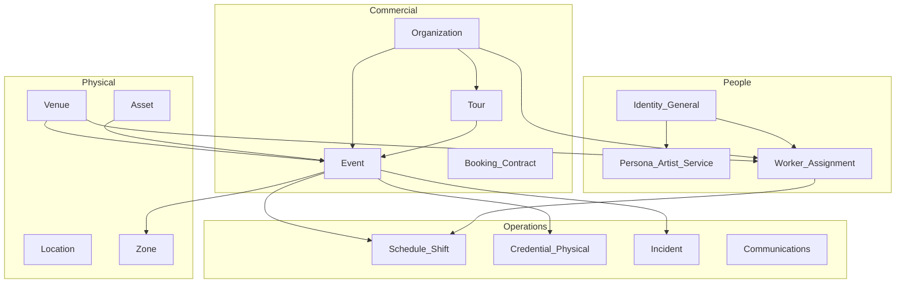
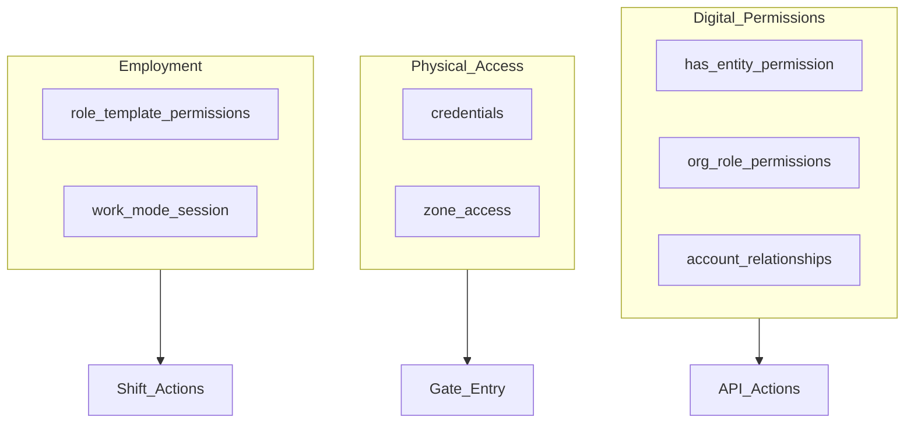

# Live Events Industry Ontology

**Status:** Canonical domain model (Phase 0)  
**Last updated:** 2026-06-08  
**Audience:** Product, engineering, database design  

This document defines the **operating model of the live events industry** as implemented (or planned) in Tourify. It complements [`multi-account-system.md`](../architecture/multi-account-system.md) (who can act) with **what exists in the world** (entities, relationships, lifecycles).

**Prerequisite:** New domain tables, APIs, and major features should align with this ontology before implementation. Use the [Architectural Review Checklist](#architectural-review-checklist) at the end.

---

## Table of Contents

1. [Domain Overview](#1-domain-overview)
2. [Organizations](#2-organizations)
3. [Venues & Locations](#3-venues--locations)
4. [Events & Tours](#4-events--tours)
5. [Workforce](#5-workforce)
6. [Personas & Identity](#6-personas--identity)
7. [Assets & Equipment](#7-assets--equipment)
8. [Credentials & Access](#8-credentials--access)
9. [Operations](#9-operations)
10. [Scheduling](#10-scheduling)
11. [Communications](#11-communications)
12. [Incident Management](#12-incident-management)
13. [Permissions Model](#13-permissions-model)
14. [Lifecycle Models](#14-lifecycle-models)
15. [Entity Classification](#15-entity-classification)
16. [Schema Mapping (Current → Target)](#16-schema-mapping-current--target)
17. [Architectural Review Checklist](#architectural-review-checklist)

---

## 1. Domain Overview

Tourify models the live events industry as intersecting domains:



### Two axes of context

| Axis | Question | Tourify mechanism |
|------|----------|-------------------|
| **Acting entity** | Who is speaking / posting / hiring? | Multi-account switcher, `acting_as`, `user_sessions` |
| **Operational assignment** | Who is on shift and in what role? | Work Mode, `employment_assignments`, `staff_shifts` |

A person can have a **public photographer persona** (portfolio, followers) and a **photographer assignment** (shift, timesheet, event credential) simultaneously. These must not be conflated.

---

## 2. Organizations

### Definition

A **organization** is a company, vendor, promoter, production company, staffing agency, or conglomerate that produces events, tours, or hires workforce. Not a person.

### Subtypes (conceptual)

| Subtype | Examples | Schema today |
|---------|----------|--------------|
| Promoter | Live Nation, local promoter | `organizer_accounts` |
| Production company | Full-service production | Planned in ENTITY_RBAC_EXPANSION_PLAN |
| Staffing agency | Event staff provider | Planned |
| Rental company | Gear rentals | `rental_agreements` |
| Vendor | Catering, security firm | Organization + contracts |

### Relationships

- **Produces** → Events, Tours
- **Owns or manages** → Venues (optional)
- **Hires** → Artists, service providers, workers
- **Books** → Venues for events (without owning venue)

### Schema

| Table | Status |
|-------|--------|
| `organizer_accounts` | Active (target rename: organizations) |
| `performance_agencies`, `staffing_agencies`, etc. | Planned — ENTITY_RBAC_EXPANSION_PLAN |

### Code type

`organization` (alias: `admin`)

---

## 3. Venues & Locations

### Venue

A **venue** is a space with an address, capacity, and owner. It hosts events and may employ staff.

| Attribute | Examples |
|-----------|----------|
| Physical | Club, arena, festival ground, theater |
| Logical | Room within a building, outdoor stage area |

**Schema:** `venue_profiles`  
**Owner:** General user or Organization (`owner_type` TBD)

### Location (multi-place events)

A **location** is a addressable place that may or may not be a full venue profile. Used when an event spans multiple sites.

**Schema:** `locations`, `event_locations` (ENTITY_RBAC_EXPANSION_PLAN)  
**Status:** Planned

### Zone

A **zone** is a subdivided area within an event or venue used for staffing, access control, logistics, and incidents.

| Examples | Purpose |
|----------|---------|
| Stage A, Stage B | Performance areas |
| Backstage, VIP | Access-restricted |
| Medical, Security post | Ops |
| Vendor Village, Parking | Logistics |

**Schema:**

| Table | Scope | Status |
|-------|-------|--------|
| `event_zones` | **Canonical unified zone** (event/venue scoped) | Active — migration `20260610000200` |
| `staff_zones` | Staffing ops; bridges via `event_zone_id` | Active (legacy, linked) |
| `site_map_zones` | Site map / logistics (geometry); bridges via `event_zone_id` | Active (legacy, optional link) |

**Model:** `event_zones` is the canonical entity that shifts (`staff_shifts.zone_id`),
credentials, and incidents reference. The two legacy tables remain for their
specialized concerns (operational staffing vs spatial canvas) and link to a
canonical zone through a nullable `event_zone_id` bridge — additive, non-destructive.
Operational `staff_zones` are back-filled 1:1 into `event_zones`.

---

## 4. Events & Tours

### Event

An **event** is a scheduled occurrence: concert, festival day, corporate show, private party.

**Schema:** `events_v2` (canonical), legacy `events`

| Dimension | Values / artifacts |
|-----------|-------------------|
| Commercial status | `inquiry` → `hold` → `offer` → `confirmed` → `advancing` → `onsite` → `settled` → `archived` |
| Production calendar | `event_calendar_items`: load-in, setup, soundcheck, doors, performance, load-out |
| Advancing | `advancing_documents`, `day_sheets` |
| Participants | `event_participants` (polymorphic: artist, vendor, crew) |

### Tour

A **tour** is a series of related events under one production.

**Schema:** tour tables + `rbac_user_entity_roles` where `entity_type = 'tour'`

### Event Operating System (north star)

Target structure for large events:

```
Event
├── Departments      (Production, Security, Medical, …)
├── Teams            (Production → Audio, Lighting, …)
├── Zones            (Stage A, Backstage, VIP, …)
├── Workforce        (assignments, shifts)
├── Assets           (equipment checkouts)
├── Credentials      (physical access)
├── Incidents        (medical, security, weather, …)
├── Communications   (run sheets, broadcasts)
└── Scheduling       (shifts, call times)
```

**Status:** Partial — see Section 16 mapping.

### Production lifecycle (conceptual)

Maps to existing commercial status + calendar items:

| Phase | Meaning | Tourify mapping |
|-------|---------|-----------------|
| Planning | Deal, routing, budget | `inquiry`–`confirmed` |
| Advance | Tech, hospitality, settlement | `advancing`, `advancing_documents` |
| Build | Load-in, construction, setup | Calendar: load-in, setup |
| Show | Live performance | `onsite`, performance items |
| Strike | Teardown, load-out | Calendar: load-out |
| Archive | Closed books | `settled`, `archived` |

---

## 5. Workforce

### Concepts

| Term | Definition |
|------|------------|
| **Worker** | A person (Identity) performing work |
| **Role** | Function: Bartender, A/V Tech, Security, Stage Manager |
| **Assignment** | Worker + role + scope (venue, event, tour) + time range |
| **Shift** | Scheduled work period within an assignment |
| **Team** | Group of workers under a department or lead |

### Role categories (starter catalog)

| Department | Example roles |
|------------|---------------|
| Bar & Service | Bartender, Bar Back, Server |
| Security | Security, Door, Crowd Control |
| Technical | A/V Tech, Lighting, Stage Hand |
| Production | Stage Manager, Production Assistant |
| Medical | EMT, Nurse |
| Hospitality | Host, VIP Host |
| Creative (hired) | Photographer, Videographer, Dancer |

**Note:** Hired creative roles are **assignments**. Optional **service personas** are public profiles.

### Schema

| Table | Purpose | Status |
|-------|---------|--------|
| `staff_members` | Unified roster (`entity_type`, `entity_id`) | Active |
| `staff_shifts` | Scheduled shifts | Active |
| `job_posting_templates` | Staffing job posts | Active |
| `job_applications` | Applications | Active |
| `staff_onboarding_candidates` | Onboarding pipeline | Active |
| `staff_documents` | Verified docs | Active |
| `employment_assignments` | Work Mode source of truth | **Planned** |
| `role_templates` | Structured roles + permissions | **Planned** |
| `venue_team_members` | Legacy | Deprecated |

### Skills & certifications (workforce)

| Concept | Schema | Status |
|---------|--------|--------|
| Profile certifications | `profile_certifications` | Active |
| Staff documents | `staff_documents` | Active |
| Skill endorsements | `endorsements` | Active |
| Achievements | `user_achievements` | Active |
| Role-required certs | Position templates (code) | Active |
| `skills`, `worker_skills` | Normalized skills | Not in active migrations |
| Worker reputation score | — | Not implemented |

---

## 6. Personas & Identity

See [`multi-account-system.md`](../architecture/multi-account-system.md) for full account architecture.

| Layer | Entity | Public page? | Feed? |
|-------|--------|--------------|-------|
| Identity | General | Personal profile | Personal feed |
| Persona | Artist | Yes | Artist feed |
| Persona | Service provider | Yes | Service/artist feed |
| Entity | Venue | Yes | Venue feed |
| Entity | Organization | Yes | Org feed |
| Assignment | Worker on shift | No (unless also has persona) | Operational only |

---

## 7. Assets & Equipment

### Definition

An **asset** is trackable equipment: generator, radio, forklift, golf cart, lighting fixture, LED wall, truss.

### Schema (fragmented — consolidation target)

| Table | Scope |
|-------|-------|
| `equipment_assets` | Polymorphic owner (canonical target) |
| `venue_equipment` | Venue inventory |
| `equipment_catalog` / `equipment_instances` | Site map assets |
| `rental_agreements` / `rental_agreement_items` | Rental checkout/return |
| `event_package_assets` | Event package links |

### Target operations

| Operation | Target table |
|-----------|--------------|
| Own asset | `equipment_assets` |
| Assign to event | `asset_assignments` (planned) |
| Checkout / return | `asset_checkouts` (planned) |

**Permission:** `MANAGE_ASSETS` (entity RBAC)

---

## 8. Credentials & Access

### Foundational distinction

| Type | Controls | Examples | Tourify today |
|------|----------|----------|---------------|
| **Digital permission** | Software actions | Post as venue, approve hire, edit run sheet | RBAC `has_entity_permission` |
| **Physical credential** | Physical access | Wristband, laminate, QR badge | Not modeled (docs only) |

Do not store physical credentials in permission tables or conflate with `staff_documents`.

### Document verification (today)

| Store | Use |
|-------|-----|
| `profile_certifications` | User-held certs (CPR, Guard Card) |
| `staff_documents` | Onboarding docs, expiry, verification |
| Onboarding vault | Encrypted sensitive credentials |

### Credentialing model — Active (migration `20260610000300`)

```
credential_templates     (Artist, VIP, Vendor, Production, Medical, Security, Crew, Press)
credentials              (issued instance per event + holder; lifecycle: issued→active→revoked/expired/lost)
credential_access        (credential_id → event_zones.id, access_level, valid_from/until)
```

- A credential grants a holder physical access to one or more `event_zones`.
- All-access passes use a `credential_access` row with `zone_id = NULL`.
- Gate checks use the `credential_opens_zone(credential_id, zone_id, at)` SQL function.
- Issuing/managing is gated by `EDIT_EVENT_LOGISTICS` on the event/venue; holders can read their own.
- Helpers: `lib/credentials/credentials.ts`.

This remains separate from `profile_certifications` / `staff_documents` (verified
professional docs) and from RBAC (digital permissions).

---

## 9. Operations

Operational activities during an event:

| Activity | Schema / feature |
|----------|-------------------|
| Run sheets | `day_sheets` |
| Advancing | `advancing_documents` |
| Check-in | Admin event check-in pages |
| Site map | `site_map_zones`, logistics components |
| Task messages | `event-task-messages` components |
| Staffing overview | `staffing_overview_cache`, RPCs |

---

## 10. Scheduling

| Concept | Schema |
|---------|--------|
| Event calendar | `event_calendar_items` |
| Staff shifts | `staff_shifts` (`zone_assignment`, `role_assignment` — text today) |
| Day sheets | `day_sheets` |
| Holds | `holds` (booking calendar) |

**Target:** Shifts FK to `zone_id` and `role_template_id`.

---

## 11. Communications

| Channel | Scope | Status |
|---------|-------|--------|
| Social feed | Per acting entity | Partial — acting context gaps |
| Admin communications | Organization | `app/api/admin/communications` |
| Event task messages | Event ops | Components exist |
| Messages / inbox | User | Platform messaging |
| Notifications | User (per-entity target) | Account filter not implemented |

**Target:** Notifications keyed to `target_profile_id` + acting entity filter.

---

## 12. Incident Management

### Definition

An **incident** is an operational issue during an event: medical, security, weather, equipment, operational.

### Schema today

`incidents`: `event_id`, `severity`, `title`, `notes`, `reported_by`

### Target

| Field / relation | Purpose |
|------------------|---------|
| `incident_type` | medical, security, weather, equipment, operational |
| `status` | open, assigned, resolved, closed |
| `zone_id` | Where |
| `assigned_to` | Worker / lead |
| `incident_comments` | Thread |
| `incident_assignments` | Multi-responder |

**Status:** Basic log only — extend later.

---

## 13. Permissions Model

Three layers — use the right one:



| Layer | When to use |
|-------|-------------|
| Entity RBAC | User can manage venue, post as org, assign roles |
| Org RBAC | Organization member roles (owner, production, finance) |
| Account relationships | Delegated access to profiles |
| Role template permissions | What a bartender vs stage manager can do on shift |
| Physical credentials | Zone entry, backstage access |

---

## 14. Lifecycle Models

Not every entity needs the same lifecycle. Apply where operational:

| Entity | Lifecycle | States |
|--------|-----------|--------|
| Event | Commercial + production | See Section 4 |
| Job posting | Hiring | draft → open → paused → closed → filled |
| Application | Hiring | pending → reviewed → accepted/rejected |
| Assignment | Employment | offered → active → completed → terminated |
| Shift | Scheduling | scheduled → checked_in → completed → no_show |
| Credential | Access | issued → active → revoked → expired |
| Asset checkout | Logistics | reserved → checked_out → returned → lost |
| Incident | Ops | open → assigned → resolved → closed |

---

## 15. Entity Classification

Before adding anything new, classify it:

| Class | Definition | Examples | Storage pattern |
|-------|------------|----------|-----------------|
| **Entity** | Noun with identity and lifecycle | Venue, Event, Artist | Dedicated table + `entity_type` in RBAC |
| **Relationship** | Link between entities | Org owns venue, artist booked on event | Junction / FK table |
| **Permission** | Capability, not a noun | ASSIGN_EVENT_ROLES | RBAC tables |
| **Assignment** | Person ↔ scope ↔ role ↔ time | Shift, employment | `staff_shifts`, `employment_assignments` |
| **Activity** | Something that happened | Post, incident report, audit | Event log / domain table with timestamp |

**If none apply:** challenge whether the feature needs new schema.

---

## 16. Schema Mapping (Current → Target)

| Domain concept | Current | Target | Priority |
|----------------|---------|--------|----------|
| Organization | `organizer_accounts` | Same + rename | Phase 1 |
| Work assignment | `staff_shifts` (partial) | `employment_assignments` | Phase 4 |
| Role template | TS constants | `role_templates` | Phase 4+ |
| Zone | `staff_zones` + `site_map_zones` | Unified `event_zones` (canonical + bridge FKs) | Phase 6 — done |
| Department | text column | `event_departments` or enum | Later |
| Team | — | Group on `staff_members` | Later |
| Physical credential | — | `credentials` + `credential_access` | Phase 6 — done |
| Asset checkout | rental item status | `asset_checkouts` | Later |
| Incident workflow | basic `incidents` | + status, types, zones | Later |
| Acting context | client switcher | `resolveActingContext` + `user_sessions` | Phase 2 |
| Post attribution | `user_id` only | `posted_as_*` | Phase 3 |
| Entity registry | `entities_all` view | Extend view, no physical table | Later |

---

## 17. Architectural Review Checklist

Before creating a new table, service, or feature:

- [ ] Classified as entity, relationship, permission, assignment, or activity (Section 15)
- [ ] Listed in this ontology or amendment proposed
- [ ] Aligned with [`multi-account-system.md`](../architecture/multi-account-system.md) acting context rules
- [ ] Evaluated in [`strategic-architecture-review.md`](../architecture/strategic-architecture-review.md) if domain-expanding
- [ ] Uses `entity_type`/`entity_id` RBAC where applicable
- [ ] Does not duplicate existing table (check Section 16)
- [ ] RLS policy defined
- [ ] Migration is additive (no database reset)

### Amendment process

1. Propose addition to this document (PR section or issue)
2. Map to existing or new tables
3. Get review if new entity type or cross-cutting concern
4. Implement migration + update `lib/database.types.ts`

---

## Related Documents

| Document | Scope |
|----------|-------|
| [`multi-account-system.md`](../architecture/multi-account-system.md) | Accounts, routing, acting context, Work Mode |
| [`strategic-architecture-review.md`](../architecture/strategic-architecture-review.md) | Strategic evaluation of 13 recommendations |
| [`ENTITY_RBAC_EXPANSION_PLAN.md`](../ENTITY_RBAC_EXPANSION_PLAN.md) | RBAC and entity expansion |
| [`STAFF_MANAGEMENT_ENHANCEMENT_PLAN.md`](../STAFF_MANAGEMENT_ENHANCEMENT_PLAN.md) | Staffing features |
| [`JOBS_STAFFING_RBAC_MATRIX.md`](../JOBS_STAFFING_RBAC_MATRIX.md) | Staffing permission matrix |
| [`ADVANCING_WORKFLOW.md`](../ADVANCING_WORKFLOW.md) | Event advancing |

---

*This ontology is a living document. Update when schema or product scope changes materially.*
