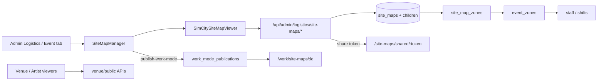

# Site Map Builder Enhancement Handoff

**Purpose:** Paste this document into another chat so an agent can build out and optimize Tourify’s logistics Site Map Builder into a highly functional expanded production tool.

**Repo root:** Tourify (`tourify-beta-K2`)

**Do not confuse with:** `app/sitemap.ts` — that is the SEO URL sitemap only. This handoff is about the **logistics interactive site map** feature.

---

## Mission

Enhance and optimize the logistics **Site Map Builder** for festival/event ops. Keep the existing **native HTML Canvas** architecture. Do **not** introduce Leaflet, Mapbox, Fabric.js, or Konva unless product explicitly requires GIS/lat-lng maps.

Extend what already exists:

- Geometry editing (zones, tents, elements)
- Layers, filters, measurements, issues
- Map tasks + zone ownership / roster sync
- Collaboration, share tokens, public viewers
- Work Mode publish → worker viewer

---

## Stack and coding language guidelines

| Layer | Standard |
|--------|----------|
| Language | TypeScript (`typescript` ^5), Node 20 |
| App | Next.js 15 App Router, React 18 |
| UI | Tailwind, Radix, Shadcn patterns, CVA, `lucide-react` |
| Validation | Zod; server actions via `next-safe-action` where used |
| Data | Supabase (`@supabase/ssr`, `@supabase/supabase-js`); SQL migrations are source of truth |
| Canvas | Native `<canvas>` + `CanvasRenderingContext2D`; DnD via `@dnd-kit/*` |
| Tests | Vitest unit/contract under `__tests__/logistics/`; Jest for broader suite; Playwright e2e |

### Style (from `.cursor/rules/shadcn.mdc`)

- Functional / declarative; no classes
- Named exports; components as `function Foo()`, not `const Foo =`
- Prefer `interface` over `type`; avoid enums (use maps)
- RORO helpers (receive an object, return an object)
- `"function"` for pure helpers; omit semicolons
- Booleans: `is` / `has` / `should` / `does`
- Early returns / guard clauses; happy path last
- Minimize `'use client'`, `useEffect`, and `setState`; favor RSC where possible
- Filenames and directories: lowercase-dash (e.g. `site-map-builder/`)
- Extensions: `.config.ts`, `.test.ts`, `.context.tsx`, `.type.ts`, `.hook.ts` as appropriate
- **NEVER RESET THE DATABASE**; additive migrations only
- Do not invent `AGENTS.md` / `CONTRIBUTING` rules — follow `.cursor/rules` and existing logistics patterns

### API / auth patterns

- Prefer `withAdminAuth` / `withAuth` from [`lib/auth/api-auth.ts`](../../lib/auth/api-auth.ts) for **new** admin routes
- Site-map ACL via [`lib/site-map/access.ts`](../../lib/site-map/access.ts):
  - `getSiteMapAccess`
  - `canAccessSiteMap`
  - `requireSiteMapAccess` (actions like `read` | `edit` | `manage` | …)
  - `siteMapSuccess` / `siteMapError` response helpers
- Org logistics scope: `resolveAuthorizedOrgLogisticsScope` and related helpers
- Default Supabase client: user-scoped `@/lib/supabase/server` `createClient()`
- Service role only when scope helpers require it — not for casual CRUD
- Never skip access checks on geometry, activity, export, publish, or share routes
- Avoid recursive RLS — use `private` schema `SECURITY DEFINER` helpers (see `supabase/migrations/20260710192849_site_map_rls_no_recursion.sql`)

### Testing expectations

| Kind | Path |
|------|------|
| Pure geometry | `__tests__/logistics/site-map-canvas-coords.test.ts` |
| Route / auth contracts | `__tests__/logistics/logistics-route-contract.test.ts` |
| Ops UX contracts | `__tests__/logistics/site-map-ops-upgrade.test.ts` |

Add tests for new pure helpers. Extend contract tests when touching auth, access, or publish.

### Do not

1. Never reset the database
2. Do not use legacy `complete_database_setup.sql` for active envs
3. Do not introduce Mapbox/Leaflet/Fabric/Konva for this feature
4. Do not bypass site-map access or org logistics scope helpers
5. Do not create recursive RLS between parent/child tables
6. Do not default to `'use client'` for data fetching
7. Do not trust client-supplied org/event IDs without server-side resolution

---

## Architecture (current)



**Rendering model:** pixel canvas with grid snap, pan/zoom, hit-test, resize handles:

- [`components/admin/logistics/site-map-builder/canvas-coords.ts`](../../components/admin/logistics/site-map-builder/canvas-coords.ts)
- [`components/admin/logistics/site-map-builder/canvas-draw.ts`](../../components/admin/logistics/site-map-builder/canvas-draw.ts)

Optional SVG `path_data` on elements is stored data, not an SVG editor. PNG export uses `canvas.toDataURL('image/png')` in the viewer.

### Main user flows

1. **Create** — Admin Logistics → Site Maps (or event Site Map tab) → create sheet → `POST /api/admin/logistics/site-maps`
2. **Edit geometry** — Open `SimCitySiteMapViewer`: zones, tents, elements, layers, filters, measure, issues, notes, tasks
3. **Collaborate / share** — Invite collaborators; optional public token → `/site-maps/shared/[token]`
4. **Publish** — `POST .../publish-work-mode` → map `published` + `work_mode_publications` → worker URL
5. **Work Mode** — Workers open `/work/site-maps/[id]`; complete tasks / report blockers
6. **Venue / artist** — Shared list or event page → public/read viewer
7. **Import / export / template** — JSON export/import; save-as-template; PNG from canvas
8. **Zone → roster** — Zone lead/dept syncs through `event_zones` into staffing

---

## Start-here files (read first)

1. [`types/site-map.ts`](../../types/site-map.ts) — domain types
2. [`components/admin/logistics/site-map-builder/simcity-site-map-viewer.tsx`](../../components/admin/logistics/site-map-builder/simcity-site-map-viewer.tsx) — main editor
3. [`components/admin/logistics/site-map/site-map-manager.tsx`](../../components/admin/logistics/site-map/site-map-manager.tsx) — list / create / publish shell
4. [`lib/site-map/access.ts`](../../lib/site-map/access.ts) — ACL
5. [`hooks/use-site-maps.ts`](../../hooks/use-site-maps.ts) + [`hooks/use-site-map-realtime.ts`](../../hooks/use-site-map-realtime.ts)
6. Foundation migration: [`supabase/migrations/20250131000000_site_map_system.sql`](../../supabase/migrations/20250131000000_site_map_system.sql)
7. Context docs (partially stale): [`docs/SITE_MAP_SYSTEM.md`](../SITE_MAP_SYSTEM.md), [`.agents/plans/phase-5-logistics.md`](../../.agents/plans/phase-5-logistics.md)

### Key exports to know

```ts
// lib/site-map/access.ts
getSiteMapAccess(supabase, siteMapId, userId?): Promise<SiteMapAccess>
canAccessSiteMap(access, action: SiteMapAccessAction): boolean
requireSiteMapAccess(access, action): SiteMapAccessSuccess | SiteMapAccessFailure

// lib/site-map/zone-roster-sync.ts
syncZoneOwnershipToRoster({ supabase, siteMapZoneId, eventId, leadUserId?, assignedDepartment?, actorUserId })
bulkAssignTeamToZone({ supabase, siteMapId, zoneId, leadUserId?, assignedDepartment?, starterTasks?, actorUserId })

// hooks
useSiteMaps(options?: { eventId?, tourId?, autoRefresh?, refreshInterval?, includeData? })
useSiteMap(options: { siteMapId, autoRefresh?, refreshInterval? })
useSiteMapRealtime({ siteMapId, userId?, enableGeometry? })

// UI
SiteMapManager({ eventId?, tourId?, compact?, eventLabel? })
SimCitySiteMapViewer({ siteMap, onClose?, onSave?, onDelete?, onPublish?, isReadOnly?, eventId? })
WorkerSiteMapViewer({ siteMapId })
PublicSiteMapViewer({ siteMap })
```

Publish helper pattern: worker URL → `/work/site-maps/${siteMapId}`.

---

## Full file inventory

### Types

| Path | Role |
|------|------|
| `types/site-map.ts` | Full domain TS: maps, zones, tents, elements, layers, tasks, measurements, issues, equipment, canvas tools, collab |

### Lib / services

| Path | Role |
|------|------|
| `lib/site-map/access.ts` | Server ACL |
| `lib/site-map/zone-roster-sync.ts` | Zone lead/dept → event_zones / staff / shifts |
| `lib/zones/event-zones.ts` | Canonical `event_zones` bridge for `site_map_zones` |
| `lib/admin/admin-ops-context.ts` | `buildAdminSiteMapHref(...)` deep links |
| `lib/admin/event-ops-tabs.ts` | Maps `site-map` / `site-maps` tabs → logistics |
| `lib/admin/operations-readiness.ts` | Readiness includes `has_site_map` |
| `lib/admin/tour-event-operations.service.ts` | Event settings can carry `site_map` |
| `lib/messaging/task-link-registry.ts` | `review_site_map` task deep-link |
| `lib/venue/event-ops-tabs.ts` | Venue IA referencing site maps |
| `lib/venue/build-action-items.ts` | Venue action items referencing site maps |
| `lib/auth/api-auth.ts` | `withAdminAuth` / `withAuth` wrappers |
| `lib/supabase/server.ts` | User-scoped server Supabase client |

### Hooks

| Path | Role |
|------|------|
| `hooks/use-site-maps.ts` | List CRUD / import / export / share + single-map zone/tent/element CRUD |
| `hooks/use-site-map-realtime.ts` | Supabase presence + activity/tasks/geometry version bumps |
| `hooks/use-work-mode.ts` | Resolves published site maps → `/work/site-maps/:id` |

### Admin builder UI

| Path | Role |
|------|------|
| `components/admin/logistics/site-map/site-map-manager.tsx` | List / create / open / duplicate / publish-to-work-mode shell |
| `components/admin/logistics/site-map/site-map-create-sheet.tsx` | Create form + size presets / templates |
| `components/admin/logistics/site-map/site-map-editor.tsx` | Re-exports `SimCitySiteMapViewer` as `SiteMapEditor` |
| `components/admin/logistics/site-map-builder/simcity-site-map-viewer.tsx` | **Main canvas editor** |
| `components/admin/logistics/site-map-builder/site-map-editor-shell.tsx` | Alias re-export of viewer |
| `components/admin/logistics/site-map-builder/canvas-coords.ts` | Grid / placement / hit-test / resize math |
| `components/admin/logistics/site-map-builder/canvas-draw.ts` | Symbol / label drawing helpers |
| `components/admin/logistics/site-map-builder/tool-palette.tsx` | Tool selector UI |
| `components/admin/logistics/site-map-builder/element-library-panel.tsx` | Canned elements DnD library |
| `components/admin/logistics/site-map-builder/element-inspector.tsx` | Selected-element property panel |
| `components/admin/logistics/site-map-builder/site-map-filter-bar.tsx` | Layer / status / assignee / issue filters |
| `components/admin/logistics/site-map-builder/site-map-context-drawer.tsx` | Zone ownership / roster context |
| `components/admin/logistics/site-map-builder/site-map-task-form.tsx` | Roster-backed map task create form |
| `components/admin/logistics/site-map-collaboration-panel.tsx` | Notes, issues, tasks, activity, presence |
| `components/admin/logistics/site-map-share-dialog.tsx` | Collaborators + public link UI |

### Consumer / Work Mode UI

| Path | Role |
|------|------|
| `components/site-maps/worker-site-map-viewer.tsx` | Work Mode worker UI (task complete / blockers) |
| `components/site-maps/public-site-map-viewer.tsx` | Read-only public / shared render |
| `components/venue/site-map-viewer.tsx` | Venue load → public or edit via editor |
| `components/account/work-mode-widget.tsx` | Surfaces `publication_type === 'site_map'` links |

### Pages (App Router)

| Path | Role |
|------|------|
| `app/admin/dashboard/logistics/logistics-page-client.tsx` | Logistics hub; Site Maps tab hosts `SiteMapManager` |
| `app/admin/dashboard/logistics/site-maps-enhanced/page.tsx` | Redirect → canonical logistics site-map href |
| `app/admin/dashboard/events/[id]/components/event-site-map-tab.tsx` | Event ops tab wrapping manager |
| `app/work/site-maps/[id]/page.tsx` | Worker page → `WorkerSiteMapViewer` |
| `app/site-maps/shared/[token]/page.tsx` | Token public share page |
| `app/venue/dashboard/site-maps/page.tsx` | Venue shared-maps list + viewer |
| `app/venue/site-maps/page.tsx` | Redirect → dashboard site-maps |
| `app/artist/events/[id]/site-map/page.tsx` | Artist event site-map (public viewer) |
| `app/sitemap.ts` | **SEO only — ignore for this feature** |

### Admin APIs (`app/api/admin/logistics/site-maps/`)

| Path | Methods | Purpose |
|------|---------|---------|
| `route.ts` | GET, POST | List / create |
| `[id]/route.ts` | GET, PUT, DELETE | Map CRUD |
| `[id]/zones/route.ts` | GET, POST | Zones list / create |
| `[id]/zones/[zoneId]/route.ts` | GET, PUT, DELETE | Zone CRUD |
| `[id]/zones/bulk-assign/route.ts` | POST | Bulk team → zone |
| `[id]/tents/route.ts` | GET, POST | Tents list / create |
| `[id]/tents/[tentId]/route.ts` | GET, PUT, DELETE | Tent CRUD |
| `[id]/elements/route.ts` | GET, POST | Elements list / create |
| `[id]/elements/[elementId]/route.ts` | GET, PUT, DELETE | Element CRUD |
| `[id]/tasks/route.ts` | GET, POST | Map tasks |
| `[id]/tasks/[taskId]/route.ts` | PATCH, DELETE | Task update / delete |
| `[id]/notes/route.ts` | GET, POST, PATCH | Notes via activity log |
| `[id]/activity/route.ts` | GET, POST | Activity |
| `[id]/share/route.ts` | POST | Invite collaborator |
| `[id]/collaborators/route.ts` | GET, DELETE | List / remove collaborators |
| `[id]/public-link/route.ts` | POST | Share token |
| `[id]/export/route.ts` | GET | JSON export |
| `import/route.ts` | POST | Import |
| `[id]/save-template/route.ts` | POST | Save template |
| `[id]/publish-work-mode/route.ts` | POST | Publish → Work Mode |
| `layers/route.ts` | GET, POST | Layers |
| `layers/[id]/route.ts` | GET, PUT, PATCH, DELETE | Layer CRUD |
| `measurements/route.ts` | GET, POST | Measurements |
| `measurements/[id]/route.ts` | GET, PUT, PATCH, DELETE | Measurement CRUD |
| `issues/route.ts` | GET, POST | Issues |
| `issues/[id]/route.ts` | GET, PUT, PATCH, DELETE | Issue CRUD |

### Other APIs

| Path | Methods | Purpose |
|------|---------|---------|
| `app/api/work/site-maps/[id]/route.ts` | GET | Worker payload |
| `app/api/venue/site-maps/[id]/route.ts` | GET | Venue-scoped read |
| `app/api/site-maps/shared/route.ts` | GET | Maps shared with current user |
| `app/api/site-maps/public/[token]/route.ts` | GET | Public-by-token |

### Migrations (active)

| Path |
|------|
| `supabase/migrations/20250131000000_site_map_system.sql` |
| `supabase/migrations/20250131000001_fix_site_map_policies.sql` |
| `supabase/migrations/20250131000002_enhanced_site_map_features.sql` |
| `supabase/migrations/20250131000013_fix_site_map_rls_policies.sql` |
| `supabase/migrations/20260529102000_site_map_realtime_publication.sql` |
| `supabase/migrations/20260529103000_site_map_task_assignments_v2.sql` |
| `supabase/migrations/20260529104000_site_map_templates_and_scale.sql` |
| `supabase/migrations/20260529105000_site_map_public_share_tokens.sql` |
| `supabase/migrations/20260630120000_site_map_ops_live_fields.sql` |
| `supabase/migrations/20260630121000_site_map_rls_hardening.sql` |
| `supabase/migrations/20260710120000_site_map_geometry_owner_rls.sql` |
| `supabase/migrations/20260710140000_site_map_zone_ownership.sql` |
| `supabase/migrations/20260710192849_site_map_rls_no_recursion.sql` |

**Related (integration):**

| Path | Role |
|------|------|
| `supabase/migrations/20260610000200_event_zones.sql` | `event_zones` bridge / `site_map_zones.event_zone_id` |
| `supabase/migrations/20260630211500_operations_work_mode_publications.sql` | `work_mode_publications`, day-sheet `site_map_id` |
| `supabase/migrations/20260630214500_logistics_team_communications_scope.sql` | Logistics team / communications scope |

### Tests

| Path | Role |
|------|------|
| `__tests__/logistics/site-map-canvas-coords.test.ts` | Unit tests for canvas math |
| `__tests__/logistics/site-map-ops-upgrade.test.ts` | Contract: ownership, worker, drawer / task form |
| `__tests__/logistics/logistics-route-contract.test.ts` | Access guards on site-map APIs |

### Docs / plans (context; treat archive as historical)

| Path | Role |
|------|------|
| `docs/SITE_MAP_SYSTEM.md` | Primary overview (partially stale names) |
| `docs/ENHANCED_SITE_MAP_PHASE1_COMPLETE.md` | Phase-1 enhanced features writeup |
| `.agents/plans/phase-5-logistics.md` | Plan to expose zones/tents/layers/measurements — **may be stale vs current SimCity viewer** |
| `docs/audits/PLATFORM_AUDIT_REPORT.md` | AUD-0102: publish-work-mode 501 when migrations missing |
| `docs/archive/SITE_MAP_*.md` | Historical fix / design notes |
| `docs/VENDOR_FEATURES_GUIDE.md` | Vendor / logistics overlap |
| `docs/implementation/logistics-tab-smoke-checklist.md` | Smoke checklist |

### Scripts (legacy / ops — prefer not to rely on)

- `scripts/test-site-map-api.js`
- `scripts/check-site-map-tables.js`
- `scripts/apply-site-map-migration.js`
- `scripts/fix-site-map-system.sql`
- `scripts/clean-site-map-migration.sql`
- `scripts/legacy/test-site-map-api.js`

---

## Data model (core tables)

| Table | Role / key columns |
|--------|---------------------|
| **`site_maps`** | `id`, `event_id`, `tour_id`, `name`, `description`, `width`, `height`, `scale`, `scale_unit`, `background_image_url`, `background_color`, `grid_enabled`, `grid_size`, `is_public`, `requires_auth`, `status` (`draft`/`published`/`archived`), `version`, `created_by` |
| **`site_map_zones`** | geometry (`x,y,width,height,rotation`), visuals, capacity/amenities, `zone_type`, `status`; later: `event_zone_id`, `lead_user_id`, `assigned_department` |
| **`glamping_tents`** | tent inventory on map: type, capacity, guest fields, amenities, pricing, geometry |
| **`site_map_elements`** | paths/buildings/utilities; `path_data`, `shape_data`, `properties` JSONB |
| **`map_layers`** | layer type, color, opacity, visibility, lock, z-index |
| **`map_versions`** | named versions / current flag |
| **`map_task_assignments`** | pin tasks to zone/tent/element; title, due_date, assignees, coordinate, checklist, blocker, `event_task_id` |
| **`map_measurements`** | distance/area/clearance/ADA/etc. |
| **`map_templates`** | reusable layout JSON |
| **`map_issues`** | severity + pin coords |
| **`site_map_collaborators`** | `can_edit`, `can_manage_tents/zones`, `can_invite_users`, `can_export`, `is_active`, expiry |
| **`site_map_share_tokens`** | public link tokens |
| **`site_map_activity_log`** | audit + **notes/issues/status_change** store (`entity_type` = `note` / `issue` / …) |
| **`work_mode_publications`** | `publication_type` includes `'site_map'`, FK `site_map_id` |
| **`day_sheets`** | optional `site_map_id` |
| **`event_zones`** | bridge for zone ownership → roster |

Equipment tables also exist in the foundation migration (`equipment_catalog`, `equipment_instances`, setup workflows, power distribution, QR codes) — adjacent, not fully productized in the builder UI.

### Known type / storage mismatch

`types/site-map.ts` defines `SiteMapNote` as if a dedicated notes table exists. Notes APIs persist via **`site_map_activity_log`**. Align types with storage when touching notes.

---

## Integration points

| Surface | How |
|---------|-----|
| Admin Logistics | Site Maps tab in `logistics-page-client.tsx` |
| Event ops | `event-site-map-tab.tsx` + `buildAdminSiteMapHref` |
| Tours | `site_maps.tour_id` + tour-scoped publications |
| Work Mode | `publish-work-mode` → `work_mode_publications` → `/work/site-maps/[id]` |
| Day sheets | `day_sheets.site_map_id` |
| Zone → roster | `lib/site-map/zone-roster-sync.ts` ↔ `event_zones` |
| Venue / Artist | shared list + public/read viewers |
| Comms | `review_site_map` task deep-link in messaging registry |
| Ops readiness | `has_site_map` in operations readiness |

---

## Known gaps / constraints

1. **Publish Work Mode 501** if `work_mode_publications` is missing — gracefully degrade; verify migrations applied (`AUD-0102` in `docs/audits/PLATFORM_AUDIT_REPORT.md`)
2. Notes type vs `site_map_activity_log` storage mismatch
3. Phase-5 plan (`.agents/plans/phase-5-logistics.md`) claims UI gaps that may already be partially implemented — **re-verify against `simcity-site-map-viewer.tsx` before rebuilding**
4. Pixel canvas only (no lat/lng GIS)
5. Adjacent logistics (vendor/equipment hubs) may still use mock data — out of scope unless needed for map tasks
6. Auth style inconsistent: older list/create routes use manual `createClient` + `getUser`; newer routes use `withAdminAuth` — standardize on new work
7. `docs/SITE_MAP_SYSTEM.md` references outdated component names (`SiteMapCanvas`, `MobileSiteMapViewer`, etc.)
8. Create-map path may retry without `scale_unit` if column missing (schema resilience hack)
9. No dedicated floor-plan / venue-GIS module beyond this site-map system

---

## Recommended enhancement agenda

Prioritized build-out for a highly functional expanded builder:

### 1. Hardening

- Unify admin auth wrappers on site-map API routes
- Never skip `requireSiteMapAccess`
- Fix publish graceful failure when Work Mode tables are missing
- Align notes types with `site_map_activity_log`

### 2. Editor UX / performance

- Extract monolith `simcity-site-map-viewer.tsx` into smaller modules
- Layer visibility / lock polish
- Undo / redo via `map_versions`
- Dirty-state save UX
- Canvas redraw throttling / spatial index for hit-tests on large maps

### 3. Ops completeness

- Zone ownership + bulk-assign UX
- Roster-backed tasks
- Measurements / issues first-class in toolbar
- Templates create-from-list / gallery

### 4. Work Mode loop

- Worker task complete / blocker reliability
- Publish status visible in manager
- Day-sheet link to published map

### 5. Collaboration

- Realtime presence / activity polish
- Share dialog permissions
- Public viewer fidelity vs editor

### 6. Import / export

- Full JSON round-trip including layers, tasks, measurements
- PNG export quality
- Template gallery

### 7. Mobile field use

- Touch-friendly worker viewer
- Read-only filters for leads

### 8. Tests

- Expand canvas-coords coverage
- Extend route contracts for every new mutation path
- Prefer pure-helper unit tests + source-contract auth locks

**Constraints while implementing:** Do not reset DB. Prefer additive migrations. Preserve RLS non-recursion pattern. Keep native canvas (no new map libraries).

---

## Suggested prompt for the next chat

Copy and paste:

> Read `docs/handoffs/SITE_MAP_BUILDER_ENHANCEMENT_HANDOFF.md` and implement the recommended enhancement agenda for the logistics Site Map Builder. Follow the coding guidelines and integration constraints in that doc. Start by auditing `simcity-site-map-viewer.tsx` against Phase-5 claims in `.agents/plans/phase-5-logistics.md`, then harden access/publish, then expand editor UX and the Work Mode loop with tests. Do not reset the database. Do not introduce Leaflet/Mapbox/Fabric/Konva. Ignore `app/sitemap.ts` (SEO only).

---

## Quick command reference

```bash
# Dev
npm run dev

# Unit / contract tests (Vitest)
npm run test:unit -- __tests__/logistics/

# Apply migrations (never reset)
npx supabase db push
```
