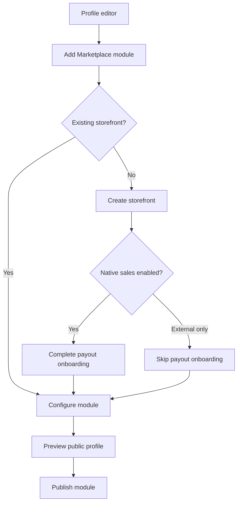
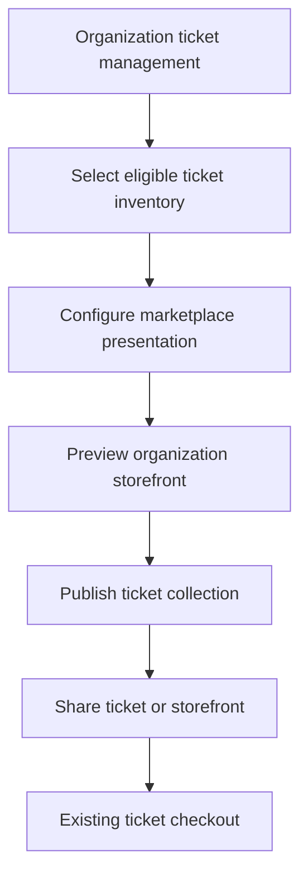
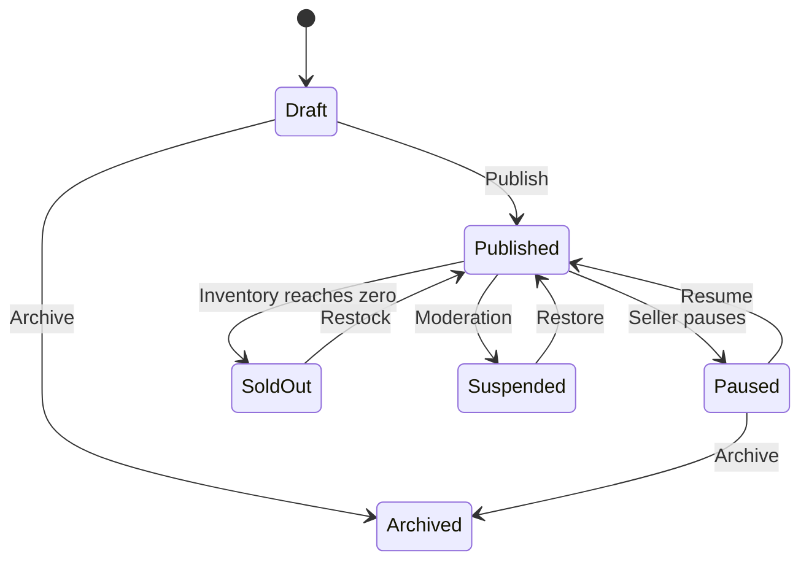
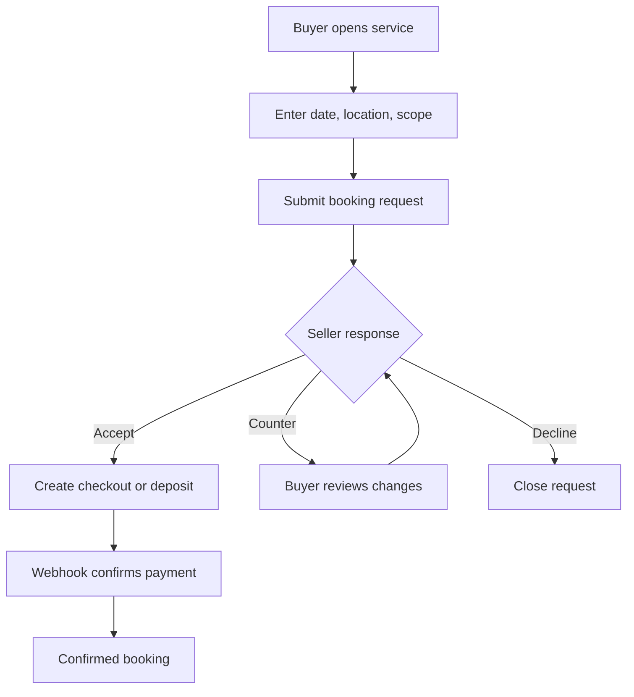
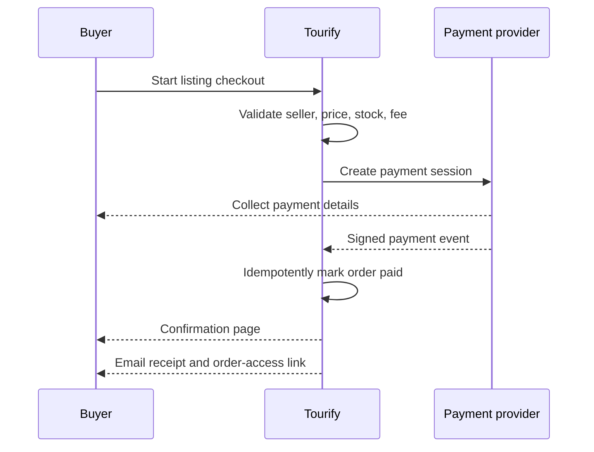

# Roles, Permissions, and User Flows

## 1. Actor Model

### Seller Actors

- General account owner.
- Artist account owner or authorized artist team member.
- Venue account owner or authorized venue team member.
- Organization member with existing ticket-management permission.

### Buyer Actors

- Logged-out guest.
- Authenticated Tourify user.

### Operational Actors

- Marketplace moderator.
- Finance/support administrator.
- System/webhook worker.

The implementation must reuse Tourify's authoritative account and team-role system. Marketplace permissions must not be inferred from editable profile metadata.

## 2. Permission Matrix

| Action | Owner | Authorized team member | Buyer | Moderator | Finance admin |
| --- | ---: | ---: | ---: | ---: | ---: |
| Configure storefront | Yes | Per existing role | No | View/suspend | View |
| Create or edit eligible listing | Yes | Per existing role | No | View/suspend | View |
| Publish listing | Yes | Per existing role | No | Override/suspend | View |
| View public listing | Yes | Yes | Yes | Yes | Yes |
| View private seller draft | Yes | Per existing role | No | Yes | As needed |
| Buy/request service | No self-purchase by default | No self-purchase by default | Yes | No | No |
| View customer address | For own paid physical order | For own store and proper role | Own order only | Redacted by default | As required |
| Refund | Per policy | Per role | Request only | No | Yes/per policy |
| Change fee rules | No | No | No | No | Admin only |

## 3. General Account: Activate a Storefront

### Detailed Steps

1. User enters the current profile editor.
2. User selects `Add section` or equivalent and chooses `Marketplace`.
3. If no storefront exists, Tourify creates a draft storefront linked to the current account identity.
4. User chooses:
   - Add native product.
   - Add native service.
   - Add external listing.
   - Finish storefront setup later.
5. Native selling triggers payment/payout onboarding before a native listing can accept payment. Draft creation remains available before onboarding completes.
6. User chooses featured listings, module title, card density, and profile placement.
7. Preview shows desktop and mobile states.
8. Publishing activates the module only when the storefront has at least one eligible published listing.

### Edge Cases

- An empty storefront stays private and shows an owner-only setup prompt.
- A paused store removes public purchase actions without deleting profile configuration.
- If payout onboarding becomes restricted, external listings remain eligible; native checkout is paused.

## 4. Artist Storefront Flow

1. Artist opens the marketplace area from the artist dashboard.
2. Tourify displays a context banner confirming the active artist identity.
3. Artist may create:
   - Native merchandise.
   - External merchandise.
   - Eligible non-music services.
4. Music is not available as a marketplace category. The interface links to the current music-management surface.
5. Artist selects featured items and enables the profile Marketplace module.
6. Artist shares a product or the whole storefront to the feed.

### Guardrails

- Artist team roles must reuse existing permissions such as owner/admin/commerce manager where available.
- Merchandise inventory is not coupled to music-track inventory.
- If current artist analytics already aggregate merchandise revenue, new order events should feed the same reporting layer rather than create an isolated dashboard.

## 5. Venue Storefront Flow

1. Authorized user switches to the venue account.
2. User opens venue marketplace management.
3. User creates merchandise, external listings, or venue services.
4. For a service, user selects fixed-price, booking request, or quote request.
5. Availability may optionally read from the venue calendar after the integration audit.
6. The storefront is added to the venue's public profile and discoverable in the hub.

Possible venue services include room rental, rehearsal time, production packages, equipment rental, VIP upgrades, and hospitality add-ons. The implementation must identify and prevent duplication with the existing venue-booking system.

## 6. Organization Ticket Storefront Flow

### Rules

- Organizations do not receive product or service creation controls.
- The marketplace references existing events and ticket types.
- A ticket card cannot remain purchasable after its existing sales window closes or inventory is exhausted.
- Ticket purchase confirmation and QR issuance remain within the ticketing domain.
- Marketplace analytics may attribute the source as hub, profile, or feed without changing the underlying order.

## 7. Create a Native Physical Listing

1. Seller selects `New listing` → `Physical good`.
2. Seller enters title, category, description, media, price, currency, stock, variants, handling time, and fulfillment choices.
3. Form autosaves a draft.
4. Server validates account entitlement and listing data.
5. Seller previews:
   - Marketplace card.
   - Listing page.
   - Profile module card.
   - Feed share card.
6. Seller publishes.
7. Listing becomes discoverable only if store status, seller status, payout eligibility, moderation state, and inventory permit.

### Listing State Flow

Archived is reversible in version 1. Hard deletion is not exposed for listings referenced by posts, orders, or audit records.

## 8. Attach a Third-Party Listing

1. Seller selects `New listing` → `External listing`.
2. Seller pastes an HTTPS listing URL.
3. Server:
   - Normalizes and validates the URL.
   - Blocks private/local network targets and unsafe schemes.
   - Checks the domain against security controls.
   - Fetches limited metadata with time, size, content-type, and redirect limits.
4. Tourify shows imported title, image, description, provider, displayed price, and currency.
5. Seller corrects the presentation and confirms they own or are authorized to promote the listing.
6. Preview visibly identifies external checkout.
7. Publish creates a Tourify marketplace listing with the external destination.
8. Buyer action records attribution and redirects to the provider.

### Failure Handling

- Metadata failure does not require abandoning the flow; seller may enter permitted fields manually.
- Invalid destination keeps the listing in draft.
- Redirect loops, malware signals, blocked domains, or non-HTTPS links prevent publication.
- A scheduled link-health check can pause unsafe links without deleting the listing.

## 9. Create a Fixed-Price Service

1. Seller selects `Service` and `Fixed price`.
2. Seller defines service scope, included deliverables, price, optional add-ons, lead time, service area, and cancellation terms.
3. Buyer selects options and begins checkout.
4. Payment succeeds and creates a service order.
5. Seller receives an action request and starts delivery through the existing messaging/task system where appropriate.
6. Seller marks complete; buyer is notified.

If scheduling is mandatory, the seller should use booking mode rather than hiding scheduling requirements inside free text.

## 10. Request a Booking

### Rules

- Requested time is not confirmed until the seller accepts and any required payment completes.
- Holds expire automatically.
- Calendar writes occur only after accepted/paid state according to the existing calendar model.
- Both parties see a chronological event history.
- Changes create new terms/version records; prior terms remain auditable.

## 11. Request and Accept a Quote

1. Buyer enters requirements, desired date, budget range, location, references, and approved attachments.
2. Seller reviews and responds with line items, taxes/fees presentation, expiration, deposit/full-payment choice, and terms.
3. Seller may revise the quote; each revision is immutable after sending.
4. Buyer accepts a specific quote version.
5. Server revalidates the quote and creates checkout.
6. Payment webhook confirms the order and locks the accepted quote version.
7. Declined or expired quotes cannot be paid.

## 12. Guest Native Checkout

### Guest Recovery

- Confirmation uses an opaque, expiring access token or server session.
- The public order number alone never grants access.
- Email verification is required to claim an order to a Tourify account.
- Claiming links `buyer_user_id` without changing the original order email snapshot.

## 13. Feed Share Flows

### Specific Item

1. User selects `Share to feed`.
2. Composer displays a live listing attachment.
3. User adds caption and audience according to existing feed controls.
4. Published card resolves current listing availability.
5. Action routes:
   - Native good/fixed service → checkout/pre-checkout.
   - Booking → booking request.
   - Quote → quote request.
   - External → external provider.
   - Ticket → existing ticket checkout.

### Entire Storefront

1. User selects `Share marketplace`.
2. Composer shows store hero, seller identity, category summary, and featured items.
3. CTA routes to the storefront.

### Resharing

- Reshare attribution preserves both sharing user and original seller.
- Seller cannot be impersonated by editing the attached store/listing identity.

## 14. Refund, Cancellation, and Dispute Flow

1. Buyer requests support/refund from order detail.
2. Policy engine identifies seller-managed versus admin-managed action.
3. Seller or authorized admin reviews.
4. Approved native refund is initiated through the current payment provider.
5. Webhook confirms financial state.
6. Order, fee, payout, inventory, and notifications update idempotently.
7. Every action is appended to the order/audit timeline.

External-listing purchases show provider support instructions; Tourify does not represent them as Tourify orders.

