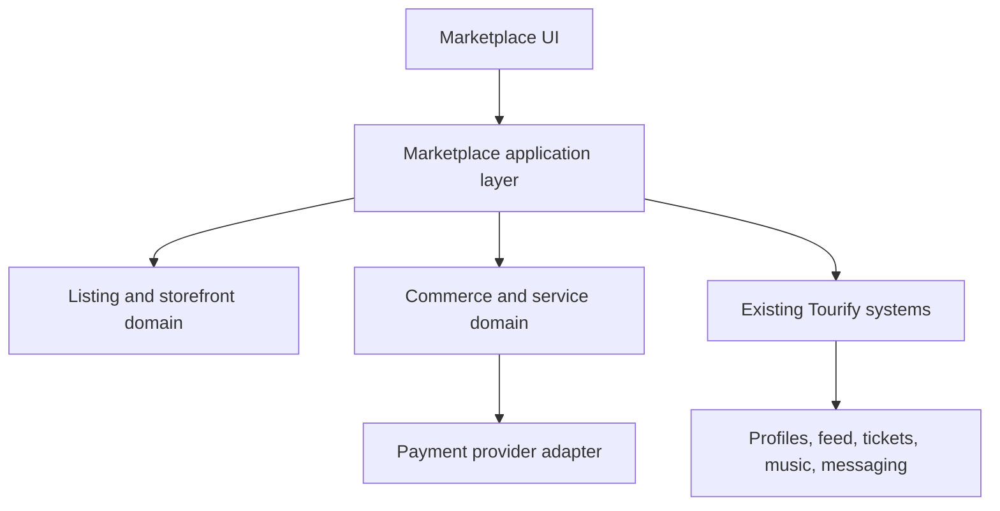

# Technical Architecture Handoff

## 1. Architecture Position

Marketplace should be a domain layer connected to existing Tourify systems, not a parallel application.



### Core Boundaries

- **Storefront/listing domain:** presentation, eligibility, discovery, variants, inventory, external links.
- **Commerce domain:** native checkout, orders, payments, fees, refunds, fulfillment.
- **Service domain:** requests, offers/quotes, booking state, deposits/payments.
- **Integration domain:** profiles, feed, ticketing, music bridge, notifications, analytics, calendar, messaging.
- **Admin/trust domain:** moderation, external-link safety, fee rules, audit.

## 2. Repository Audit Before Design Freeze

The implementation agent must produce an integration map with exact file paths, table names, functions, routes, and owners for:

1. Multi-account context and account-switching.
2. Account membership and authorization.
3. Public profiles and configurable sections.
4. Feed posts, attachments, resharing, and Open Graph rendering.
5. Payments, checkout sessions, payment intents, refunds, fees, webhooks, and environment variables.
6. Ticket products and checkout.
7. Music player and distribution.
8. Notifications, email, messaging, calendar, tasks, and analytics.
9. Supabase clients, server helpers, generated types, RLS patterns, storage buckets, and migration workflow.
10. Feature flags, admin roles, audit logs, error handling, rate limiting, and observability.

If an equivalent exists, extend or reference it. Do not create a second source of truth.

## 3. Technology Direction

Based on known Tourify context:

- Next.js App Router.
- TypeScript/React.
- Supabase Postgres, Auth, and Storage.
- Existing Tailwind/Radix/shadcn conventions.

The implementation must confirm actual versions and patterns from lockfiles and code. Do not upgrade core dependencies as part of the marketplace unless required and separately approved.

## 4. Payment Provider Strategy

### Conditional Recommendation

If Tourify's existing native payments use Stripe, prefer:

- Stripe Connect for seller onboarding/payout eligibility.
- Checkout Sessions or the existing approved payment UI for guest-compatible native checkout.
- Destination or direct charges selected only after merchant-of-record, dispute, cross-border, and fee-liability review.
- Application fees for Tourify's configurable fee where compatible with the selected charge model.
- Signed webhooks as the authoritative payment signal.

If Tourify uses another provider, create the same domain behavior through that existing provider. Do not introduce Stripe as a second processor merely because this document recommends it conditionally.

### Provider Adapter

Create or extend a server-only interface resembling:

```ts
interface MarketplacePaymentProvider {
  getSellerCapability(accountId: string): Promise<SellerPaymentCapability>;
  createOnboardingLink(accountId: string, returnUrl: string): Promise<string>;
  createCheckout(input: CreateMarketplaceCheckoutInput): Promise<CheckoutResult>;
  createRefund(input: CreateMarketplaceRefundInput): Promise<RefundResult>;
  verifyWebhook(rawBody: Uint8Array, signature: string): Promise<VerifiedPaymentEvent>;
}
```

Do not leak provider-specific identifiers throughout client components. Store provider IDs in protected integration records.

## 5. Checkout Transaction Design

### Server-Authoritative Sequence

1. Receive listing, variant/options, quantity, fulfillment selection, buyer email, and idempotency key.
2. Load current seller, storefront, listing, price, stock, fee rule, and payment capability.
3. Reject ineligible account/listing combinations.
4. Calculate price and fee on the server.
5. Create a pending order and immutable line-item snapshots in one database transaction.
6. Reserve inventory with an expiration when applicable.
7. Create provider checkout with internal order ID in provider metadata.
8. Persist provider session ID.
9. Return provider-controlled checkout details/URL.
10. On signed webhook, lock/process the event idempotently and transition order/payment/inventory.
11. Send notifications through an outbox or retry-safe job mechanism.

Never fulfill solely from the browser return URL.

### Single-Seller Constraint

Version 1 checkout contains items from one storefront. This prevents premature multi-party split-payment logic and keeps seller policies, shipping, tax context, and refunds coherent.

### Idempotency

- Client generates a checkout-attempt key.
- Server enforces unique key per buyer/session plus normalized checkout input.
- Payment events have a unique provider/event key.
- Order transition functions ignore or safely reconcile duplicates.
- Notifications are keyed to domain event plus recipient.

## 6. Third-Party Import Architecture

### Import Service

Server-only, with:

- HTTPS-only URL parsing.
- DNS/IP checks that reject loopback, link-local, private, metadata-service, and internal destinations.
- Redirect count and cross-domain redirect controls.
- Timeout and response-size limits.
- Content-type allowlist.
- No browser-supplied HTML.
- Sanitized Open Graph/schema metadata extraction.
- Image proxy/import through existing media validation only when rights and storage policy permit; otherwise retain an approved remote URL strategy.
- Domain risk controls and audit logs.

### External Click Redirect

Use a server redirect endpoint:

1. Load published eligible listing.
2. Revalidate normalized destination/domain policy.
3. Record source attribution without sensitive query leakage.
4. Return a safe 302/303 to the stored destination.

Never accept an arbitrary destination URL in the redirect request.

## 7. Search and Discovery

Start with Postgres-backed search compatible with current Tourify patterns:

- Search vector or indexed normalized fields for title, seller, category, tags, and location.
- Structured filters for listing type, account type, transaction mode, status, currency, and fulfillment.
- Cursor pagination preferred for stable large result sets.
- Indexed public-eligibility predicates.

Do not add an external search service until measured scale or latency warrants it. Search results must be derived only from published/eligible records and must not expose draft or private fields.

## 8. Feed Integration

Prefer a typed association:

- Existing post remains the parent.
- Add a marketplace attachment/join record referencing either listing or storefront.
- Renderer loads current public projection and current CTA state.
- Post authorization stays in the feed domain.
- Marketplace seller authorization stays in the marketplace domain.
- Deleting/archiving a post does not delete a listing.
- Archiving/suspending a listing does not delete a post; it changes attachment rendering.

Open Graph metadata for shared URLs should be produced server-side from the public listing/storefront projection.

## 9. Profile Integration

- Extend the existing profile section registry with a Marketplace module type.
- Store module configuration using the current profile-layout system where possible.
- The module references a storefront; it does not copy listing records.
- Use one shared public listing-card component with explicit variants for hub, profile, feed, and compact views.
- Account context must be passed from the authoritative server resolution, not a query parameter alone.

## 10. Ticket Integration

Create a read adapter around the existing ticket domain:

```ts
interface MarketplaceTicketSource {
  listEligibleTickets(organizationId: string, filters: TicketFilters): Promise<TicketCard[]>;
  getPurchaseTarget(ticketTypeId: string): Promise<TicketPurchaseTarget>;
}
```

Marketplace stores display references/projections only. They do not decrement ticket inventory, create QR codes, or calculate ticket fees.

## 11. Service Workflow Architecture

Use a shared request aggregate with typed modes:

- `fixed_price`
- `booking_request`
- `quote_request`

Booking and quote terms must be versioned. Messages may reference the request while remaining in the existing messaging system. Calendar events are created only after the workflow reaches the approved confirmed state.

Suggested state transitions:

- Booking: submitted → under_review → countered/accepted/declined/expired → payment_pending → confirmed → completed/canceled/refunded.
- Quote: submitted → under_review → quoted → revised → accepted/declined/expired → payment_pending → paid → in_progress → completed/canceled/refunded.

All transitions run through server functions with role checks and optimistic concurrency/version checks.

## 12. API Surface

Exact route names must follow repository conventions.

### Public Reads

- Search/list public marketplace.
- Read storefront.
- Read listing.
- Resolve public CTA state.

### Seller Commands

- Create/update storefront.
- Create/update/preview/publish/pause/archive listing.
- Import/refresh external listing metadata.
- Reorder featured listings.
- Configure profile module.
- Share listing/storefront to feed.
- Manage inventory/fulfillment.
- Accept/decline/counter booking.
- Create/revise quote.

### Buyer Commands

- Create checkout.
- Submit booking request.
- Submit quote request.
- Accept quote/counter.
- Claim guest order.
- Request cancellation/refund/support.

### System/Admin

- Payment webhook.
- External-link health check.
- Expire checkout holds, requests, and quotes.
- Suspend/restore store/listing.
- Configure fees/categories.
- Payment/refund reconciliation.

## 13. Validation and Authorization

- Shared schemas for server actions/API routes using the project's existing validation library.
- Server resolves active account and membership for every seller command.
- Listing type entitlement is checked at create, update, publish, and checkout.
- Price, fee, stock, and redirect target never come from trusted client state.
- Admin authorization uses current authoritative roles/app metadata, never editable user metadata.
- Mass assignment is prevented with explicit command DTOs.

## 14. Domain Events

Emit internal events after committed state changes:

- `marketplace.store.activated`
- `marketplace.listing.published`
- `marketplace.listing.suspended`
- `marketplace.external.clicked`
- `marketplace.checkout.created`
- `marketplace.order.paid`
- `marketplace.order.refunded`
- `marketplace.fulfillment.updated`
- `marketplace.booking.requested`
- `marketplace.booking.confirmed`
- `marketplace.quote.sent`
- `marketplace.quote.accepted`

Use events for notifications, analytics, and integrations; do not make critical order commits depend on optional analytics delivery.

## 15. Observability

- Structured logs with request, account, storefront, listing, order, and provider-event identifiers.
- Metrics for checkout creation, webhook age/failures, inventory reconciliation, redirect failure, notification retries, and request-state latency.
- Alert on repeated webhook failures, paid orders stuck pending, negative inventory, payout restriction, and unsafe external links.
- Admin support timeline combines domain events without exposing raw secrets.

## 16. Feature Flags

At minimum:

- `marketplace_enabled`
- `marketplace_public_discovery_enabled`
- `marketplace_native_goods_enabled`
- `marketplace_services_enabled`
- `marketplace_external_listings_enabled`
- `marketplace_guest_checkout_enabled`
- Account-type flags.
- Account allowlist/beta cohort.

Flags disable entry points and commands while preserving data.

## 17. Official Technical References

- Stripe marketplace overview: https://docs.stripe.com/connect/end-to-end-marketplace
- Stripe application fees: https://docs.stripe.com/connect/marketplace/tasks/app-fees
- Stripe Checkout fulfillment: https://docs.stripe.com/checkout/fulfillment
- Stripe webhook verification: https://docs.stripe.com/webhooks
- Supabase RLS: https://supabase.com/docs/guides/database/postgres/row-level-security
- Supabase Storage access control: https://supabase.com/docs/guides/storage/security/access-control
- Supabase Data API table exposure change: https://supabase.com/changelog/45329-breaking-change-tables-not-exposed-to-data-and-graphql-api-automatically

