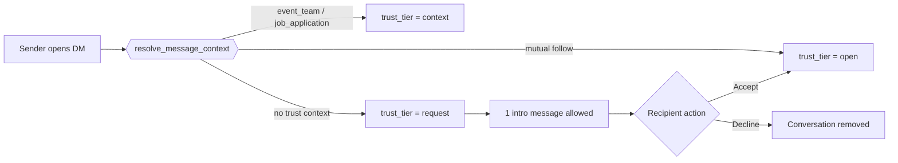

# Messaging Capability Matrix

## Policy Principles

- Messaging capabilities are granted by context, not only layout role.
- Context sources are `follows`, `event_participants`, `job_applications` (and `job_posting_templates.allow_applicant_messages`), and accepted message requests.
- Viewer accounts (`profiles.role = 'viewer'`) are read-only for messaging APIs and UI compose controls.

## Direct Messaging Tiers

| Tier      | Rule                                                              | Result                                                              |
| --------- | ----------------------------------------------------------------- | ------------------------------------------------------------------- |
| `open`    | Mutual follow or accepted request                                 | Normal direct thread behavior                                       |
| `context` | Shared event team, applicant↔reviewer, applicant↔posting owner    | Direct messaging without a social follow                            |
| `request` | No trust context                                                  | One intro message, recipient must accept or decline                 |

## Trust-tier Flow

## Cross-role Allowances

| From ↔ To                  | Allowed Contexts                                                       | Default Routing                                |
| --------------------------- | ---------------------------------------------------------------------- | ---------------------------------------------- |
| Artist ↔ Venue owner        | Job application, event-team, mutual follow                             | Work tab for context, Primary for open         |
| Crew ↔ Tour/Event manager   | Shared event participation                                             | Work tab                                       |
| Vendor ↔ Event team         | Shared event participation                                             | Work tab                                       |
| Applicant ↔ Posting owner   | `allow_applicant_messages = true` on the posting                       | Work tab (context = `job_application`)         |
| Viewer ↔ Any                | None (compose disabled in UI; blocked by API + RLS `is_viewer()`)      | Read-only inbox only                           |

## Transition Rules

- Request → Open: `POST /api/messages/[conversationId]/accept` (recipient only)
- Request → Removed: `POST /api/messages/[conversationId]/decline` (recipient only)
- Context conversation creation: API or `send_dm_request()` RPC marks `trust_tier = 'context'` with `context_type/context_id`

## Notification Mapping

- Direct DM: `message`
- Direct DM request: `message_request`
- Group thread messages: `group_message`
- Event group messages: `group_message`

All notification inserts are gated through `should_send_notification`.

## Implementation Status

| Area                                                                 | Web                                | Mobile                                 |
| -------------------------------------------------------------------- | ---------------------------------- | -------------------------------------- |
| Inbox tabs (Primary / Requests / Work)                                | Implemented (`app/messages/`)      | Implemented (segmented bar)            |
| Optimistic accept / decline + sender waiting state                    | Implemented                        | Not yet                                |
| Trust-tier context chips                                              | Implemented                        | Request badge only                     |
| Composer disabled for viewer accounts (`profiles.role = 'viewer'`)    | Implemented via `viewer.canSend`   | Composer respects API rejection        |
| Group create dialog with member picker                                | Implemented                        | N/A (web-only entry point)             |
| Group thread view                                                     | Implemented (`/groups/[id]`)       | Implemented (`/group-chats/[id]`)      |
| Event group chat realtime (admin hub + viewer)                        | Realtime subscription              | Realtime via shared Supabase channel   |
| Mention extraction filtered to thread members                         | Implemented                        | N/A (mention syntax not surfaced yet)  |
| Cursor pagination on messages / group messages / unified list         | Implemented                        | Reads default page (uses API limits)   |

## Realtime Channels (Appendix)

| Channel                                              | Source                                       | Notes                                              |
| ---------------------------------------------------- | -------------------------------------------- | -------------------------------------------------- |
| `messages-{conversationId}`                          | `app/messages/messages-page-client.tsx`      | One per opened DM thread                            |
| `conversations-{userId}`                             | `app/messages/messages-page-client.tsx`      | User-scoped, updates inbox previews                |
| `group-thread-{threadId}`                            | `/groups/[id]/group-thread-client.tsx`       | Subscribes only when the thread view is mounted    |
| `notifications-{userId}`                             | `components/notifications/enhanced-notification-center.tsx` | Filtered server-side on `user_id`                  |
| `rtc-messages-{userId}-{channelIdsKey}`              | `hooks/use-real-time-communications.ts`      | Stable namespace prevents collisions across hubs   |
| `rtc-announcements-{userId}-{venueId}`               | `hooks/use-real-time-communications.ts`      | Venue-scoped announcement updates                  |
| `rtc-channels-{userId}-{venueId}`                    | `hooks/use-real-time-communications.ts`      | Venue-scoped channel CRUD                          |
| `rtc-presence-{venueId}`                             | `hooks/use-real-time-communications.ts`      | Presence per venue (or `global` when not scoped)   |

## Server-side Helpers

- `resolve_message_context(sender, recipient)` → returns `(tier, context_type, context_id)`.
- `send_dm_request(sender, recipient, content)` → race-safe convenience that resolves the tier, enforces request rate limits, creates the conversation if needed, inserts the intro message, and updates `last_message_id`. Raises:
  - `viewer_cannot_send` / `invalid_participants` / `empty_content`
  - `rate_limited`
  - `request_pending_accept` / `request_must_accept_first`
- `is_thread_member(thread_id, user_id)` / `is_thread_admin(thread_id, user_id)` — `SECURITY DEFINER` helpers used by the group thread RLS to avoid recursion.
- `is_viewer(user_id)` — `SECURITY DEFINER` helper used by `messages` RLS for the viewer block.
