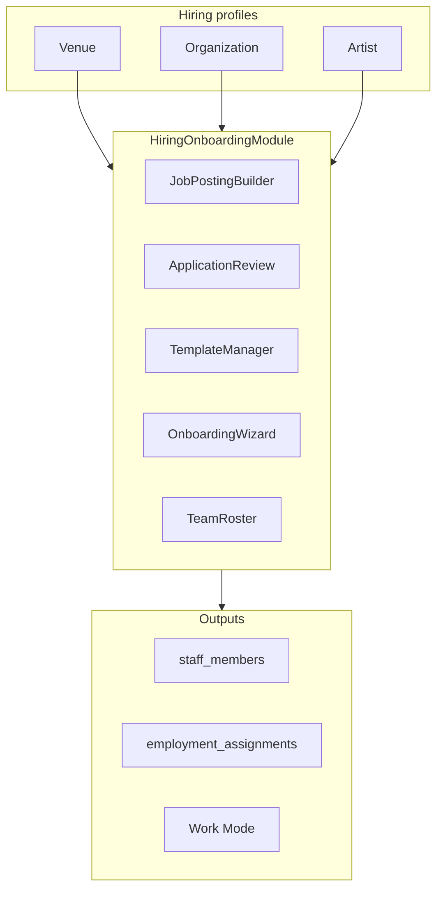

# External Implementation Prompt: Universal Hiring & Onboarding Module

Copy everything below the `---` line into the other platform. Attach or reference the file list at the end of this document.

---

## System prompt / implementation brief

You are implementing the **Universal Hiring & Onboarding Module** for Tourify, a Next.js 15 (App Router) + Supabase + TypeScript platform for live events. Your job is to refactor a fragmented, venue-only staffing stack into one reusable module that **any hiring profile** (Venue, Organization, Artist) can use to post jobs, vet applicants, run template-driven onboarding, and produce roster + Work Mode assignments.

### Canonical references (read first)

1. **Product rules:** `.cursor/rules/admin_onboarding.md` — compliance-heavy staff hiring, dynamic forms, step gating, RLS, team management at scale.
2. **Architecture:** `docs/architecture/multi-account-system.md` — multi-entity accounts, acting context, Work Mode (Layer 5), permission matrix §7.3.
3. **Integration spec:** `docs/onboarding-platform-integration-spec.md` — end-to-end job → approve → token → roster flow.
4. **Implementation plan:** `.cursor/plans/universal_onboarding_module_f76e8afb.plan.md` — phases, `HiringEntity` abstraction, salvage inventory for orphaned wizards.
5. **RBAC:** `docs/JOBS_STAFFING_RBAC_MATRIX.md`.

### Hard constraints

- **NEVER reset the database.** All schema changes are additive migrations with backfill.
- **TypeScript everywhere.** Prefer `interface` over `type`, `function` keyword for pure functions, named exports, RORO pattern.
- **Validate with Zod.** All API inputs and forms use Zod; use guard clauses and early returns.
- **Minimize `use client`.** Prefer RSC for data fetching; small client islands for forms/wizards.
- **Security:** RLS on all tables; service role only where necessary (token onboarding); encrypt PII (SSN, bank) via credentials vault; audit all hiring status changes.
- **Backward compatibility:** Keep `venue_id` columns during migration; `?venue_id=` query params alias to `employer_entity_type=venue` for two release cycles.
- **Do not delete orphaned wizards blindly.** Salvage per plan Section 2.6 — extract compliance schemas, merge persona fields, retire only true duplicate routes.

### Tech stack

- Next.js 15 App Router, React, Tailwind CSS, Shadcn UI, Radix UI
- Supabase (Postgres + Auth + Storage + RLS)
- react-hook-form + @hookform/resolvers/zod
- next-safe-action for server actions where applicable

---

## What you are building

### One module, three employer types, one hiree flow



### Core abstraction: `HiringEntity`

Every hiring mutation must resolve and validate a hiring entity before writes:

```typescript
interface HiringEntity {
  entityType: 'venue' | 'organization' | 'artist'
  entityId: string
  displayName: string
  scope?: {
    eventId?: string
    tourId?: string
    venueId?: string  // org hiring at third-party venue
  }
}
```

Implement `resolveHiringEntity()` in `lib/auth/acting-context.ts` (extend existing acting context used by `artist_jobs`).

### Permission mapping

| Entity | Gate |
|--------|------|
| Venue | `hasEntityPermission('Venue', id, 'ASSIGN_EVENT_ROLES')` |
| Organization | org `staff.manage` via `has_perm` OR entity RBAC |
| Artist | `hasEntityPermission('Artist', id, 'ASSIGN_EVENT_ROLES')` or `can_hire` on profile |

Expand `lib/auth/hiring-permissions.ts`:
- `canManageHiring({ userId, entityType, entityId })`
- `canReviewApplications(...)`
- `canManageOnboardingTemplates(...)`

### End-to-end hiring flow (must preserve)

1. **Employer** creates `job_posting_templates` with embedded `application_form_template.fields[]`.
2. **Applicant** (authenticated `auth.users`) submits `job_applications` via `POST /api/job-applications`.
3. **Employer** reviews; on `approved`:
   - Run hiring eligibility gate (`FEATURE_HIRING_ELIGIBILITY_GATE`: off | shadow | enforce)
   - Create `staff_onboarding_candidates` linked to application
   - Create `staff_invitations` with unique token; stamp `invitation_token` on candidate
   - Bootstrap `onboarding_workflows`
   - Create `employment_assignments` with Work Mode permissions from `role_templates`
   - Notify applicant with `{APP_URL}/onboarding/{token}`
4. **Hiree** completes token wizard; on submit:
   - Save `onboarding_responses`
   - Mark candidate `completed`, progress 100%
   - Create `staff_members` with `entity_type`/`entity_id` from employer
   - Send completion notifications

Canonical approve logic lives in `app/api/admin/applications/route.ts` and `app/api/admin/applications/[id]/route.ts`. Consolidate into `HiringOnboardingService.approveApplication()`.

### Template system (four layers, one resolver)

Implement `resolveOnboardingTemplate()`:

```typescript
resolveOnboardingTemplate({
  employer: HiringEntity,
  position?: string,
  department?: string,
  templateId?: string,
  flowType: 'application' | 'onboarding' | 'workflow' | 'role'
})
```

| Layer | Table / source |
|-------|----------------|
| Application form | `job_posting_templates.application_form_template` |
| Onboarding form | `staff_onboarding_templates` (+ legacy `onboarding_templates`) |
| Workflow steps | `onboarding_workflows` + `onboarding_steps` |
| Role / Work Mode | `role_templates` + `lib/staff/onboarding-position-templates.ts` |

**Critical bug to fix:** `GET /api/onboarding/[token]` currently loads global default template — must resolve entity-scoped template from candidate/invitation.

### UI module structure (create)

```
components/hiring/
  hiring-dashboard.tsx              # tabs: Jobs | Applications | Onboarding | Roster
  job-posting-builder.tsx
  application-review-panel.tsx
  onboarding-kanban.tsx
  team-roster-panel.tsx
  onboarding-module/
    onboarding-wizard-shell.tsx     # shared progress/nav
    dynamic-onboarding-form.tsx     # uses OnboardingFormField
    token-onboarding-flow.tsx       # hiree path
    invite-onboarding-flow.tsx
    persona-onboarding-flow.tsx     # artist/venue account creation (salvaged fields)
```

Mount `HiringDashboard` on:
- Venue: `/venue/staff` or `/venue/dashboard/hiring`
- Organization: `/admin/dashboard/staff`
- Artist: `/artist/team` or `/artist/business/hiring`

Replace `useCurrentVenue()` as sole scope with `useHiringEntity()` hook.

### Worker-facing routes (consolidate)

- **Canonical:** `/onboarding/hire/{token}` (new)
- **Redirects:** `/onboarding/{token}`, retire `enhanced-onboarding-flow`, `complete/page`
- **Separate (not hiring):** `/onboarding?type=artist|venue` (persona), `/onboarding?token=` (legacy staff), platform admin wizard

### Database migration (additive)

New migration: add to core tables:

```sql
employer_entity_type text check (employer_entity_type in ('venue','organization','artist'))
employer_entity_id uuid
```

Tables: `job_posting_templates`, `job_applications`, `staff_onboarding_candidates`, `onboarding_workflows`, `staff_onboarding_templates`, `hiring_audit_events`, `hiring_eligibility_snapshots`, `staff_invitations` (also add `template_id`).

Backfill: `employer_entity_type='venue'`, `employer_entity_id=venue_id`.

Add RLS RPC: `can_manage_hiring(auth.uid(), employer_entity_type, employer_entity_id)`.

### Orphaned wizard salvage (do not delete without extracting value)

| File | Action |
|------|--------|
| `components/onboarding/onboarding-wizard.tsx` | Extract Zod compliance schema → template seeds / DynamicOnboardingForm |
| `components/onboarding/artist-onboarding.tsx` | Merge genre/social fields into persona flow |
| `components/onboarding/venue-onboarding.tsx` | Merge venue-type/capacity fields into persona flow |
| `components/admin/onboarding/onboarding-wizard.tsx` | Wire to org setup — separate from hiring |
| `components/onboarding/profile.tsx` | Wire to post-signup welcome modal |
| `app/venue/staff/components/onboarding-wizard.tsx` | Fold employer patterns into HiringDashboard |
| `app/onboarding/enhanced-onboarding-flow/page.tsx` | Retire → redirect |
| `app/onboarding/complete/page.tsx` | Retire → redirect; fix task-link-registry |

### Service facade

Create `lib/services/hiring-onboarding.service.ts` delegating to `AdminOnboardingStaffService`:

- `createJobPosting(employer, data)`
- `listApplications(employer, filters)`
- `approveApplication(applicationId, actor)`
- `createCandidateFromApplication(...)`
- `generateOnboardingInvite(candidate)`
- `completeOnboarding(candidateId)`
- `getDashboardStats(employer)`
- `resolveOnboardingTemplate(...)`

### New API endpoints

- `GET /api/hiring/dashboard?entity_type=&entity_id=`
- `POST /api/hiring/invite`

Update existing admin APIs to accept `employer_entity_type` + `employer_entity_id` (infer from acting context if omitted).

### Testing requirements

| Scenario | Employer |
|----------|----------|
| Security guards bulk hire | Venue |
| Bartender W-9/compliance | Venue |
| Tour FOH crew | Artist |
| Event staffing at third-party venue | Organization |
| Direct invite (no application) | Any |
| Eligibility gate blocks approve | Any (enforce mode) |

Unit test: `resolveHiringEntity`, `resolveOnboardingTemplate`, permission matrix.
Integration test: approve → candidate + token + employment_assignment per entity type.

### Implementation phases (follow in order)

0. Docs + types (`types/hiring-entity.ts`, extend admin-onboarding types, update integration spec + admin_onboarding.md)
1. Migration + RBAC + `resolveHiringEntity()` + `HiringOnboardingService` facade shell
2. Template unification + fix token API + compliance schema salvage + artist tour crew presets
3. Unified worker UI (`OnboardingWizardShell`, `TokenOnboardingFlow`, retire duplicate routes)
4. `HiringDashboard` module + mount on venue/admin/artist + unify approve APIs + `/api/hiring/*`
5. Artist hiring route + fix board publish ID conflation + optional `artist_jobs` bridge
6. Persona + platform admin domains (salvage artist/venue standalone, wire profile welcome, org setup wizard)
7. Hardening + tests + retire duplicate worker components

See master plan: `.cursor/plans/universal_onboarding_module_f76e8afb.plan.md`

### Success criteria

- [ ] Venue, Organization, Artist can post jobs, review applications, run onboarding from same module
- [ ] Token onboarding uses entity-scoped templates (not global default)
- [ ] Completion creates `staff_members` + `employment_assignments` with correct Work Mode permissions
- [ ] One `DynamicOnboardingForm`; no duplicate inline field renderers
- [ ] All hiring writes attributed to `HiringEntity`; RLS enforced
- [ ] Backward compat: existing venue-only flows still work during migration

---

## File inventory: fix / rewrite / create

Legend:
- **REWRITE** — substantial refactor or replace with module equivalent
- **FIX** — targeted bug fix or parameterization
- **CREATE** — new file
- **RETIRE** — redirect/delete after consolidation
- **SALVAGE** — extract logic then remove or merge

### Types & rules

| File | Action | Notes |
|------|--------|-------|
| `types/hiring-entity.ts` | CREATE | `HiringEntity`, resolver types |
| `types/admin-onboarding.ts` | FIX | Add `employer_entity_type`, `employer_entity_id` to interfaces |
| `.cursor/rules/admin_onboarding.md` | FIX | Add polymorphic employer scope, module paths |
| `docs/onboarding-platform-integration-spec.md` | FIX | Add HiringEntity, artist/org paths, module API |
| `docs/onboarding-external-implementation-prompt.md` | — | This document |

### Database

| File | Action | Notes |
|------|--------|-------|
| `supabase/migrations/20260625000000_polymorphic_hiring_entity.sql` | CREATE | Additive columns, backfill, RLS RPC, indexes |

### Auth & permissions

| File | Action | Notes |
|------|--------|-------|
| `lib/auth/acting-context.ts` | REWRITE | Add `resolveHiringEntity()` |
| `lib/auth/hiring-permissions.ts` | REWRITE | Entity-polymorphic gates |
| `lib/hiring/states.ts` | FIX | Milestones for all employer types |
| `lib/hiring/application-transitions.ts` | FIX | Verify transitions unchanged |

### Services

| File | Action | Notes |
|------|--------|-------|
| `lib/services/hiring-onboarding.service.ts` | CREATE | Facade over staffing/onboarding |
| `lib/services/admin-onboarding-staff.service.ts` | REWRITE | Replace `venueId`-only params with `HiringEntity`; keep internals |
| `lib/services/onboarding-templates.service.ts` | REWRITE | Entity-scoped template CRUD |
| `lib/services/enhanced-onboarding-templates.service.ts` | REWRITE | Merge into unified template resolver |
| `lib/services/onboarding-workflow.service.ts` | FIX | Entity scope on workflow init |
| `lib/services/hiring-eligibility.service.ts` | FIX | Evaluate per employer entity |
| `lib/services/unified-onboarding.service.ts` | FIX | Persona flows; keep separate from hiring |
| `lib/services/admin-onboarding.service.ts` | FIX | Platform admin wizard — keep separate |
| `lib/services/staff-onboarding.service.ts` | SALVAGE | Merge useful parts into facade |
| `lib/rebuild/hiring-automation.ts` | FIX | Include employer entity in notification metadata |
| `lib/staff/role-templates.ts` | FIX | Resolve grants for artist/org employers |
| `lib/staff/onboarding-position-templates.ts` | FIX | Add artist tour crew presets |
| `lib/job-board/publish-template-to-board.ts` | FIX | Stop conflating `organizationId=venueId` |
| `lib/messaging/task-link-registry.ts` | FIX | Point to canonical onboarding routes |
| `lib/security/employee-credentials-vault.ts` | FIX | Ensure used by DynamicOnboardingForm |

### Server actions

| File | Action | Notes |
|------|--------|-------|
| `app/actions/staffing/create-job-posting.ts` | REWRITE | Accept `HiringEntity` instead of `venueId` only |

### API routes — hiring core

| File | Action | Notes |
|------|--------|-------|
| `app/api/admin/applications/route.ts` | REWRITE | Delegate approve to `HiringOnboardingService` |
| `app/api/admin/applications/[id]/route.ts` | REWRITE | Same; unify duplicate bridge logic |
| `app/api/admin/job-postings/route.ts` | REWRITE | Employer entity on create/list |
| `app/api/admin/job-postings/[id]/route.ts` | FIX | Employer-scoped update |
| `app/api/job-applications/route.ts` | FIX | Store employer entity from posting |
| `app/api/onboarding/[token]/route.ts` | REWRITE | Fix template resolution; entity-scoped |
| `app/api/hiring/dashboard/route.ts` | CREATE | Unified stats |
| `app/api/hiring/invite/route.ts` | CREATE | Unified invite endpoint |

### API routes — admin onboarding

| File | Action | Notes |
|------|--------|-------|
| `app/api/admin/onboarding/route.ts` | REWRITE | Entity scope |
| `app/api/admin/onboarding/templates/route.ts` | REWRITE | Entity scope |
| `app/api/admin/onboarding/templates/[id]/route.ts` | REWRITE | Entity scope |
| `app/api/admin/onboarding/initialize-templates/route.ts` | FIX | Parameterize by entity type |
| `app/api/admin/onboarding/candidates/route.ts` | REWRITE | Filter by employer entity |
| `app/api/admin/onboarding/candidates/[id]/route.ts` | FIX | Entity scope |
| `app/api/admin/onboarding/candidates/[id]/credentials/route.ts` | FIX | Unchanged logic, entity RBAC |
| `app/api/admin/onboarding/enhanced-invite/route.ts` | RETIRE | Merge into `/api/hiring/invite` |
| `app/api/admin/onboarding/invite-new-user/route.ts` | RETIRE | Merge into `/api/hiring/invite` |
| `app/api/admin/onboarding/add-existing-user/route.ts` | FIX | Entity scope |
| `app/api/admin/onboarding/dashboard/route.ts` | REWRITE | Entity scope |
| `app/api/admin/onboarding/workflows/route.ts` | FIX | Entity scope |
| `app/api/admin/onboarding/workflows/advance/route.ts` | FIX | Entity scope |
| `app/api/admin/onboarding/workflows/analytics/route.ts` | FIX | Entity scope |
| `app/api/admin/onboarding/update-status/route.ts` | FIX | Entity scope |
| `app/api/admin/onboarding/review/route.ts` | FIX | Entity scope |
| `app/api/admin/staff/dashboard/route.ts` | REWRITE | Accept entity_type/id not only venue_id |
| `app/api/venue/onboarding/summary/route.ts` | FIX | Delegate to hiring dashboard |
| `app/api/employer/vetting/[applicationId]/route.ts` | FIX | Entity-polymorphic RBAC |

### API routes — persona onboarding (keep separate, minor fixes)

| File | Action | Notes |
|------|--------|-------|
| `app/api/onboarding/unified/route.ts` | FIX | Document boundary vs hiring module |
| `app/api/onboarding/submit/route.ts` | FIX | Align payload with token route or retire |
| `app/api/onboarding/create-account/route.ts` | FIX | Invitation signup path |
| `app/api/onboarding-templates/route.ts` | FIX | Clarify vs staff_onboarding_templates |
| `app/api/onboarding-templates/[id]/route.ts` | FIX | Same |

### App routes / pages

| File | Action | Notes |
|------|--------|-------|
| `app/onboarding/page.tsx` | FIX | Router; add hire vs persona vs admin discrimination |
| `app/onboarding/[token]/page.tsx` | REWRITE | Use TokenOnboardingFlow module |
| `app/onboarding/enhanced-onboarding-flow/page.tsx` | RETIRE | Redirect to canonical route |
| `app/onboarding/complete/page.tsx` | RETIRE | Redirect to canonical route |
| `app/admin/dashboard/staff/page.tsx` | REWRITE | Mount HiringDashboard |
| `app/admin/dashboard/jobs/page.tsx` | FIX | Pass HiringEntity |
| `app/admin/dashboard/onboarding/page.tsx` | REWRITE | Use HiringDashboard onboarding tab |
| `app/admin/(dashboard-shell)/applications/page.tsx` | FIX | Entity-scoped filters |
| `app/admin/(dashboard-shell)/teams/[jobId]/page.tsx` | FIX | Onboarding links use canonical token URL |
| `app/venue/staff/page.tsx` | REWRITE | Mount HiringDashboard |
| `app/venue/dashboard/onboarding/page.tsx` | REWRITE | Mount HiringDashboard or redirect |
| `app/artist/team/page.tsx` or `app/artist/business/hiring/page.tsx` | CREATE | Artist hiring entry |
| `app/jobs/[id]/page.tsx` | FIX | Show employer persona on posting |
| `app/jobs/page.tsx` | FIX | List employer attribution |
| `next.config.ts` | FIX | Redirects for retired onboarding routes |

### Components — new hiring module

| File | Action | Notes |
|------|--------|-------|
| `components/hiring/hiring-dashboard.tsx` | CREATE | Main employer shell |
| `components/hiring/job-posting-builder.tsx` | CREATE | Wraps job-posting-form |
| `components/hiring/application-review-panel.tsx` | CREATE | From enhanced-application-review |
| `components/hiring/onboarding-kanban.tsx` | CREATE | From onboarding-kanban-board |
| `components/hiring/team-roster-panel.tsx` | CREATE | Roster + Work Mode status |
| `components/hiring/onboarding-module/onboarding-wizard-shell.tsx` | CREATE | Shared step UI |
| `components/hiring/onboarding-module/dynamic-onboarding-form.tsx` | CREATE | Single field renderer |
| `components/hiring/onboarding-module/token-onboarding-flow.tsx` | CREATE | Hiree token path |
| `components/hiring/onboarding-module/invite-onboarding-flow.tsx` | CREATE | Email/link invite |
| `components/hiring/onboarding-module/persona-onboarding-flow.tsx` | CREATE | Salvage artist/venue fields |
| `hooks/use-hiring-entity.tsx` | CREATE | Resolve active employer from acting context |

### Components — refactor / salvage

| File | Action | Notes |
|------|--------|-------|
| `components/admin/job-posting-form.tsx` | FIX | Accept employer prop |
| `components/admin/enhanced-application-review.tsx` | SALVAGE | Logic → application-review-panel |
| `components/admin/enhanced-onboarding-wizard.tsx` | REWRITE | Entity prop; or fold into HiringDashboard |
| `components/admin/onboarding-form-fields.tsx` | SALVAGE | Becomes DynamicOnboardingForm field lib |
| `components/admin/onboarding-kanban-board.tsx` | SALVAGE | Logic → onboarding-kanban |
| `components/admin/onboarding-management.tsx` | FIX | Entity scope or retire |
| `components/admin/onboarding-workflow-visualizer.tsx` | FIX | Entity scope |
| `components/forms/application-form.tsx` | FIX | Minor; driven by posting template |
| `components/onboarding/onboarding-wizard.tsx` | SALVAGE | Extract compliance schema → templates |
| `components/onboarding/staff-onboarding.tsx` | RETIRE | Replace with token-onboarding-flow |
| `components/onboarding/invitation-onboarding.tsx` | RETIRE | Replace with invite-onboarding-flow |
| `components/onboarding/artist-venue-onboarding.tsx` | FIX | Merge salvaged persona fields |
| `components/onboarding/artist-onboarding.tsx` | SALVAGE | Merge fields → persona flow |
| `components/onboarding/venue-onboarding.tsx` | SALVAGE | Merge fields → persona flow |
| `components/onboarding/profile.tsx` | FIX | Wire to welcome-onboarding |
| `components/onboarding/quick-signup-onboarding.tsx` | FIX | Keep; Layer 1 identity |
| `components/admin/onboarding/onboarding-wizard.tsx` | FIX | Wire to org setup route |
| `components/admin/onboarding/steps/*.tsx` | FIX | Platform admin education steps |
| `components/onboarding/admin-onboarding.tsx` | FIX | Platform admin application |
| `app/venue/staff/components/onboarding-wizard.tsx` | SALVAGE | Employer patterns → HiringDashboard |
| `app/venue/staff/components/staff-onboarding-system.tsx` | REWRITE | Use HiringDashboard |
| `app/venue/staff/components/job-board-integration.tsx` | FIX | Remove dead wizard import |
| `components/dashboard/welcome-onboarding.tsx` | FIX | Link to persona/profile flows |
| `components/account/work-mode-widget.tsx` | FIX | Read assignments for all employer types |
| `components/hiring/application-status-badge.tsx` | FIX | Eligibility display |
| `components/hiring/application-insights-badges.tsx` | FIX | Unchanged if data available |

### Context & layout

| File | Action | Notes |
|------|--------|-------|
| `app/admin/dashboard/contexts/admin-dashboard-context.tsx` | FIX | Expose hiring entity not only venueId |
| `hooks/use-multi-account.tsx` | FIX | Support artist/org as hiring context |
| `hooks/use-acting-context.ts` | FIX | Feed useHiringEntity |
| `lib/navigation/account-dashboard-routes.ts` | FIX | Add artist hiring route |
| `middleware.ts` | FIX | If onboarding routes change |

### Tests

| File | Action | Notes |
|------|--------|-------|
| `__tests__/services/admin-onboarding-staff.test.ts` | REWRITE | Entity-polymorphic cases |
| `lib/services/__tests__/hiring-eligibility.service.test.ts` | FIX | Entity scope |
| `lib/job-board/__tests__/publish-template-to-board.test.ts` | FIX | Correct org/venue IDs |
| `__tests__/services/hiring-onboarding.service.test.ts` | CREATE | Facade + approve bridge |
| `__tests__/auth/hiring-permissions.test.ts` | CREATE | Venue/org/artist matrix |

### Config

| File | Action | Notes |
|------|--------|-------|
| `next.config.ts` | FIX | Redirects for retired routes |
| `.env.example` | FIX | Document `FEATURE_HIRING_ELIGIBILITY_GATE` |

---

## File count summary

| Action | Approx. count |
|--------|----------------|
| CREATE | ~18 |
| REWRITE | ~25 |
| FIX | ~45 |
| SALVAGE | ~12 |
| RETIRE | ~6 |

**Total touched:** ~90–100 files across 6 phases.

---

## Suggested prompt preamble for the other platform

When pasting into the external tool, start with:

> You have access to the Tourify repository. Read the files listed under "Canonical references" first. Implement Phase 0, then Phase 1, in order. Do not skip the migration backfill. Do not reset the database. After each phase, run TypeScript check and existing tests. Ask before deleting any file in the SALVAGE list — extract value first.

Then paste the full **System prompt / implementation brief** section above.
