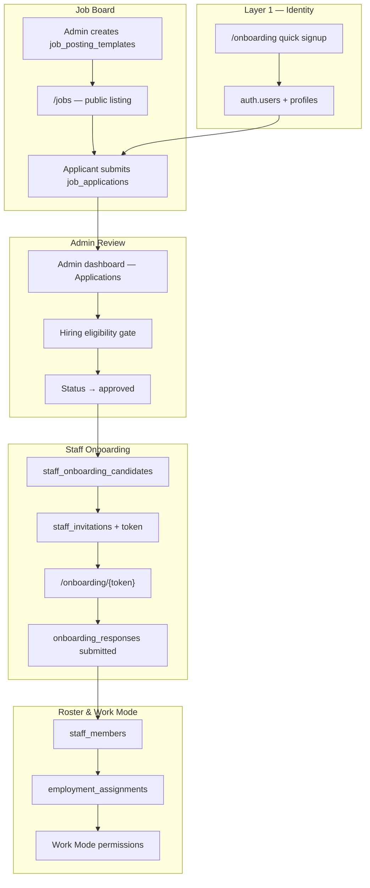

# Tourify Onboarding — Platform Integration Specification

**Purpose:** This document describes how onboarding is integrated across the Tourify platform so it can be reproduced in another system (design tool, workflow builder, or greenfield implementation). It covers intended features, templates, data flows, and how real users who apply for jobs become active staff in the system.

**Audience:** Product, engineering, and external tooling that needs a faithful model of the hiring → onboarding → roster pipeline.

**Last updated:** 2026-06-24

---

## 1. Executive Summary

Tourify has **two related but distinct onboarding domains**:

| Domain | Entry point | Goal |
|--------|-------------|------|
| **Platform onboarding** | `/onboarding` | Create a human identity (signup) and optional persona accounts (artist, venue) |
| **Staff hiring onboarding** | Job application → admin approval → token link | Convert an authenticated applicant into an onboarded worker on a venue/org roster |

The **staff hiring onboarding** path is the one that connects job postings to real users. It is admin-driven, template-configurable, compliance-aware, and terminates in `staff_members` + **Work Mode** (`employment_assignments`) so the worker can operate on shift.

Platform onboarding is a prerequisite: applicants must be authenticated (`auth.users`) before they can apply for jobs. Staff onboarding does not replace signup—it layers employment data and permissions on top of an existing identity.

---

## 2. System Context



### 2.1 Platform layers (from multi-account architecture)

Onboarding for hired staff sits in **Layer 5 — Employment (Work Mode)**:

- **Identity** (`profiles` / `auth.users`): the login; one email per human.
- **Personas** (artist, venue pages): public-facing entities; separate from employment.
- **Work Mode**: operational context when someone works a shift for a venue/org. Created during approval/onboarding via `employment_assignments`.

A bartender hired through a job posting does **not** get a new login—they get an **employment assignment** scoped to the hiring venue, with permissions derived from **role templates**.

---

## 3. End-to-End Flow: Job Applicant → Active Staff

This is the canonical path for real users who apply to jobs created in the admin dashboard.

### Phase A — Job creation (employer)

1. Venue/org admin creates a **job posting** (`job_posting_templates`) in `/admin/dashboard/jobs` or related admin UI.
2. Posting includes:
   - Role metadata: department, position, employment type, location, certifications required, role type (security, bartender, etc.).
   - **Application form template** (`application_form_template.fields[]`): dynamic intake fields (text, file, select, etc.).
   - Optional link to an **onboarding template** (`staff_onboarding_templates`) for post-hire paperwork.
3. Admin publishes posting (`status: published`).

**Key files:** `components/admin/job-posting-form.tsx`, `lib/services/admin-onboarding-staff.service.ts`, `types/admin-onboarding.ts`

### Phase B — Application (applicant)

1. Authenticated user browses `/jobs` or `/jobs/[id]`.
2. User submits application via `POST /api/job-applications` with:
   - `job_posting_id`
   - `form_responses` (answers keyed to application form fields)
3. Row created in `job_applications`:
   - `applicant_id` → `auth.users.id`
   - `status: pending`
   - `venue_id` copied from posting
4. Optional: auto-screening populates `auto_screening_result`, `screening_issues`.

**Requirements:** User must already exist (platform signup). Anonymous users cannot apply.

**Key files:** `app/jobs/[id]/page.tsx`, `components/forms/application-form.tsx`, `app/api/job-applications/route.ts`

### Phase C — Admin review & approval

1. Admin reviews applications in `/admin/(dashboard-shell)/applications` or staff dashboard.
2. Admin transitions status: `pending` → `reviewed` → `shortlisted` → **`approved`** (or `rejected`).
3. On **`approved`**, the system runs a **bridge sequence** (non-blocking steps wrapped in try/catch):

   | Step | Action | Table(s) |
   |------|--------|----------|
   | 1 | Eligibility gate (optional enforce mode) | snapshots, audit |
   | 2 | Update application status | `job_applications` |
   | 3 | Create/link onboarding candidate | `staff_onboarding_candidates` |
   | 4 | Create staff invitation with token | `staff_invitations` |
   | 5 | Stamp `invitation_token` on candidate | `staff_onboarding_candidates` |
   | 6 | Bootstrap workflow tracker | `onboarding_workflows` |
   | 7 | Create employment assignment (Work Mode) | `employment_assignments` |
   | 8 | Optionally send contract | contracts service |
   | 9 | Notify applicant with onboarding URL | notifications |

4. **Onboarding URL** format: `{APP_URL}/onboarding/{token}`

**Key files:** `app/api/admin/applications/route.ts`, `app/api/admin/applications/[id]/route.ts`, `lib/rebuild/hiring-automation.ts`, `lib/services/hiring-eligibility.service.ts`

### Phase D — Worker completes onboarding

1. Worker opens `/onboarding/[token]` (client page).
2. `GET /api/onboarding/[token]` returns:
   - Invitation + position details
   - **Onboarding template** fields (from `onboarding_templates` or `staff_onboarding_templates`)
3. Worker fills multi-step form (personal info, emergency contact, tax docs, certifications, file uploads).
4. `POST /api/onboarding/[token]` with `{ responses: Record<string, unknown> }`:
   - Saves `onboarding_responses`
   - Marks invitation `completed`
   - Updates candidate: `status: completed`, `onboarding_progress: 100`, `stage: approved`
   - Creates **`staff_members`** row (canonical roster)
   - Sends completion notifications

**Key files:** `app/onboarding/[token]/page.tsx`, `app/api/onboarding/[token]/route.ts`, `components/onboarding/onboarding-wizard.tsx`

### Phase E — Post-hire platform access

After onboarding completion (or partially at approval):

- **`employment_assignments`**: links user to venue with Work Mode permissions from `role_templates`.
- **`staff_members`**: venue roster record for scheduling, messaging, compliance.
- **`staff_shifts`**: optional default shift created on admin `completeOnboarding()`.
- Worker can use **Work Mode** widget to check in, view run sheets, access scoped staff docs.

**Key files:** `lib/staff/role-templates.ts`, `components/account/work-mode-widget.tsx`, `docs/architecture/multi-account-system.md` §8

---

## 4. Template System (Intended Features)

Tourify uses **four template layers**. When rebuilding elsewhere, model each separately—they compose but are not interchangeable.

### 4.1 Application form templates

**Purpose:** Collect applicant information *before* hire.

**Storage:** Embedded in `job_posting_templates.application_form_template.fields[]`

**Field types:** `text`, `textarea`, `email`, `phone`, `date`, `select`, `multiselect`, `file`, `checkbox`, `number`

**Features:**
- Per-field validation (min/max, regex)
- Required/optional flags
- Ordered fields
- Default fallback form if posting has no custom template

**Used by:** `ApplicationForm` component, job detail page apply flow.

---

### 4.2 Staff onboarding form templates

**Purpose:** Collect compliance and HR data *after* approval.

**Storage:** `staff_onboarding_templates` (venue-scoped) and legacy `onboarding_templates` (global default)

**Schema highlights:**
```typescript
interface OnboardingTemplate {
  id: string
  venue_id: string
  name: string
  department: string
  position: string
  employment_type: 'full_time' | 'part_time' | 'contractor' | 'volunteer' | 'intern'
  fields: OnboardingField[]       // JSONB
  estimated_days: number
  required_documents: string[]
  assignees: string[]             // admin users responsible
  tags: string[]
  is_default: boolean
  parent_template_id?: string     // inheritance
  use_count: number
}
```

**Extended field types (beyond application forms):**
`address`, `emergency_contact`, `bank_info`, `tax_info`, `id_document`

**Pre-built defaults** (initialized via `POST /api/admin/onboarding/initialize-templates`):
- General Staff
- Security Staff (licenses, background checks)
- Technical Staff (skills, equipment)
- Management
- Volunteer (streamlined)

**Features:**
- Role/department scoping
- Section-based multi-step UI
- Conditional field display (planned/partial)
- Template inheritance from parent
- Document checklist per template

**Key files:** `lib/services/onboarding-templates.service.ts`, `lib/services/enhanced-onboarding-templates.service.ts`

---

### 4.3 Onboarding workflow templates

**Purpose:** Track multi-step *process* (not just form fields)—documents, training, meetings, approvals.

**Storage:** `onboarding_workflows` + `onboarding_steps`

**Step types:** `document`, `training`, `meeting`, `setup`, `review`, `task`, `approval`

**Categories:** `admin`, `training`, `equipment`, `social`, `performance`

**Workflow stages** (`OnboardingWorkflowService`):
```
job_posted → application_received → screening → invitation_sent →
onboarding_started → onboarding_completed → review_pending →
approved → team_assigned
```

**Features:**
- Step dependencies (`depends_on`)
- Due date offsets from hire date
- Assignee per step
- Progress analytics (`/api/admin/onboarding/workflows/analytics`)
- Kanban-style admin visualizer

**Key files:** `lib/services/onboarding-workflow.service.ts`, `components/admin/onboarding-workflow-visualizer.tsx`

---

### 4.4 Role / position templates

**Purpose:** Map hired position → **Work Mode permissions** + required credentials.

**Sources (priority order):**
1. DB table `role_templates` (migration `20260610000000_role_templates.sql`)
2. Code fallback `ONBOARDING_POSITION_TEMPLATES` in `lib/staff/onboarding-position-templates.ts`

**Built-in position templates:**
| Key | Role | Required credentials (examples) |
|-----|------|--------------------------------|
| `security-guard` | Security | Guard card, CPR, de-escalation |
| `bartender` | Service | Alcohol server permit |
| `sound-engineer` | Technical | Audio safety, rigging awareness |
| `lighting-tech` | Technical | Electrical safety |
| `forklift-operator` | Operations | Forklift cert, OSHA 10 |
| `venue-manager` | Management | Leadership training |

**Work Mode permissions granted:**
```typescript
interface WorkModePermissions {
  view_shift_schedule: boolean
  check_in_out: boolean
  view_run_sheet: boolean | 'limited'
  post_official_comms: boolean
  manage_other_staff: boolean
  access_staff_docs: 'own' | 'team' | 'none'
}
```

Permissions vary by `role_category` (security gets limited run sheet; management gets team doc access).

**Key files:** `lib/staff/role-templates.ts`, `lib/staff/onboarding-position-templates.ts`

---

## 5. Data Model Reference

### 5.1 Core hiring tables

| Table | Role in onboarding |
|-------|-------------------|
| `job_posting_templates` | Job definitions + application form schema |
| `job_applications` | Applicant submissions; status drives pipeline |
| `staff_onboarding_candidates` | Bridge entity: application → onboarding → staff |
| `staff_invitations` | Token-based access to onboarding wizard |
| `onboarding_responses` | Submitted onboarding form payload |
| `onboarding_workflows` | Per-candidate process tracker |
| `onboarding_steps` | Workflow step definitions |
| `staff_onboarding_templates` | Venue-configurable onboarding forms |
| `onboarding_templates` | Global/default onboarding forms |
| `staff_members` | Canonical roster after completion |
| `employment_assignments` | Work Mode link (user + venue + permissions) |
| `staff_documents` | Uploaded/verified compliance docs |
| `hiring_audit_events` | Immutable audit trail of status changes |
| `role_templates` | Permission + credential templates per role |

### 5.2 Key relationships

```
job_posting_templates (1) ──< (N) job_applications
job_applications (1) ──< (0..1) staff_onboarding_candidates  [via application_id]
staff_onboarding_candidates (1) ──< (0..1) staff_invitations   [via invitation_token]
staff_onboarding_candidates (1) ──< (0..1) onboarding_workflows
staff_onboarding_candidates (1) ──> (1) staff_members           [on completion]
auth.users (1) ──< (N) job_applications                         [applicant_id]
auth.users (1) ──< (N) employment_assignments                  [user_id]
```

### 5.3 Candidate status model

**`staff_onboarding_candidates.status`:**
`pending` | `in_progress` | `completed` | `rejected`

**`staff_onboarding_candidates.stage`:**
`invitation` | `onboarding` | `review` | `approved` | `rejected`

**`job_applications.status`:**
`pending` | `reviewed` | `shortlisted` | `approved` | `accepted` | `rejected` | `withdrawn`

### 5.4 Hiring pipeline milestones (UI)

Built by `buildHiringMilestones()` in `lib/hiring/states.ts`:

1. Application received  
2. Under review  
3. Offer sent  
4. Offer accepted  
5. Onboarding in progress  
6. Contract sent  
7. Contract signed  
8. Hired  

Displayed on applicant-facing job pages and admin review UI.

---

## 6. API Surface (Integration Contract)

### 6.1 Public / applicant APIs

| Method | Path | Purpose |
|--------|------|---------|
| GET | `/api/job-postings/[id]` | Fetch published job + form template |
| POST | `/api/job-applications` | Submit application (auth required) |
| GET | `/api/job-applications` | List own applications |
| GET | `/api/onboarding/[token]` | Load onboarding wizard data |
| POST | `/api/onboarding/[token]` | Submit onboarding responses |

### 6.2 Admin APIs

| Method | Path | Purpose |
|--------|------|---------|
| GET/POST | `/api/admin/job-postings` | CRUD job postings |
| GET | `/api/admin/applications` | List applications |
| POST | `/api/admin/applications` | Bulk actions (`approve`, `reject`) |
| PATCH | `/api/admin/applications/[id]` | Single application status update |
| GET/POST | `/api/admin/onboarding/templates` | Manage onboarding form templates |
| POST | `/api/admin/onboarding/initialize-templates` | Seed default templates for venue |
| GET/POST | `/api/admin/onboarding/candidates` | List/manage candidates |
| PATCH | `/api/admin/onboarding/candidates/[id]` | Update progress, credentials |
| POST | `/api/admin/onboarding/enhanced-invite` | Invite existing/new users directly |
| GET | `/api/admin/onboarding/dashboard` | Aggregated stats |
| GET/POST | `/api/admin/onboarding/workflows` | Workflow CRUD |
| POST | `/api/admin/onboarding/workflows/advance` | Advance workflow stage |

### 6.3 Platform signup APIs (separate from staff hire)

| Method | Path | Purpose |
|--------|------|---------|
| POST | `/api/onboarding/create-account` | Create auth user from invitation |
| POST | `/api/onboarding/unified` | Unified onboarding flow CRUD |
| POST | `/api/onboarding/submit` | Generic onboarding submission |

---

## 7. Integration with Other Platform Systems

### 7.1 Authentication & identity

- All job applications require `auth.users` session.
- Platform signup at `/onboarding` (quick signup, artist/venue sub-accounts, staff token flows) creates the identity layer first.
- Staff token onboarding (`/onboarding?token=`) handles invited workers who may not have completed persona setup.

### 7.2 Multi-account & acting context

- Job postings are scoped to `venue_id` (or org entity).
- Admin actions validate venue/org RBAC via `canReviewStaffingApplications()` / `hasEntityPermission()`.
- Applicant actions attribute to their **General account** (personal identity), not a venue persona.

### 7.3 Notifications

- `OptimizedNotificationService` sends:
  - `hiring_application_approved` → applicant with onboarding URL
  - `hiring_application_status_updated` → status changes
  - `onboarding_completed` → worker on form submit
- Team communications via `staff_messages` / `sendTeamCommunication()`.

### 7.4 Contracts

- On approval, optional contract send via `sendHireContractWithProvider()`.
- Contract status feeds hiring milestones (`contract_sent`, `contract_signed`).

### 7.5 Hiring eligibility gate

Environment flag: `FEATURE_HIRING_ELIGIBILITY_GATE`

| Mode | Behavior |
|------|----------|
| `off` | Gate disabled |
| `shadow` | Evaluates and logs; approvals proceed |
| `enforce` | Blocks approval with `409` if checklist fails |

**Checklist items:** verified credentials, required certifications, signed agreements, verified endorsements, work history, trusted connections.

**Key file:** `lib/services/hiring-eligibility.service.ts`

### 7.6 Credentials vault

- Sensitive onboarding data (SSN, bank info) encrypted via `employee-credentials-vault`.
- Credential summaries attached to `staff_members.notes` on completion.
- Admin credential review: `/api/admin/onboarding/candidates/[id]/credentials`

### 7.7 Achievements & trust signals

- Application submission can record achievement metric events.
- Eligibility gate reads verified documents, endorsements, follower counts for trust-based screening.

### 7.8 Artist jobs (parallel board)

Tourify also has an **artist job board** (`artist_jobs`, `artist_job_applications`) for artist-to-artist or artist-to-venue creative work. It uses a separate application flow (`/api/artist-jobs/...`) and does **not** currently share the same `staff_onboarding_candidates` pipeline. The staffing onboarding spec in this document applies to **venue/org staff job postings** (`job_posting_templates`).

---

## 8. Admin UI Entry Points

| Route | Function |
|-------|----------|
| `/admin/dashboard/jobs` | Create/manage job postings |
| `/admin/(dashboard-shell)/applications` | Review applications, approve/reject |
| `/admin/dashboard/onboarding` | Onboarding dashboard & candidate kanban |
| `/admin/dashboard/staff` | Staff roster, add staff dialog, credentials |
| `/admin/(dashboard-shell)/teams/[jobId]` | Team view per job; open onboarding links |
| `/venue/dashboard/onboarding` | Venue-scoped onboarding summary |
| `/venue/staff` | Venue staff management UI |

---

## 9. Invitation Methods (Beyond Job Applications)

Admins can onboard workers **without** a prior job application:

| Method | API / UI | Flow |
|--------|----------|------|
| **Approve job applicant** | Applications dashboard | Application → candidate → token (primary path) |
| **Invite new user** | `POST /api/admin/onboarding/invite-new-user` | Email invite → signup → onboarding |
| **Add existing user** | `POST /api/admin/onboarding/add-existing-user` | Search platform user → assign role |
| **Enhanced invite** | `POST /api/admin/onboarding/enhanced-invite` | Email, shareable link, or QR code |
| **Manual add staff** | `enhanced-add-staff-dialog.tsx` | Direct roster addition with template selection |

All paths should converge on `staff_onboarding_candidates` + token onboarding for compliance consistency.

---

## 10. Security & Compliance (Design Requirements)

When reproducing this system:

1. **RLS on all tables** — applicants see only their applications; admins scoped by venue/org.
2. **Service role usage minimized** — token onboarding API uses service role; audit all such paths.
3. **Token security** — invitation tokens are unique, tied to candidate, invalidated after completion.
4. **Status transition guards** — `canTransitionApplicationStatus()` prevents illegal jumps (e.g., `rejected` → `approved`).
5. **File upload validation** — type/size limits; store in Supabase Storage with signed URLs.
6. **PII encryption** — credentials vault for sensitive fields.
7. **Audit trail** — `hiring_audit_events` for every approval/rejection/block.

---

## 11. Intended Feature Checklist

Use this as a acceptance checklist when rebuilding:

### Job posting & applications
- [ ] Admin creates job with custom application form builder
- [ ] Role type, certifications, compliance flags on posting
- [ ] Published jobs visible on public `/jobs` board
- [ ] Authenticated users submit applications
- [ ] Auto-screening with issues/recommendations
- [ ] Application status workflow with admin feedback/rating

### Templates
- [ ] Venue-scoped onboarding form templates with field builder
- [ ] Default templates per role (security, bartender, technical, etc.)
- [ ] Template initialization endpoint for new venues
- [ ] Multi-step workflow templates with step types and dependencies
- [ ] Role templates mapping position → Work Mode permissions + credentials

### Approval → onboarding bridge
- [ ] Approval creates `staff_onboarding_candidates` linked to application
- [ ] Invitation token generated and stamped on candidate
- [ ] Onboarding URL sent via notification
- [ ] Workflow record bootstrapped
- [ ] Employment assignment created with role template permissions
- [ ] Optional contract send on approval

### Worker onboarding experience
- [ ] Token-based onboarding page (no admin login required)
- [ ] Template-driven dynamic form
- [ ] Progress indicator across sections
- [ ] Document upload fields
- [ ] Submission creates roster entry

### Completion & roster
- [ ] `staff_members` row on completion
- [ ] Candidate marked completed with 100% progress
- [ ] Work Mode activation via `employment_assignments`
- [ ] Optional default shift assignment
- [ ] Welcome notification / team message

### Admin oversight
- [ ] Onboarding kanban / dashboard with stats
- [ ] Candidate progress updates
- [ ] Credential review and verification
- [ ] Workflow analytics
- [ ] Hiring audit log

### Compliance & gating
- [ ] Hiring eligibility gate (shadow/enforce modes)
- [ ] Required certification enforcement
- [ ] Background check / drug test tracking flags on candidate

---

## 12. Minimal Reproduction Sequence

For an external program implementing this from scratch, follow this order:

1. **Identity** — User signup (`auth.users`, `profiles`).
2. **Job postings** — `job_posting_templates` with embedded application form JSON.
3. **Applications** — `job_applications` with status enum and venue scoping.
4. **Admin review** — PATCH status endpoint with RBAC.
5. **Candidate bridge** — On `approved`, insert `staff_onboarding_candidates` from application row.
6. **Templates** — `staff_onboarding_templates` with JSON field definitions; seed defaults.
7. **Invitations** — `staff_invitations` with unique token; stamp on candidate.
8. **Onboarding UI** — Fetch template by token; render dynamic form; POST responses.
9. **Roster** — On POST success, insert `staff_members` + `employment_assignments`.
10. **Notifications** — Approval and completion messages with onboarding URL.
11. **Workflow tracking** — Optional `onboarding_workflows` for admin visibility.
12. **Role templates** — Map position string → permissions object on employment assignment.

---

## 13. Key Source Files (Implementation Index)

| Area | Path |
|------|------|
| Types | `types/admin-onboarding.ts` |
| Main service | `lib/services/admin-onboarding-staff.service.ts` |
| Form templates | `lib/services/onboarding-templates.service.ts` |
| Workflow engine | `lib/services/onboarding-workflow.service.ts` |
| Role/Work Mode | `lib/staff/role-templates.ts` |
| Position defaults | `lib/staff/onboarding-position-templates.ts` |
| Hiring states | `lib/hiring/states.ts` |
| Post-approve hooks | `lib/rebuild/hiring-automation.ts` |
| Eligibility gate | `lib/services/hiring-eligibility.service.ts` |
| Approve API | `app/api/admin/applications/route.ts` |
| Token onboarding API | `app/api/onboarding/[token]/route.ts` |
| Worker onboarding UI | `app/onboarding/[token]/page.tsx` |
| Application form | `components/forms/application-form.tsx` |
| Platform signup router | `app/onboarding/page.tsx` |
| Multi-account spec | `docs/architecture/multi-account-system.md` |
| RBAC matrix | `docs/JOBS_STAFFING_RBAC_MATRIX.md` |

---

## 14. Related Documentation

- `docs/ADMIN_ONBOARDING_SYSTEM.md` — Admin dashboard feature overview
- `docs/ENHANCED_TEAM_ONBOARDING_SYSTEM.md` — Invitation methods & gamification
- `docs/STREAMLINED_ONBOARDING_FLOW.md` — Platform signup (Layer 1) flows
- `docs/ONBOARDING_IMPLEMENTATION_GUIDE.md` — Unified onboarding router (signup consolidation)
- `.cursor/rules/admin_onboarding.md` — Engineering conventions for staffing onboarding

---

## 15. Glossary

| Term | Definition |
|------|------------|
| **Candidate** | Person in `staff_onboarding_candidates`; approved applicant not yet fully onboarded |
| **Application form template** | Pre-hire intake fields on job posting |
| **Onboarding template** | Post-hire compliance/HR form definition |
| **Workflow template** | Process steps (training, docs, meetings) |
| **Role template** | Permission + credential blueprint for a position |
| **Work Mode** | Operational shift context; separate from public persona pages |
| **Token** | URL-safe key in `staff_invitations` gating onboarding wizard access |
| **Canonical hire round-trip** | approve → candidate → token → form submit → `staff_members` |
