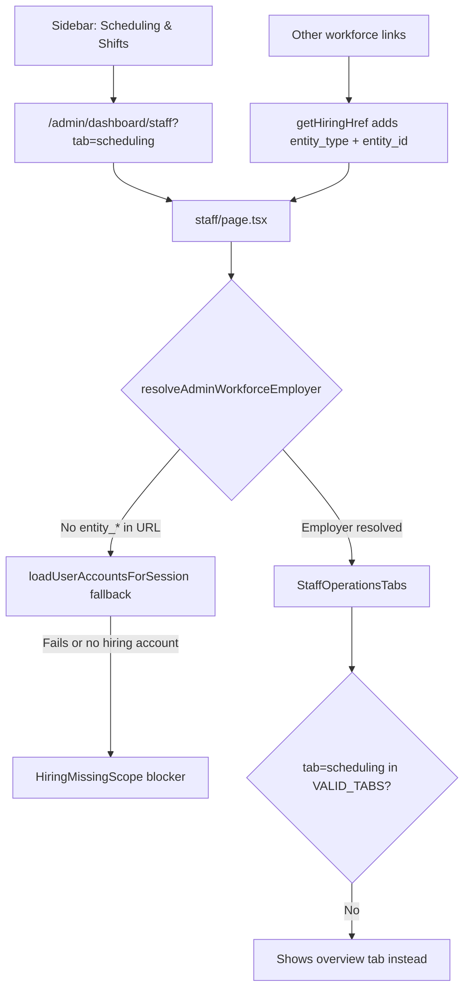

# Tourify Staff Scheduling & Shifts Context Document

The purpose of this document is to provide all necessary technical, database, routing, design, and workflow context needed to build the Staff Scheduling & Shifts component for the Tourify admin dashboard.

**Audit date:** 2026-07-08  
**Route under review:** `/admin/dashboard/staff?tab=scheduling`  
**Audit mode:** Read-only (no code or schema changes)

---

## 1. Executive Summary

### What the current Staff Scheduling route does

`/admin/dashboard/staff?tab=scheduling` is routed to `app/admin/dashboard/staff/page.tsx`, which is branded **Staff Operations HQ** — a unified workforce hub (overview, roster, applications, onboarding, jobs, audit). It is **not** a dedicated scheduling UI today.

When the page cannot resolve a **hiring employer scope** (`HiringEntity`), it renders `HiringMissingScope` with:

- Title: **"Workforce scope required"**
- Description: **"Select a Venue, Organization, or Artist to open the Staff Operations HQ."**
- Footer hint about `entity_type`, `entity_id`, or legacy `venue_id`

When scope **does** resolve, the page renders `StaffOperationsTabs` with tabs: `overview | roster | applications | onboarding | jobs | audit`. There is **no `scheduling` tab** in that component.

### Why it is blocked

Three separate wiring gaps combine to produce the visible blocker:

1. **Sidebar link omits employer scope.** The "Scheduling & Shifts" nav item uses a hardcoded href:
   ```ts
   href: "/admin/dashboard/staff?tab=scheduling"
   ```
   Other Workforce links use `getHiringHref(...)`, which appends `entity_type`, `entity_id`, optional `venue_id`, and `display_name` from `useMultiAccount().currentAccount`.

2. **Server fallback may not match client acting account.** `resolveAdminWorkforceEmployer` falls back to `loadUserAccountsForSession()` + `user_sessions.active_profile_id`. If session/account hydration fails or the active account is not a venue/organization/artist hiring entity, resolution returns `null` even when the sidebar header shows an org name client-side.

3. **`tab=scheduling` is invalid.** `VALID_TABS` in `staff/page.tsx` and `staff-operations-tabs.tsx` does not include `scheduling`. Even with a resolved employer, the URL tab silently falls back to `overview`.

### What context it requires

All admin workforce pages share the **HiringEntity** model:

```ts
entity_type: "venue" | "organization" | "artist"
entity_id: string          // UUID (legacy org composite ids normalized)
venue_id?: string          // legacy alias; also used when entity_type === "venue"
event_id?: string          // optional sub-scope
tour_id?: string           // optional sub-scope
display_name?: string      // UI label only
```

Resolution order in `resolveAdminWorkforceEmployer`:

1. URL/search params via `buildEmployerFromSearchParams`
2. Server session: `user_sessions` + first active org account, else first hiring-capable account

### Whether a scheduling component already exists

**Yes — multiple partial implementations, none wired to the admin staff route:**

| Location | Status | Table / API |
|----------|--------|-------------|
| `components/admin/staff-scheduling-tab.tsx` | **Orphan** (not imported anywhere) | `/api/admin/staffing/shifts`, `/api/admin/staffing/zones`, `/api/admin/staff` |
| `components/venue/staff/venue-staff-shifts-panel.tsx` | **Live** on venue surfaces | `/api/venue/shifts`, `/api/staffing/employees` |
| `app/venue/staff/scheduling/page.tsx` | **Live** venue scheduling page | `staff_shifts` (direct Supabase) + rich tab UI |
| `components/venue/staff/shift-calendar.tsx` | **Partial** (types reference `venue_shifts`) | `/api/venue/shifts` (actually reads `staff_shifts`) |
| `lib/services/venue-scheduling.service.ts` | **Legacy service** | `venue_shifts`, `venue_shift_assignments`, etc. |

`docs/architecture/admin-audit.md` marks `staff-scheduling-tab.tsx` as "Live, Ready" — **that is inaccurate**; grep shows zero imports.

### Whether workforce systems are already implemented

**Largely yes** for hiring/roster/onboarding (Phase 4–13 rebuild):

- Hiring Hub, Applications, Candidates, Roster pages under `/admin/dashboard/*`
- Polymorphic employer scoping (`employer_entity_type` / `employer_entity_id`)
- `/api/hiring/*` routes with `resolveHiringActorFromRequest`
- `TeamRosterPanel`, `ApplicationReviewPanel`, `OnboardingKanban`, etc.

**Partially yes** for scheduling:

- DB tables `staff_shifts`, `staff_zones` exist
- Admin staffing APIs exist but are **venue-scoped** (`venueId` required)
- No org/artist-polymorphic scheduling API yet

### What should be reused (not recreated)

| Reuse | Avoid recreating |
|-------|------------------|
| `HiringEntity` + `resolveAdminWorkforceEmployer` | New ad-hoc scope params |
| `getHiringHref` / `getEmployerQueryString` | Hardcoded staff URLs in nav |
| `WorkforcePageShell`, `WorkforceHero`, `WorkforcePanel` | One-off page chrome |
| `components/admin/staff-scheduling-tab.tsx` (wire + fix) | Brand-new calendar from scratch |
| `VenueStaffShiftsPanel` patterns | Duplicate shift CRUD logic |
| `/api/admin/staffing/shifts`, `/api/admin/staffing/zones` | Parallel shift endpoints |
| `lib/auth/hiring-permissions.ts`, `hasEntityPermission` | Custom permission checks |
| `staff_members` roster from `/api/hiring/roster` or `/api/admin/staff` | New staff list tables |
| `lib/hiring/work-mode-permissions.ts` (`view_shift_schedule`, `assign_zones`) | Ad-hoc capability flags |

---

## 2. Relevant Routes and Files

Legend: **Reuse** = integrate as-is or extend; **Edit** = wire/fix for scheduling; **Avoid** = legacy/duplicate unless migrating

### Admin layout & shell

| File | Role | Action | Key exports |
|------|------|--------|-------------|
| `app/admin/layout.tsx` | Server layout: auth, `AccountsSeed`, `AdminLayoutClient` | **Reuse** | default layout |
| `app/admin/admin-layout-client.tsx` | Client gate: requires organizer-capable account | **Reuse** | `AdminLayoutClient` |
| `app/admin/dashboard/layout.tsx` | Wraps pages in `AdminDashboardShell` | **Reuse** | default layout |
| `app/admin/dashboard/components/admin-dashboard-shell.tsx` | Sidebar + breadcrumbs + main content | **Reuse** | `AdminDashboardShell` |
| `app/admin/dashboard/components/optimized-sidebar.tsx` | Workforce nav; **Scheduling link bug here** | **Edit** | `OptimizedSidebar`, `getHiringHref` |
| `app/admin/dashboard/components/breadcrumbs.tsx` | Path-based crumbs (no entity name) | **Reuse** | `Breadcrumbs` |
| `app/admin/dashboard/contexts/admin-dashboard-context.tsx` | Client context: `venueId`, `accountId`, `displayName` | **Reuse** | `useAdminDashboard` |

**Sidebar header title** (e.g. "Test Events & Tours LLC") comes from `currentAccount.profile_data.organization_name` (or similar) in `optimized-sidebar.tsx` — client-only; **not** passed to staff page server component automatically.

```154:160:app/admin/dashboard/components/optimized-sidebar.tsx
  const sidebarHeaderTitle =
    (currentAccount as { display_name?: string } | null)?.display_name ||
    (currentAccount as { username?: string } | null)?.username ||
    profile?.display_name ||
    profile?.username ||
    profile?.organization_name ||
    "Organizer"
```

**`getHiringHref`** — pattern Scheduling link should follow:

```92:105:app/admin/dashboard/components/optimized-sidebar.tsx
function getHiringHref(path: string, currentAccount: ReturnType<typeof useMultiAccount>["currentAccount"]) {
  const entityType = getHiringEntityType(currentAccount?.account_type)
  if (!entityType || !currentAccount?.profile_id) return path

  const params = new URLSearchParams()
  params.set("entity_type", entityType)
  params.set("entity_id", currentAccount.profile_id)
  if (entityType === "venue") params.set("venue_id", currentAccount.profile_id)

  const displayName = getHiringDisplayName(currentAccount)
  if (displayName) params.set("display_name", displayName)

  return `${path}?${params.toString()}`
}
```

**Scheduling nav item (needs fix):**

```234:239:app/admin/dashboard/components/optimized-sidebar.tsx
          {
            label: "Scheduling & Shifts",
            href: "/admin/dashboard/staff?tab=scheduling",
            icon: Clock,
            description: "Shift calendar and zone assignments",
          },
```

### Staff / workforce pages

| File | Role | Action | Notes |
|------|------|--------|-------|
| `app/admin/dashboard/staff/page.tsx` | Staff Operations HQ entry | **Edit** | Add scheduling tab or dedicated branch |
| `components/hiring/staff-operations-tabs.tsx` | Tab shell for workforce HQ | **Edit** | Add `scheduling` tab + content |
| `components/hiring/hiring-missing-scope.tsx` | Blocker card | **Reuse** | Renders workforce scope message |
| `lib/hiring/resolve-admin-workforce-employer.ts` | Server employer resolution | **Reuse** | Core scope resolver |
| `lib/hiring/employer-search-params.ts` | Parse `entity_*` from URL | **Reuse** | `buildEmployerFromSearchParams` |
| `app/admin/dashboard/hiring/page.tsx` | Hiring Hub | **Reuse** | Same scope pattern |
| `app/admin/dashboard/applications/page.tsx` | Application review | **Reuse** | |
| `app/admin/dashboard/candidates/page.tsx` | Onboarding kanban | **Reuse** | |
| `app/admin/dashboard/roster/page.tsx` | Team roster | **Reuse** | |
| `app/admin/dashboard/rbac/page.tsx` | Roles & permissions UI | **Reuse** | Not employer-scoped in URL |
| `app/admin/dashboard/staff/add-staff-dialog.tsx` | Legacy staff dialogs | **Avoid** | Superseded by hiring flows |
| `app/admin/dashboard/staff/loading.tsx` | Loading skeleton | **Reuse** | |

### Scheduling-specific (existing but unwired)

| File | Role | Action |
|------|------|--------|
| `components/admin/staff-scheduling-tab.tsx` | Week grid UI for admin shifts | **Edit & wire** |
| `components/admin/staff-roster-panel.tsx` | Legacy admin roster | **Avoid** (use `TeamRosterPanel`) |
| `components/admin/staff-analytics-panel.tsx` | Staff analytics | **Avoid** for scheduling MVP |
| `components/admin/neural-staff-command.tsx` | Mock AI insights incl. scheduling | **Avoid** for MVP |

### Venue scheduling (reference implementation)

| File | Role | Action |
|------|------|--------|
| `app/venue/staff/scheduling/page.tsx` | Full venue scheduling page | **Reuse patterns** |
| `components/venue/staff/venue-staff-shifts-panel.tsx` | Production shift list/create UI | **Reuse** |
| `components/venue/staff/venue-staff-scheduler-shell.tsx` | Suspense wrapper + `event_id` param | **Reuse** |
| `components/venue/staff/shift-calendar.tsx` | Calendar view (older types) | **Edit** if calendar needed |
| `lib/venue/staff-shift-date-range.ts` | Date range helpers | **Reuse** |

### Acting context & accounts

| File | Role | Action |
|------|------|--------|
| `lib/auth/acting-context.ts` | API acting context (headers → session → general) | **Reuse** for API mutations |
| `hooks/use-acting-context.ts` | Client `x-acting-profile-id` headers | **Reuse** in client fetch |
| `hooks/use-multi-account.tsx` | Account switcher state | **Reuse** |
| `components/account/accounts-seed.tsx` | SSR → client account hydration | **Reuse** |
| `lib/accounts/server-load-accounts.ts` | Server account + session load | **Reuse** |
| `lib/navigation/account-context-url.ts` | `?account=` URL param helpers | **Unknown / Needs Confirmation** for staff routes |

### Hiring / permissions

| File | Role | Action |
|------|------|--------|
| `types/hiring-entity.ts` | `HiringEntity` types + serializers | **Reuse** |
| `lib/auth/hiring-entity-resolver.ts` | `resolveHiringEntity` + permission gate | **Reuse** |
| `lib/auth/hiring-permissions.ts` | `canManageHiring`, venue staffing helpers | **Reuse** |
| `lib/api/hiring-route-helpers.ts` | `resolveHiringActorFromRequest` | **Reuse** for new APIs |
| `lib/hiring/hiring-dashboard-utils.ts` | `getEmployerQueryString` | **Reuse** |
| `lib/hiring/hiring-entity-id.ts` | Normalize legacy org composite IDs | **Reuse** |
| `lib/hiring/work-mode-permissions.ts` | `view_shift_schedule`, `assign_zones` | **Reuse** |
| `lib/services/rbac.ts` / `rbac.service.ts` | `hasEntityPermission`, `ASSIGN_EVENT_ROLES` | **Reuse** |
| `docs/JOBS_STAFFING_RBAC_MATRIX.md` | RBAC matrix doc | **Reuse** |

### API routes

| Route | Purpose | Scope | Action |
|-------|---------|-------|--------|
| `GET/POST /api/admin/staffing/shifts` | Shift list/create | `venueId` required | **Reuse** (extend for org) |
| `PATCH/DELETE /api/admin/staffing/shifts/[id]` | Shift update/delete | shift id | **Reuse** |
| `GET/POST /api/admin/staffing/zones` | Staff zones | `venueId` required | **Reuse** |
| `GET /api/admin/staff` | Staff member list | entity or venue or org fallback | **Reuse** |
| `GET /api/admin/staff/dashboard` | Legacy venue dashboard aggregate | `venue_id` | **Avoid** for new UI |
| `GET/POST /api/venue/shifts` | Venue shift CRUD | venue access | **Reuse** on venue routes |
| `GET /api/hiring/roster` | Polymorphic roster | `entity_type` + `entity_id` | **Reuse** for staff picker |
| `GET /api/hiring/dashboard` | Hiring KPIs | employer query string | **Reuse** |
| `GET /api/admin/calendar` | Calendar includes `staff_shifts` as logistics | global-ish | **Reuse** for calendar integration |

### Events / tours (scheduling adjacency)

| File | Relevance |
|------|-----------|
| `app/admin/dashboard/events/**` | Events may scope shifts via `event_id` on `staff_shifts` |
| `app/admin/dashboard/tours/**` | Tour crew hiring uses `tour_id` in hiring scope |
| `app/api/admin/calendar/route.ts` | Already surfaces shifts on admin calendar |

### Middleware

`middleware.ts` — protects `/admin` routes via Supabase session; **does not** inject entity scope into staff pages.

---

## 3. Current Staff Scheduling Route Behavior

### Routing

- **Path:** `app/admin/dashboard/staff/page.tsx`
- **URL:** `/admin/dashboard/staff` with optional `?tab=...` and employer params
- **Layout chain:** `app/admin/layout.tsx` → `app/admin/dashboard/layout.tsx` → page

### Tab handling

**Server** (`staff/page.tsx`):

```8:26:app/admin/dashboard/staff/page.tsx
type StaffOperationsTab = "overview" | "roster" | "applications" | "onboarding" | "jobs" | "audit"

const VALID_TABS = new Set<StaffOperationsTab>([
  "overview",
  "roster",
  "applications",
  "onboarding",
  "jobs",
  "audit",
])

function resolveInitialTab(value: string | string[] | undefined): StaffOperationsTab {
  const tab = Array.isArray(value) ? value[0] : value
  return tab && VALID_TABS.has(tab as StaffOperationsTab) ? (tab as StaffOperationsTab) : "overview"
}
```

**Client** (`staff-operations-tabs.tsx`): uses `useSearchParams` + `router.replace` on tab change — **not `nuqs`** (no `nuqs` usage found in repo).

```72:82:components/hiring/staff-operations-tabs.tsx
  const tabParam = searchParams.get("tab")
  const activeTab = tabParam && VALID_TABS.has(tabParam) ? (tabParam as StaffOperationsTab) : initialTab

  const handleTabChange = useCallback(
    function handleTabChange(value: string) {
      const params = new URLSearchParams(searchParams.toString())
      params.set("tab", value)
      router.replace(`${pathname}?${params.toString()}`, { scroll: false })
    },
    [pathname, router, searchParams],
  )
```

### Where the blocker is rendered

```35:44:app/admin/dashboard/staff/page.tsx
  if (!employer) {
    return (
      <WorkforcePageShell>
        <HiringMissingScope
          title="Workforce scope required"
          description="Select a Venue, Organization, or Artist to open the Staff Operations HQ."
        />
      </WorkforcePageShell>
    )
  }
```

```9:28:components/hiring/hiring-missing-scope.tsx
export function HiringMissingScope({
  title = "Select a hiring account",
  description = "This dashboard needs a Venue, Organization, or Artist hiring scope before it can load real onboarding data.",
}: HiringMissingScopeProps) {
  return (
    <Card className="border-amber-500/30 bg-amber-950/20">
      ...
      <CardContent className="text-sm text-muted-foreground">
        Pass <code>entity_type</code> and <code>entity_id</code>, or the legacy <code>venue_id</code>, while this route is being wired into the repo's acting-context provider.
      </CardContent>
    </Card>
  )
}
```

### Props / data expectations

When employer resolves, page passes:

```tsx
<StaffOperationsTabs employer={employer} initialTab={initialTab} />
```

`employer: HiringEntity`:

```ts
{
  entityType: "venue" | "organization" | "artist"
  entityId: string
  displayName: string
  scope?: { eventId?, tourId?, venueId? }
}
```

**`StaffSchedulingTab` expects** `{ venueId?: string }` only — no `HiringEntity` — and falls back to `venueId || 'default'` (invalid UUID) when missing.

### Supported query params

| Param | Used by | Purpose |
|-------|---------|---------|
| `tab` | staff page + tabs | Tab selection (`scheduling` **not valid**) |
| `entity_type` | employer resolution | `venue \| organization \| artist` |
| `entity_id` | employer resolution | Employer UUID |
| `venue_id` | employer resolution | Legacy venue alias |
| `display_name` | employer resolution | UI label |
| `event_id` | employer scope | Optional event context |
| `tour_id` | employer scope | Optional tour context |
| `scoped_venue_id` | hiring serializers | Third-party venue for orgs |
| `account` | multi-account URLs | **Not read** by `resolveAdminWorkforceEmployer` |

### Expected workspace identifiers

The staff page expects **hiring employer scope**, not raw acting-context headers:

- Primary: `entity_type` + `entity_id`
- Legacy: `venue_id` alone (implies `entity_type=venue`)
- Fallback: server `user_sessions.active_profile_id` mapped through account list

It does **not** currently read `x-acting-profile-id` headers (those are API-only).

---

## 4. Acting Workspace / Entity Scope System

### How the active admin workspace is selected

| Layer | Mechanism | Source of truth |
|-------|-----------|-----------------|
| **Client UI** | `useMultiAccount().currentAccount` | Hydrated from `AccountsSeed` + `/api/accounts` |
| **Client API calls** | `useActingContext().actingHeaders` | `x-acting-profile-id`, `x-acting-account-type` |
| **Server pages (workforce)** | `resolveAdminWorkforceEmployer` | URL params → `user_sessions` → account list heuristic |
| **Server API (general)** | `resolveActingContext(request)` | Headers → `user_sessions` → `general` fallback |
| **Server API (hiring)** | `resolveHiringActorFromRequest` | Query/body `entity_type`/`entity_id` + permission check |
| **URL (optional)** | `?account=<profileId>` | `lib/navigation/account-context-url.ts` — used in some dashboards, **not wired to staff page** |
| **Middleware** | Auth only | No entity injection |

### Entity type mapping (account switcher → hiring entity)

```33:38:lib/hiring/resolve-admin-workforce-employer.ts
function getHiringEntityType(accountType: string | undefined): HiringEntityType | null {
  const normalized = normalizeAccountType(accountType)
  if (normalized === "venue") return "venue"
  if (normalized === "artist" || normalized === "service") return "artist"
  if (isOrganizationType(normalized)) return "organization"
  return null
}
```

### How the app knows user is acting as org / venue / artist

1. **Account switcher** updates `user_sessions.active_profile_id` + `active_account_type` (via account management service).
2. **Client** reflects switch immediately in `currentAccount`.
3. **Server pages** re-read session on each request through `loadUserAccountsForSession()`.

### "Test Events & Tours LLC" in top nav

- Rendered in **sidebar header** from `currentAccount.profile_data.organization_name` (client).
- **Entity ID available client-side:** `currentAccount.profile_id`
- **Entity ID on server staff page:** only if URL params present or session fallback succeeds — **not automatically synced from sidebar display name**

### How to pass active entity into Staff Scheduling safely

**Recommended pattern (matches Hiring Hub / Roster):**

1. **Nav links:** use `getHiringHref("/admin/dashboard/staff", currentAccount)` and append `&tab=scheduling`.
2. **Server page:** keep `resolveAdminWorkforceEmployer({ searchParams })` — no client-only trust.
3. **Scheduling panel:** derive `venueId` for shift APIs:
   - If `employer.entityType === "venue"` → `employer.entityId`
   - If org/artist → **Unknown / Needs Confirmation:** map to operational venue (`employer.scope?.venueId`, linked event venue, or org default venue)
4. **API calls:** prefer extending staffing APIs to accept `entity_type` + `entity_id` OR resolve venue from employer before calling existing `venueId` endpoints.
5. **Permissions:** gate with `canManageHiring` / `hasEntityPermission(..., ASSIGN_EVENT_ROLES)` consistent with `/api/admin/staffing/shifts`.

### Entity scope model (canonical)

```ts
// types/hiring-entity.ts
entity_type: "venue" | "organization" | "artist"
entity_id: string   // uuid (normalizeHiringEntityId strips legacy composite prefix)

// Optional scope
scope?: {
  eventId?: string
  tourId?: string
  venueId?: string   // for orgs operating at a third-party venue
}

// Legacy aliases
venue_id?: string    // treated as venue entity when entity_type absent
```

### Acting context (API-only, related)

```24:33:lib/auth/acting-context.ts
export interface ActingContext {
  userId: string
  accountType: ProfileType
  profileId: string
  supabase: any
}
```

Resolution order: request headers → `user_sessions` → `general` account.

**Gap:** Staff **page** does not call `resolveActingContext`; message in `HiringMissingScope` references "acting-context provider" as future wiring.

---

## 5. Database Schema (Scheduling-Relevant)

### Primary tables (admin staffing — **use these**)

From `supabase/migrations/20250818120000_admin_staffing_core.sql`:

**`staff_shifts`**

| Column | Type | Notes |
|--------|------|-------|
| `id` | uuid | PK |
| `venue_id` | uuid → `venues` | Legacy venue FK |
| `adhoc_venue_id` | uuid → `venues_v2` | Newer venue mapping |
| `event_id` | uuid → `events_v2` | Optional event scope |
| `staff_member_id` | uuid → `staff_members` | Assigned worker |
| `shift_date` | date | |
| `start_time` / `end_time` | time | |
| `break_duration` | int | minutes |
| `zone_assignment` | text | Free text or zone name |
| `role_assignment` | text | |
| `notes` | text | |
| `status` | text | `scheduled \| confirmed \| completed \| cancelled` |
| `created_by` | uuid | |

**`staff_zones`**

| Column | Notes |
|--------|-------|
| `venue_id`, `adhoc_venue_id`, `event_id` | Scope |
| `zone_name`, `zone_type`, `capacity` | Zone metadata |
| `required_staff_count`, `assigned_staff_count` | Staffing levels |
| `event_zone_id` | Link to canonical `event_zones` (newer migrations) |

**`staff_members`** — polymorphic employer columns added in `20260625000000_polymorphic_hiring_entity.sql`:

- `employer_entity_type`, `employer_entity_id` (venue | organization | artist)
- Legacy `venue_id` still present

### Legacy parallel schema (**avoid for new admin work**)

`venue_shifts`, `venue_shift_assignments`, etc. — used by `lib/services/venue-scheduling.service.ts` and `shift-calendar.tsx` types. **Dual-model risk:** venue scheduling page queries `staff_shifts` but calendar component types reference `VenueShift`.

### RLS note

`staff_shifts` / `staff_zones` have permissive authenticated policies in beta; **endpoints enforce RBAC** via `hasEntityPermission`. Treat service-role usage carefully.

---

## 6. API Surface for Scheduling

### Admin staffing (venue-scoped today)

**`GET /api/admin/staffing/shifts?venueId=&date_from=&date_to=&eventId=&staff_member_id=&status=`**

- Permission: `EDIT_EVENT_LOGISTICS` on Venue
- Returns rows from `staff_shifts`

**`POST /api/admin/staffing/shifts`**

- Body: `{ venue_id, staff_member_id, shift_date, start_time, end_time, ... }`
- Permission: `ASSIGN_EVENT_ROLES` on Venue or Event

**`GET/POST /api/admin/staffing/zones`**

- Query: `venueId` / `venue_id`, optional `eventId`
- Creates linked `event_zones` row when possible

### Venue shifts (venue account surface)

**`GET/POST /api/venue/shifts`**

- Uses `staff_shifts` table (not `venue_shifts`)
- Handles `venues_v2` mapping via `ensureVenueOperationalContext`
- Permission: `canManageVenue(..., "manage_team")`

### Staff roster for pickers

- **`GET /api/hiring/roster?entity_type=&entity_id=`** — polymorphic, preferred for org/artist
- **`GET /api/admin/staff?entity_type=&entity_id=`** — unified staff_members view (fallback)

### Known API gaps for org scheduling

- Admin staffing routes require **`venueId`**, not `entity_type`/`entity_id`
- `StaffSchedulingTab` calls `/api/admin/staff` **without** entity params (relies on org fallback server-side)
- No `employer_entity_*` columns on `staff_shifts` — **Unknown / Needs Confirmation** whether org-level shifts should add columns or always bind to a concrete `venue_id`/`event_id`

---

## 7. UI / Design Conventions to Follow

- **Shell:** `WorkforcePageShell` + `WorkforceHero` (dark gradient, cyan/purple accents)
- **Tabs:** Shadcn `Tabs` with `WorkforcePanel` wrapper (see `staff-operations-tabs.tsx`)
- **Components:** `@/components/ui/*` (global shadcn) — admin dashboard duplicate UI folder was deleted
- **Toasts:** `sonner` (admin scheduling tab) or `useToast` (venue panel) — both exist
- **Loading:** `RefreshCw` spinner pattern in scheduling tab; `Loader2` in venue panel
- **Week grid:** `StaffSchedulingTab` implements Sunday-start week grid with zone color badges

---

## 8. Permissions & Work Mode

From `docs/JOBS_STAFFING_RBAC_MATRIX.md`:

- Shift management tied to **`ASSIGN_EVENT_ROLES`** (entity RBAC)
- Read logistics/shifts: **`EDIT_EVENT_LOGISTICS`**

Work Mode capabilities (`lib/hiring/work-mode-permissions.ts`):

- `view_shift_schedule` — base for all roles
- `assign_zones` — managers only

These govern **worker** experience, not admin scheduler UI — but admin UI should respect the same entity permissions.

---

## 9. Integration Points (Events, Calendar, Roster)

| System | Integration |
|--------|-------------|
| **Roster** | Shifts reference `staff_member_id` → roster from `/api/hiring/roster` |
| **Onboarding** | `admin-onboarding-staff.service.ts` can seed default `staff_shifts` on hire |
| **Admin calendar** | `staff_shifts` appear as `type: 'logistics'` events |
| **Event zones** | `staff_zones.event_zone_id` links to `event_zones` |
| **HQ / check-in** | `app/api/events/[id]/hq/route.ts` reads staff shift for role |

---

## 10. Root Cause Diagram (Current Blocker)



---

## 11. Gaps, Risks, and Recommended Build Order

### P0 — Unblock route

1. Change sidebar Scheduling href to:
   ```ts
   `${getHiringHref("/admin/dashboard/staff", currentAccount)}&tab=scheduling`
   ```
   (preserve existing query params when building URL)
2. Add `"scheduling"` to `VALID_TABS` in `staff/page.tsx` and `staff-operations-tabs.tsx`
3. Render `StaffSchedulingTab` or `VenueStaffShiftsPanel` in new `TabsContent value="scheduling"`

### P1 — Scope correctness

4. Pass resolved `venueId` into scheduling component:
   - venue employer → `employer.entityId`
   - org employer → resolve operational venue (**product decision needed**)
5. Remove `venueId || 'default'` fallback in `StaffSchedulingTab` — fails UUID validation
6. Align staff picker fetch with employer scope (`/api/hiring/roster` or `/api/admin/staff?entity_type=&entity_id=`)

### P2 — API & data model

7. Extend `/api/admin/staffing/shifts` to accept hiring entity params OR document venue-only scheduling for orgs
8. Reconcile `venue_shifts` vs `staff_shifts` — pick **staff_shifts** for admin
9. Wire zone CRUD UI (zones fetched but limited management in scheduling tab)

### P3 — UX parity

10. Event-scoped scheduling (`event_id` search param) like `VenueStaffSchedulerShell`
11. Surface shifts on `/admin/dashboard/calendar` with employer filters
12. Export/import buttons on venue scheduling page are placeholders — **Unknown** if required for admin

---

## 12. Open Questions / Needs Confirmation

| # | Question |
|---|----------|
| 1 | For **organization** employers, which `venue_id` should shifts attach to — primary org venue, per-event venue, or new `employer_entity_*` on `staff_shifts`? |
| 2 | Should Scheduling live as a **tab** on Staff Operations HQ or a **standalone** `/admin/dashboard/scheduling` route? |
| 3 | Is **`StaffSchedulingTab`** the desired admin UI, or should admin adopt **`VenueStaffShiftsPanel`** for consistency? |
| 4 | Should `resolveAdminWorkforceEmployer` also read `?account=` param for parity with other dashboards? |
| 5 | Are **`venue_shifts`** tables deprecated, or is a migration from `venue_shifts` → `staff_shifts` still in flight? |
| 6 | Does scheduling require **tour-level** shifts (`tour_id`), or only venue/event? |
| 7 | Should workers see assigned shifts in **Work Mode** mobile app (out of scope but affects API design)? |
| 8 | Why does server fallback fail when sidebar shows org name? (Needs live debugging with session/account payload — **environment-specific**) |

---

## 13. Suggested Implementation Prompt (for a future Cursor session)

Use this checklist when generating the build prompt:

```
Build Staff Scheduling & Shifts for Tourify admin at /admin/dashboard/staff?tab=scheduling.

Constraints:
- Do NOT reset database. Extend staff_shifts / staff_zones only if confirmed.
- Reuse HiringEntity scope (resolveAdminWorkforceEmployer, getHiringHref).
- Wire existing components/admin/staff-scheduling-tab.tsx OR venue-staff-shifts-panel.tsx.
- Use /api/admin/staffing/shifts and /api/admin/staffing/zones with hasEntityPermission.
- Match WorkforcePageShell / staff-operations-tabs styling.
- Add scheduling to VALID_TABS; fix optimized-sidebar Scheduling href to use getHiringHref.
- Pass real venueId — never 'default'.
- Gate on ASSIGN_EVENT_ROLES / EDIT_EVENT_LOGISTICS per JOBS_STAFFING_RBAC_MATRIX.md.
- Add tests for tab routing and employer scope resolution.

Read first:
- docs/staff-scheduling-context.md (this file)
- app/admin/dashboard/staff/page.tsx
- components/hiring/staff-operations-tabs.tsx
- components/admin/staff-scheduling-tab.tsx
- lib/hiring/resolve-admin-workforce-employer.ts
- app/api/admin/staffing/shifts/route.ts
```

---

## 14. Quick Reference — File Paths

```
app/admin/dashboard/staff/page.tsx          # Route entry + blocker
components/hiring/staff-operations-tabs.tsx   # Tab container (no scheduling)
components/hiring/hiring-missing-scope.tsx    # Blocker UI
components/admin/staff-scheduling-tab.tsx     # Orphan scheduling UI
lib/hiring/resolve-admin-workforce-employer.ts
app/admin/dashboard/components/optimized-sidebar.tsx  # Nav bug
lib/auth/acting-context.ts
hooks/use-multi-account.tsx
types/hiring-entity.ts
app/api/admin/staffing/shifts/route.ts
app/api/admin/staffing/zones/route.ts
components/venue/staff/venue-staff-shifts-panel.tsx
app/venue/staff/scheduling/page.tsx
supabase/migrations/20250818120000_admin_staffing_core.sql
docs/JOBS_STAFFING_RBAC_MATRIX.md
```

---

*End of audit document. No application code was modified during this audit.*
