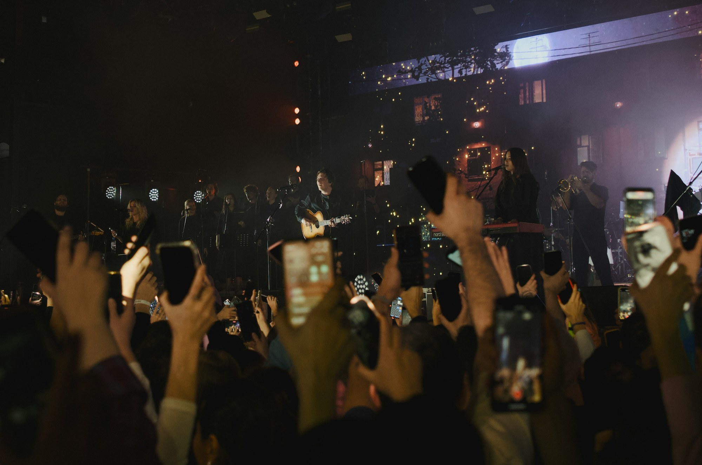

# Discover What’s Next: Finding Music, Artists, and Live Events on Tourify

**By Tourify**

Music discovery rarely happens in only one place. A fan may hear a song in a video, see an artist mentioned by a friend, notice a local event, and then search several different platforms before deciding to listen, follow, or attend. Tourify is designed to connect those moments.

The Tourify discovery experience helps people find artists, music, events, articles, and community activity without separating the live-music world into unrelated apps. Instead of treating a song, an artist profile, and an upcoming show as isolated pieces of information, Tourify connects them so that discovery can lead to a meaningful next step.

## What the discovery feature does

Tourify organizes music and live-event discovery around the people, places, and interests that matter to each user. Fans can explore artists, browse upcoming events, follow accounts, read music and industry coverage, and save opportunities that interest them.

An artist profile can lead to music, videos, tour dates, merchandise, posts, and professional information. An event page can lead to the performers, venue, ticket information, related posts, and other events nearby. This connected structure reduces the amount of searching required to understand what is happening and how to participate.

This matters because music engagement is already spread across many formats and services. IFPI’s *Engaging with Music 2023* study surveyed more than 43,000 people across 26 countries and found that fans use an average of seven different methods to engage with music. A platform that connects discovery with profiles, events, and community activity can help turn fragmented interest into deeper engagement.

## Benefits for fans

For fans, Tourify can make it easier to:

- Discover new artists through music, posts, events, and recommendations.
- Find concerts and music-related experiences based on location and interests.
- Follow artists, venues, organizations, and industry professionals.
- Save events and keep track of upcoming plans.
- Move from discovering an artist to hearing their music or attending a show.
- Read platform-native news, blogs, interviews, and announcements.

The goal is not simply to show more content. It is to make each discovery more useful. When a user finds something interesting, Tourify provides a path toward listening, following, sharing, attending, buying, or connecting.

## Benefits for artists and event organizers

Discovery tools also help creators and organizers become easier to find. A complete artist or event profile gives users more context than a single promotional post.

Artists can connect their music, identity, upcoming events, professional materials, and updates in one place. Venues and organizations can make their calendars, opportunities, and hosted events visible to the people most likely to care about them.

Because these elements are connected, one action can support another. A new music post may lead a listener to an artist profile. That profile may lead to an upcoming show. The show may lead to a ticket purchase, follow, or share.

## How to access discovery tools

1. Sign in to Tourify or create a general user account.
2. Open the main discovery, news, music, or events area from the primary navigation.
3. Add your location and select genres, artists, or interests when those preferences are available.
4. Follow artists, venues, organizations, and people you want to hear from.
5. Save events or add them to your calendar so they are easier to revisit.
6. Open any artist, event, or venue page to explore the related content attached to it.

The more relevant accounts and interests a user follows, the more useful Tourify’s connected discovery experience becomes.

## A more connected music ecosystem

Tourify is built around the idea that music discovery should lead somewhere. A listener should be able to become a fan. A fan should be able to find a show. A show should connect people to the artists, venue, workers, and community behind it.

By bringing those pieces together, Tourify helps make music discovery more actionable for everyone involved.

## Sources and further reading

- [IFPI — Engaging with Music 2023](https://www.ifpi.org/wp-content/uploads/2023/12/IFPI-Engaging-With-Music-2023_full-report.pdf)
- [IFPI — Global study finds people are listening to more music in more ways](https://www.ifpi.org/ifpis-global-study-finds-were-listening-to-more-music-in-more-ways-than-ever/)

## Photo credit

[Photo by Konstantin Kitsenuik on Unsplash](https://unsplash.com/photos/crowd-holding-up-phones-at-a-concert-EdnpGCedfrY) — free to use under the Unsplash License.
