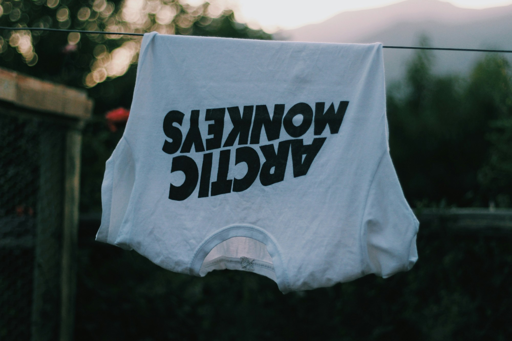

# Turn Attention Into Revenue With Tourify Marketplace and Promotions

**By Tourify**

Discovery is valuable, but creators and event professionals also need ways to turn attention into sustainable support.

Tourify’s marketplace and promotions ecosystem is designed to connect what users create or offer with the profiles, posts, events, and audiences already discovering them. Artists can feature merchandise and releases. Professionals can present services. Events can connect people to tickets. Organizations and venues can highlight relevant listings. Eligible users can promote content to expand its reach.

## One storefront connected to a professional identity

A Tourify storefront is not intended to exist separately from the seller’s profile. It is part of the larger professional and community presence.

That means a fan can discover an artist through a song or event, open the artist profile, and find related merchandise or offers. A potential client can discover a photographer’s work, review the portfolio, and open a service listing. A user can see an event post and continue directly toward the event or ticket page.

This reduces the distance between interest and action.

## What users can offer

Tourify’s marketplace model can support several types of listings, including:

- Artist merchandise and physical products.
- Native or externally hosted product listings.
- Creative and professional services.
- Booking, quote, or availability requests.
- Event tickets and related upgrades.
- Music, special releases, or collectible products where enabled.
- Venue, organization, or event-specific offers.
- Shareable listings that can appear in posts and profiles.

External listings can send buyers to an established third-party checkout, while native listings can use Tourify-supported checkout or request workflows when available.

Bandcamp’s Artist Guide emphasizes the importance of direct fan support and notes that merchandise can be a major part of an artist’s sales. Berklee Online similarly recommends developing merchandise that reflects the artist’s identity and the interests of the audience. Tourify extends that direct-to-audience idea by connecting commerce to the broader live-music ecosystem.

## Shareable commerce

A marketplace listing becomes more useful when it can travel through the platform.

Sellers can attach eligible products, services, tickets, or offers to posts. Those posts can be shared, allowing the listing to reach people through discovery and community activity rather than requiring them to find a separate store first.

A strong listing should clearly explain:

- What the buyer receives.
- The price or type of request.
- Fulfillment, delivery, or scheduling expectations.
- Available options, sizes, dates, or quantities.
- Refund, cancellation, or external-checkout terms.
- Who is responsible for the product or service.

Clear information helps users make informed decisions and protects trust between buyers, sellers, and the platform.

## Self-serve promotions

Tourify promotions are designed to let eligible users expand the reach of their own content. Promotable content may include posts, music, events, merchandise, services, announcements, or other approved listings.

A promotion can allow a user to choose an objective, audience, budget, and schedule. Performance reporting can then help the user understand how the promotion delivered.

This gives artists and professionals a path to support specific goals, such as:

- Increasing awareness for a new release.
- Reaching people near an upcoming event.
- Driving attention to tickets or merchandise.
- Promoting a portfolio or service.
- Expanding the reach of an important post.
- Reintroducing successful content to a relevant audience.

Promotions should strengthen useful content, not replace it. A complete profile, clear offer, strong creative asset, and relevant destination all improve the chance that paid reach leads to a meaningful result.

## How to create a marketplace listing

1. Sign in to an eligible account.
2. Open Marketplace, Storefront, Products, Services, or the corresponding profile-management section.
3. Choose the listing type.
4. Add the title, description, images, price or request method, and availability.
5. Select native checkout or add the approved external destination.
6. Add fulfillment, booking, cancellation, and policy details.
7. Preview the public listing.
8. Publish it to the marketplace and your profile.
9. Create a post featuring the listing when appropriate.

## How to promote content

1. Open an eligible post, song, event, product, service, or listing.
2. Select **Promote** or open the Promotions area of the dashboard.
3. Choose the campaign objective.
4. Select the audience, location, interests, or other available targeting.
5. Set the budget and campaign dates.
6. Review the destination and preview the promoted content.
7. Submit the campaign for approval and payment.
8. Monitor delivery and results from the promotions dashboard.

Feature access may depend on account eligibility and the current Tourify rollout.

## Building a healthier creator economy

Tourify’s marketplace and promotions ecosystem is designed around a simple idea: the people creating value in music and live events should have clearer ways to connect that value to an audience.

By linking commerce and promotion to trusted profiles, events, posts, and professional history, Tourify can help creators earn support without separating business activity from the community and work that made the audience care in the first place.

## Sources and further reading

- [Bandcamp — Artist Guide](https://bandcamp.com/guide)
- [Berklee Online — How to Create Music Merch to Grow Your Brand](https://online.berklee.edu/takenote/how-to-create-music-merch-to-grow-your-brand/)
- [U.S. Small Business Administration — E-Commerce and Digital Opportunities](https://www.sba.gov/document/brand-guide-increase-your-online-sales-global-marketplace-e-commerce-digital-opportunities-businesses)

## Photo credit

[Photo by Sofia Guaico on Unsplash](https://unsplash.com/photos/white-t-shirt-on-rack-ujihpJUpnvY) — free to use under the Unsplash License.
